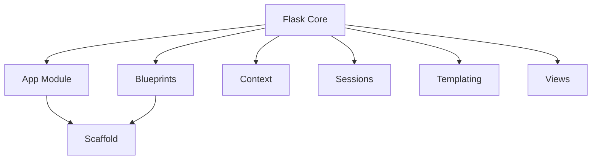

# Flask Repository Overview

## Purpose
Flask is a lightweight WSGI (Web Server Gateway Interface) web application framework for Python. It is designed to make getting started with web development quick and easy, while providing the flexibility to scale up to complex, high-performance applications. Flask provides the core essentials for web development—including routing, request handling, template rendering, and session management—without imposing a rigid project structure.

## End-to-End Architecture
Flask operates as a WSGI application that manages the lifecycle of an HTTP request. It uses a context-based system to ensure that application and request-specific data are accessible globally within a thread or coroutine.

The following diagram illustrates the end-to-end request-response lifecycle within the Flask framework:

## Core Modules Documentation
The framework is organized into specialized modules that handle different aspects of the web application lifecycle. For detailed information on specific components, refer to the following documentation:

*   [App Module](app.md): The central `Flask` application object and base `Scaffold` logic.
*   [Blueprints Module](blueprints.md): Modular application structure and registration logic.
*   [Context Module](ctx.md): Application and Request context management.
*   [Wrappers Module](wrappers.md): Flask-specific extensions to Werkzeug's Request and Response objects.
*   [Config Module](config.md): Configuration loading and management system.
*   [Sessions Module](sessions.md): Server-side and client-side session persistence interfaces.
*   [JSON Module](json.md): Extensible JSON serialization and tagging system.
*   [CLI Module](cli.md): Integration with Click for command-line management.
*   [Templating Module](templating.md): Integration with the Jinja2 template engine.
*   [Testing Module](testing.md): Utilities for unit testing Flask applications and CLI commands.
*   [Views Module](views.md): Generic and method-based class views.