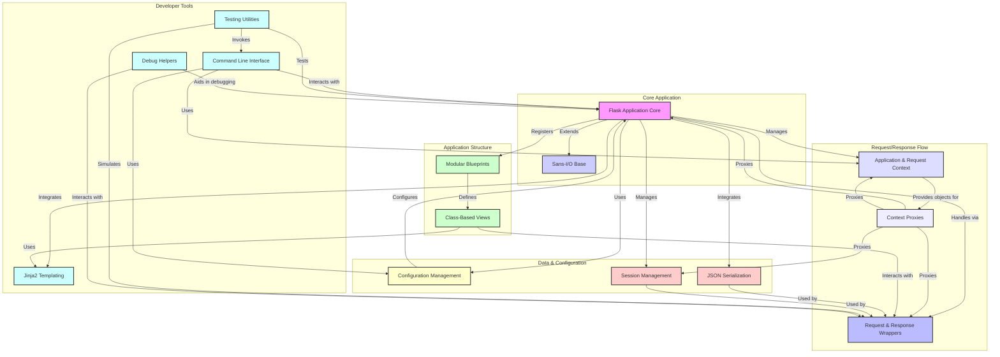

## Flask Repository Overview

The Flask repository contains the source code for the Flask web framework, a lightweight and extensible WSGI web application framework for Python. Its primary purpose is to provide a solid foundation for building web applications and APIs, emphasizing simplicity, flexibility, and modularity. Flask offers core functionalities such as URL routing, request and response handling, templating with Jinja2, session management, and a robust context system, while allowing developers to choose their preferred tools and extensions for other aspects like database integration or authentication.

### Architecture Diagram

The following diagram illustrates the main modules within the Flask repository and their key relationships:

