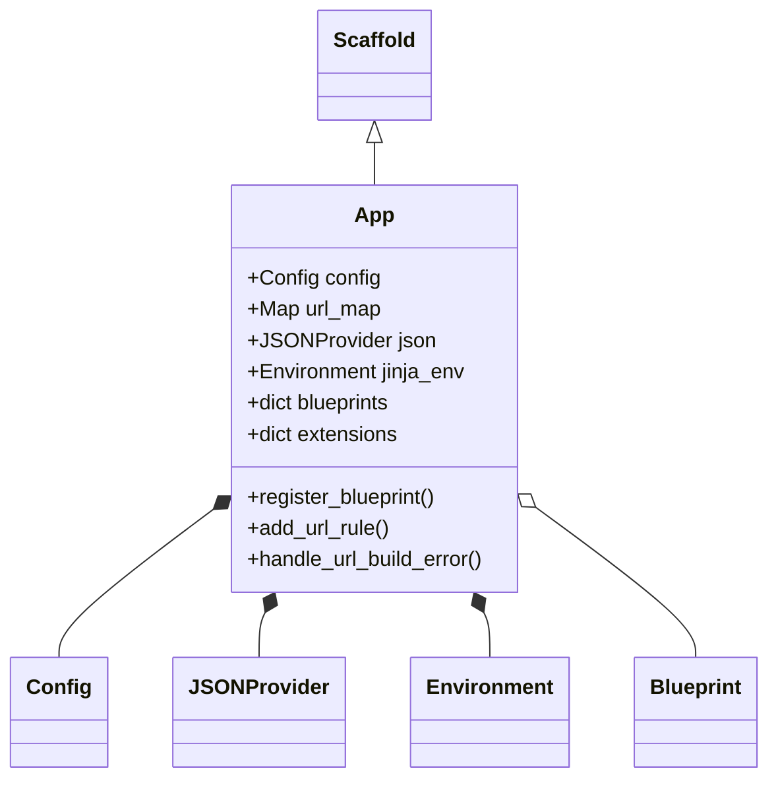
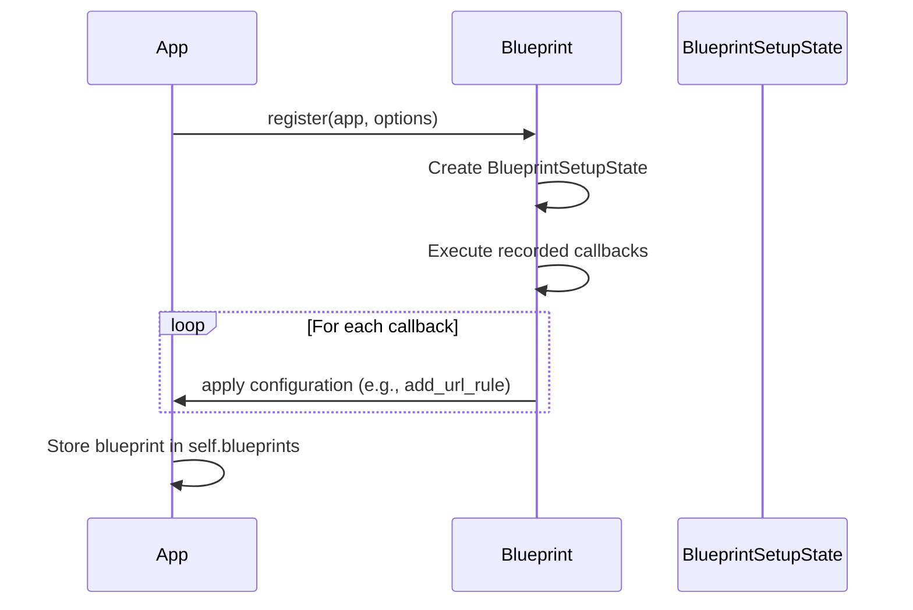
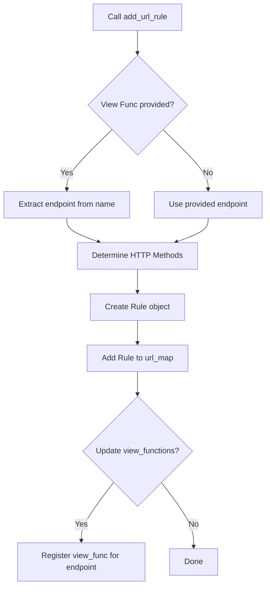
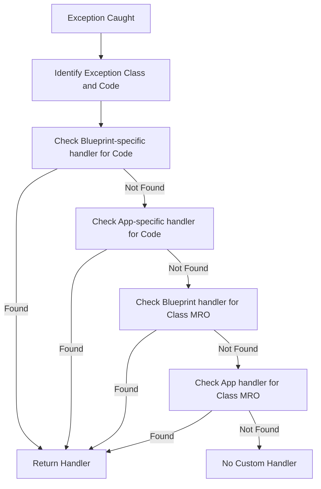

# Sans-IO App Module

The `sansio_app` module centers around the `App` class, which serves as the fundamental foundation for a Flask application. It provides the core registry and management logic for routes, configuration, blueprints, templates, and error handling. Designed as a "Sans-IO" component, `App` focuses on application logic independent of the specific I/O layer (such as WSGI or ASGI).

## Overview

The `App` class inherits from [Scaffold](scaffold.md) and acts as the central hub of a Flask application. It coordinates various subsystems to handle the lifecycle and configuration of the web application.

### Key Responsibilities
*   **Central Registry**: Tracks view functions, URL rules, blueprints, and extensions.
*   **Configuration**: Manages application settings via the [Config](config.md) class.
*   **Routing**: Interfaces with the Werkzeug routing system to map URLs to endpoints.
*   **Templating**: Manages the Jinja2 [Environment](templating.md) and template loading.
*   **JSON Handling**: Provides pluggable JSON serialization through [JSONProvider](json.md).
*   **Error Management**: Dispatches exceptions to registered error handlers.

## Architecture

The `App` class maintains relationships with several internal components and external subsystems:

## Component Interaction

### Blueprint Registration

Registration allows modular application development. When a [Blueprint](blueprints.md) is registered, its deferred operations are applied to the `App` instance.

### Routing and View Functions

The `add_url_rule` method populates the internal `url_map` and maps endpoints to view functions.

## Data Flow

### Error Handling Dispatch

When an exception occurs, the `App` searches for the most specific handler available, prioritizing blueprint-level handlers over application-level ones.

## Configuration and Context

*   **Config**: Initialized via `make_config`, it supports loading from various sources and handles the `DEBUG` flag. It is relative to either the application root or the `instance_path`.
*   **App Context**: The `App` class manages teardown functions via `teardown_appcontext`, which are executed when the [AppContext](ctx.md) is destroyed.
*   **Jinja Environment**: Created via `create_jinja_environment`, it uses a `DispatchingJinjaLoader` to aggregate templates from the app and all registered blueprints.

## Lifecycle Constraints

To ensure consistency, `App` enforces that setup methods (like `register_blueprint` or `add_url_rule`) cannot be called after the application has started handling its first request. This is tracked via the `_got_first_request` flag and enforced by the `_check_setup_finished` helper.

## Dependencies

*   [Scaffold](scaffold.md): Provides basic resource loading and setup functionality.
*   [Config](config.md): Handles application configuration.
*   [JSONProvider](json.md): Manages JSON serialization/deserialization.
*   [Blueprints](blueprints.md): Supports application modularity.
*   [Templating](templating.md): Provides the Jinja2 integration.
*   [AppContext](ctx.md): Manages the application context lifecycle.
*   [Wrappers](wrappers.md): Provides `Response` and `Request` classes.
