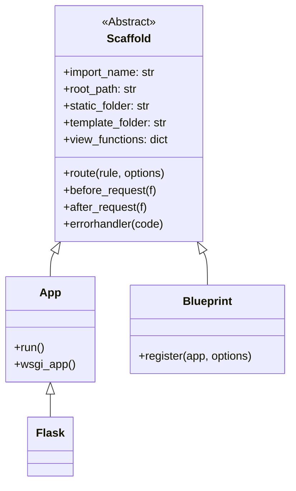
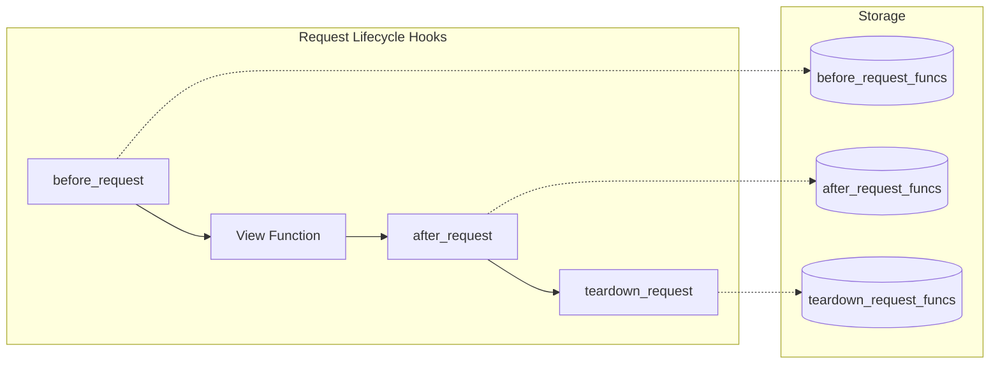
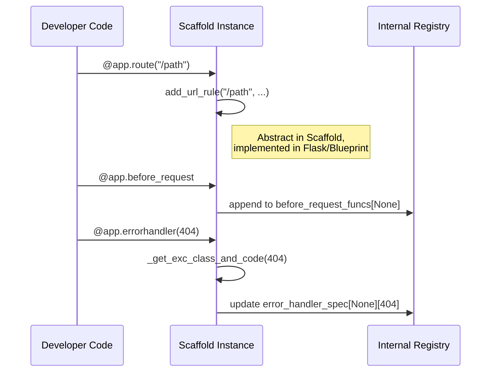

# Scaffold Module

The `scaffold` module provides the foundational `Scaffold` class, which serves as a common base for both the [Flask application](app.md) and [Blueprints](blueprints.md). It encapsulates shared logic for resource management, routing registration, error handling, and request lifecycle hooks.

## Overview

In Flask, both the main application object (`Flask`) and modular components (`Blueprint`) share many behaviors. They both allow registering routes, defining error handlers, and hooking into the request/response cycle. The `Scaffold` class implements these commonalities in a "Sans-IO" manner, meaning it focuses on the data structures and registration logic rather than the specific details of request handling or WSGI.

### Key Responsibilities
- **Resource Management**: Determining the root path and managing static and template folders.
- **Routing Registration**: Providing decorators like `@route`, `@get`, `@post`, etc., to register view functions.
- **Request Hooks**: Managing functions that run before, after, or during the teardown of a request.
- **Error Handling**: Maintaining a registry of exception handlers and status code handlers.
- **Context Management**: Handling template context processors and URL value preprocessors.

## Architecture and Relationships

The `Scaffold` class is the parent of the two most important components in a Flask application structure.

## Core Components

### Scaffold
`src.flask.sansio.scaffold.Scaffold`

The `Scaffold` class is initialized with an `import_name`, which it uses to discover its `root_path`. This path is then used to resolve relative paths for static files and templates.

#### Resource Management
- **`root_path`**: The absolute path to the package/module.
- **`static_folder`**: Path to the folder containing static assets (CSS, JS, images).
- **`template_folder`**: Path to the folder containing Jinja2 templates.
- **`jinja_loader`**: A [Jinja loader](templating.md) (typically `FileSystemLoader`) created based on the `template_folder`.

#### Routing
`Scaffold` provides several decorators for registering routes. These decorators internally call `add_url_rule`, which is implemented by subclasses (like `Flask` or `Blueprint`) to handle the specifics of how routes are added to the routing system.

| Method | Description |
| --- | --- |
| `route(rule, **options)` | General purpose route decorator. |
| `get(rule, **options)` | Shortcut for `GET` requests. |
| `post(rule, **options)` | Shortcut for `POST` requests. |
| `put(rule, **options)` | Shortcut for `PUT` requests. |
| `delete(rule, **options)` | Shortcut for `DELETE` requests. |
| `patch(rule, **options)` | Shortcut for `PATCH` requests. |
| `endpoint(name)` | Registers a view function for a previously defined endpoint. |

#### Request Lifecycle Hooks
`Scaffold` maintains registries for functions that should be called at various stages of a request's life.

- **`before_request`**: Functions called before the view function. If a function returns a value, request handling stops and that value is treated as the response.
- **`after_request`**: Functions called after the view function returns a response. These can modify or replace the response object.
- **`teardown_request`**: Functions called at the end of the request, even if an exception was raised. They are typically used for resource cleanup (e.g., closing database connections).

#### Error Handling
The `errorhandler` decorator and `register_error_handler` method allow registering functions to handle specific HTTP status codes or Python exception classes. These are stored in `error_handler_spec`.

#### Context and URL Processing
- **`context_processor`**: Registers functions that return a dictionary of variables to be injected into the template rendering context.
- **`url_value_preprocessor`**: Functions that can modify URL values before they are passed to the view function.
- **`url_defaults`**: Functions that provide default values for URL generation.

## Data Flow: Registration

When a developer uses a decorator provided by `Scaffold`, the following flow occurs:

## Related Modules
- [**App**](app.md): Implements the concrete `Flask` application which inherits from `Scaffold`.
- [**Blueprints**](blueprints.md): Implements modular components that inherit from `Scaffold`.
- [**Templating**](templating.md): Uses the `jinja_loader` provided by `Scaffold`.
- [**CLI**](cli.md): `Scaffold` integrates with the click-based CLI system via the `cli` attribute.
