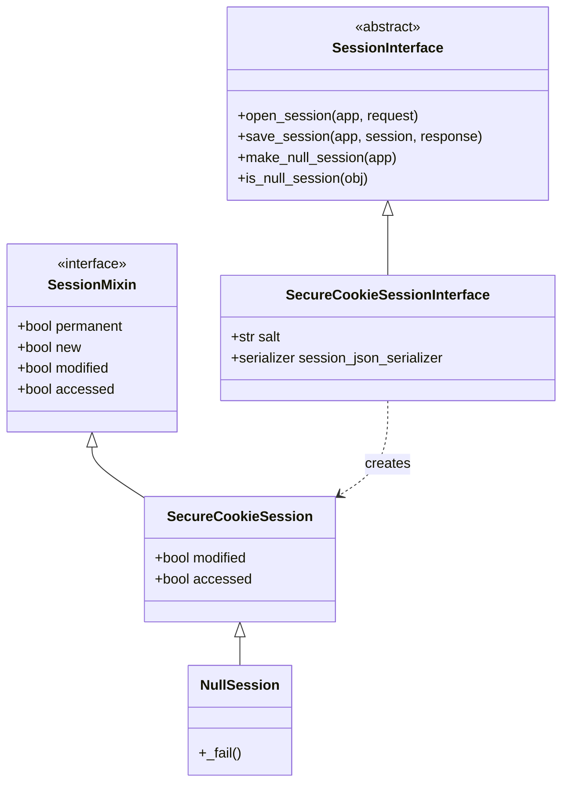
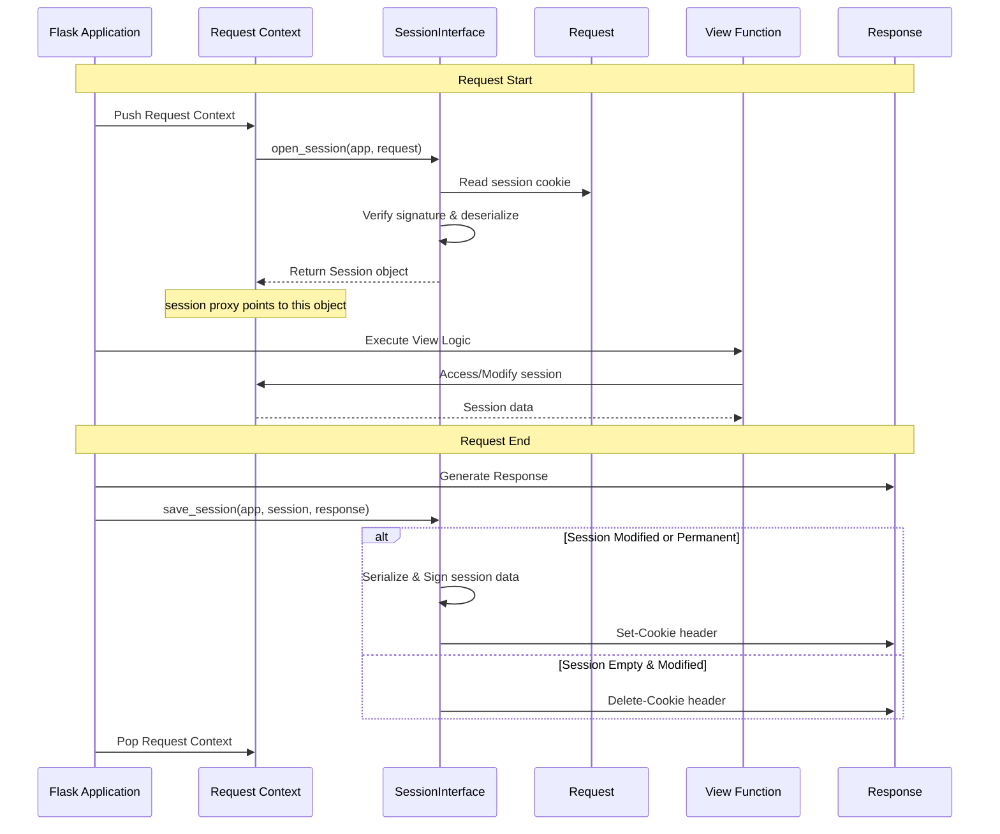

# Sessions Module

The sessions module provides a mechanism for storing user-specific information across multiple requests. It defines the interface for session management and provides a default implementation using signed cookies.

## Architecture

Flask's session system is built around a strategy pattern. The [Flask](app.md) application delegating session handling to a `SessionInterface`. This allows for various storage backends (cookies, server-side databases, etc.) to be used interchangeably.

### Class Hierarchy



## Core Components

### SessionInterface

The `SessionInterface` is the base class for all session implementations. It defines the contract that any session backend must fulfill.

*   **`open_session(app, request)`**: Called at the beginning of a request. It should return an object that implements both a dictionary-like interface and `SessionMixin`.
*   **`save_session(app, session, response)`**: Called at the end of a request. It handles persisting the session data (e.g., by setting a cookie on the response).
*   **`make_null_session(app)`**: Creates a `NullSession` if session support is unavailable (e.g., missing secret key), providing helpful error messages when modification is attempted.

### SessionMixin

`SessionMixin` adds session-specific properties to a dictionary-like object:

*   **`permanent`**: If True, the session will live for the duration defined by `PERMANENT_SESSION_LIFETIME`.
*   **`modified`**: Tracks whether the session data has been changed during the request.
*   **`accessed`**: Tracks whether the session data has been read or written. This is used to set the `Vary: Cookie` header.

### SecureCookieSessionInterface

This is the default session interface used by Flask. It stores session data in a cryptographically signed cookie on the client side using the [itsdangerous](https://itsdangerous.palletsprojects.com/) library.

*   **Security**: Uses the application's `SECRET_KEY` to sign the session cookie, preventing tampering.
*   **Serialization**: Uses [TaggedJSONSerializer](json.md) to convert session data to a string format suitable for cookies.
*   **Storage**: The entire session dictionary is serialized, compressed, and signed into the cookie.

### SecureCookieSession

The session object used by `SecureCookieSessionInterface`. It inherits from `SessionMixin` and `werkzeug.datastructures.CallbackDict`, which allows it to automatically track its own `modified` state when keys are set or deleted.

## Session Lifecycle

The following diagram illustrates how sessions are managed during the lifecycle of a request within the [Request Context](ctx.md).



## Configuration

The session behavior is heavily influenced by the [Config](config.md) of the Flask application:

| Configuration Key | Description |
|---|---|
| `SESSION_COOKIE_NAME` | The name of the cookie used for the session. Default: `'session'`. |
| `SESSION_COOKIE_DOMAIN` | The domain for the session cookie. |
| `SESSION_COOKIE_PATH` | The path for the session cookie. |
| `SESSION_COOKIE_HTTPONLY` | Controls the `HttpOnly` flag on the cookie. |
| `SESSION_COOKIE_SECURE` | Controls the `Secure` flag on the cookie. |
| `SESSION_COOKIE_SAMESITE` | Controls the `SameSite` attribute of the cookie. |
| `PERMANENT_SESSION_LIFETIME` | A `timedelta` object defining how long a permanent session lasts. |
| `SESSION_REFRESH_EACH_REQUEST` | If True, the cookie is sent on every request even if not modified. |

## Custom Session Interfaces

To implement a custom session backend (e.g., using Redis or a database), developers can subclass `SessionInterface` and override `open_session` and `save_session`.

```python
from flask.sessions import SessionInterface

class MySessionInterface(SessionInterface):
    def open_session(self, app, request):
        # Load session from backend
        ...

    def save_session(self, app, session, response):
        # Save session to backend
        ...

app.session_interface = MySessionInterface()
```

For more details on request handling, see the [Wrappers](wrappers.md) documentation.
