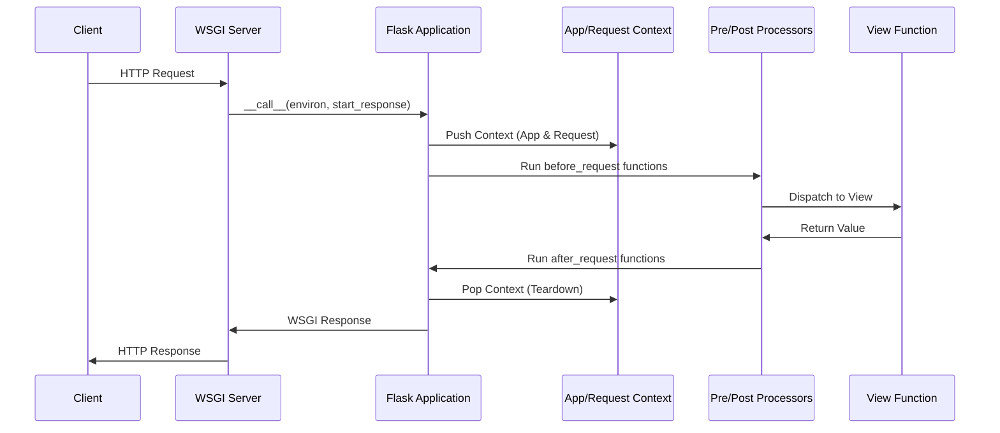

# Flask Core Module (src)

## Overview

The `src` module contains the core implementation of the Flask web framework. Flask is a lightweight WSGI web application framework designed to make getting started quick and easy, with the ability to scale up to complex applications.

At its heart, Flask manages the lifecycle of a web request, providing tools for routing, template rendering, configuration management, and session handling. It uses a "context" system to make application and request-specific data available globally within a thread or coroutine without passing objects explicitly.

## Core Architecture

Flask operates as a WSGI (Web Server Gateway Interface) application. The following diagram illustrates the high-level request-response lifecycle:

## Sub-module Directory

The framework is divided into several specialized sub-modules:

| Sub-module | Description |
| --- | --- |
| [app](app.md) | The central `Flask` application object and base `Scaffold` logic. |
| [blueprints](blueprints.md) | Modular application structure and registration logic. |
| [ctx](ctx.md) | Application and Request context management. |
| [wrappers](wrappers.md) | Flask-specific extensions to Werkzeug's Request and Response objects. |
| [config](config.md) | Configuration loading and management system. |
| [sessions](sessions.md) | Server-side and client-side session persistence interfaces. |
| [json](json.md) | Extensible JSON serialization and tagging system. |
| [cli](cli.md) | Integration with Click for command-line management. |
| [templating](templating.md) | Integration with the Jinja2 template engine. |
| [testing](testing.md) | Utilities for unit testing Flask applications and CLI commands. |
| [views](views.md) | Generic and method-based class views. |

## Key Concepts

### The Scaffold
The `Scaffold` class provides a common base for both the `Flask` application and `Blueprint` objects. It handles the registration of routes, error handlers, and lifecycle hooks (like `@before_request`).

### Context Management
Flask uses `AppContext` to manage state. A context is pushed when a request begins, making `current_app`, `request`, `g`, and `session` available via proxies.

### Blueprints
Blueprints allow for modular application development. They record operations to be performed when registered on an application, allowing for shared URL prefixes, subdomains, and template folders.
