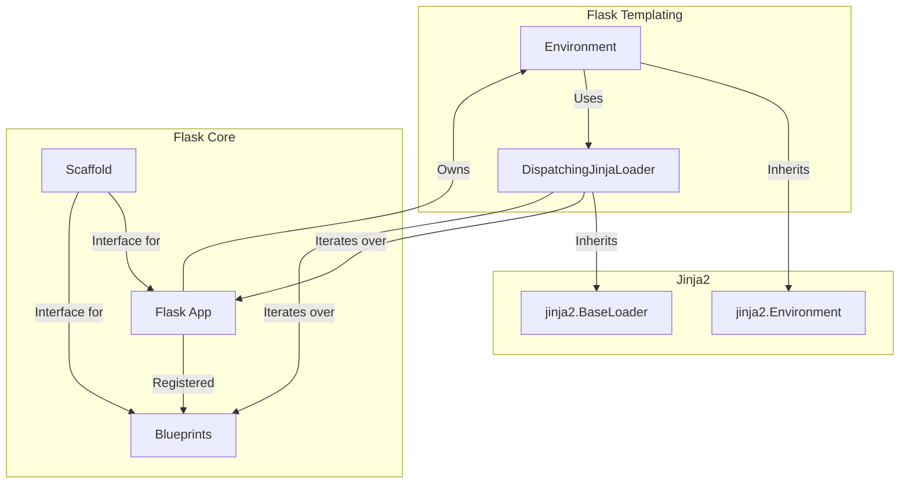
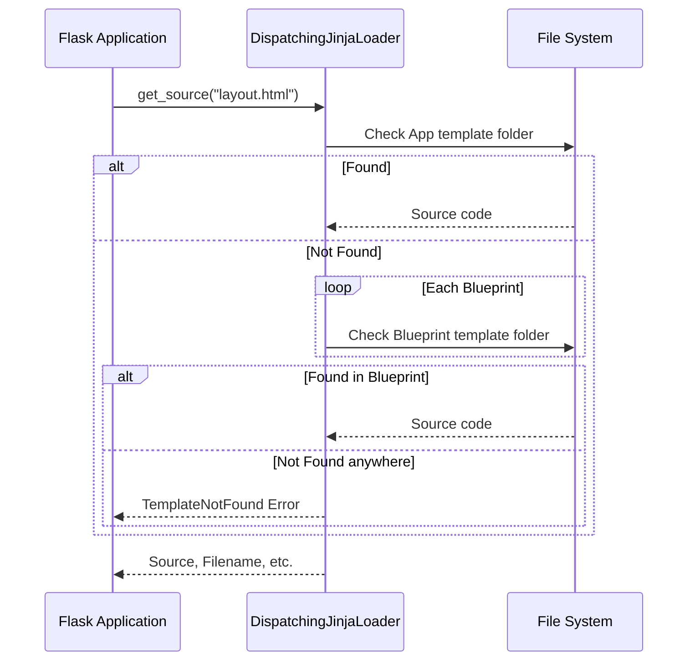

# Templating Module

The `templating` module integrates the Jinja2 templating engine into Flask. It provides a customized environment and a dispatching loader that allows Flask to resolve templates from both the application's main template directory and any registered blueprints.

## Overview

Flask's templating system is built on top of [Jinja2](https://jinja.palletsprojects.com/). The module extends Jinja2 to support Flask-specific features such as:
- **Blueprint-aware template loading**: Templates can be stored within blueprint directories.
- **Context injection**: Automatic availability of `request`, `session`, `g`, and `config` within templates.
- **Streaming**: Support for rendering large templates as a stream of chunks.
- **Signals**: Hooks for pre- and post-rendering events.

## Architecture

The following diagram illustrates how the templating module interacts with the Flask application and Jinja2.

## Core Components

### Environment
The `Environment` class (subclass of `jinja2.Environment`) is the central configuration object for Jinja2 in a Flask application. It holds references to filters, tests, and the loader.

- **Initialization**: When created, it defaults to using a loader provided by the application (usually `DispatchingJinjaLoader`).
- **Blueprint Awareness**: It maintains a reference to the Flask application object, allowing it to integrate with Flask's blueprint system.

### DispatchingJinjaLoader
The `DispatchingJinjaLoader` is responsible for finding templates. Unlike a standard file system loader, it searches multiple locations:

1.  **Application Templates**: First, it checks the template folder of the [Flask application](app.md).
2.  **Blueprint Templates**: If not found in the application, it iterates through all registered [blueprints](blueprints.md) and checks their respective template folders.

#### Template Resolution Process

If the configuration `EXPLAIN_TEMPLATE_LOADING` is enabled, the loader records every attempt to find a template, which is useful for debugging template overrides.

## Template Rendering Flow

When a developer calls `render_template`, the following sequence occurs:

1.  **Context Setup**: The current [application context](ctx.md) is retrieved.
2.  **Template Retrieval**: The `Environment` is asked for the template. It uses the `DispatchingJinjaLoader` to find the source.
3.  **Context Enrichment**: Flask updates the template context with:
    - Default variables: `g`, `request`, `session` (via `_default_template_ctx_processor`).
    - Application-wide context (from `app.context_processor`).
4.  **Signals**: The `before_render_template` signal is sent.
5.  **Rendering**: Jinja2 renders the template with the enriched context.
6.  **Signals**: The `template_rendered` signal is sent.
7.  **Result**: The rendered string is returned.

## Public API

The module provides several high-level functions for rendering templates:

| Function | Description |
| --- | --- |
| `render_template(name, **context)` | Renders a template file by name. |
| `render_template_string(source, **context)` | Renders a template from a string. |
| `stream_template(name, **context)` | Renders a template file as a stream (iterator). |
| `stream_template_string(source, **context)` | Renders a template string as a stream. |

## Context Processing
The `_default_template_ctx_processor` ensures that common Flask objects are always available in templates if a request is active:

- `g`: The [application globals](globals.md).
- `request`: The current [Request](wrappers.md) object.
- `session`: The current [Session](sessions.md) object.

## See Also
- [Application Object](app.md)
- [Blueprints](blueprints.md)
- [Context Management](ctx.md)
- [Request/Response Wrappers](wrappers.md)
