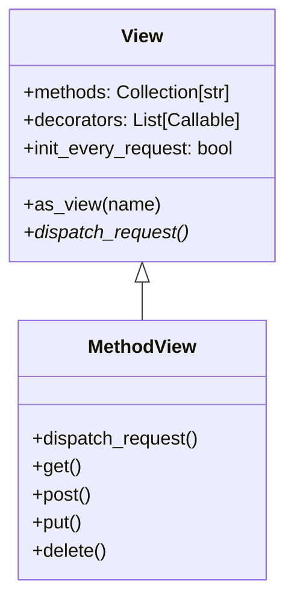
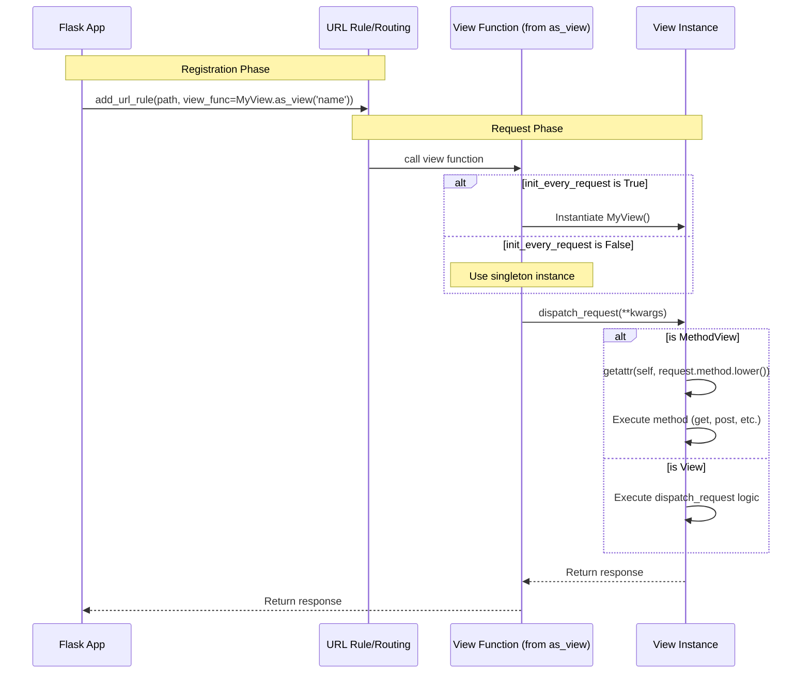

# Views Module

The `views` module provides a set of class-based view utilities for Flask. Class-based views allow for better code reuse and organization compared to traditional function-based views, especially when dealing with complex logic or RESTful APIs.

## Core Concepts

The module is built around two primary classes: `View` and `MethodView`. These classes allow you to define request handling logic as methods within a class, which can then be converted into a standard Flask view function.

### Key Components

#### [View](app.md#view)
The base class for all class-based views. It provides the infrastructure to convert a class into a callable view function that Flask's routing system can understand.

- **`as_view(name, *class_args, **class_kwargs)`**: A class method that returns a view function. This function, when called, instantiates the class (if `init_every_request` is True) and calls `dispatch_request`.
- **`dispatch_request()`**: The method that subclasses must override to implement the actual request handling logic.
- **`decorators`**: A list of decorators to apply to the generated view function.
- **`init_every_request`**: A boolean flag (default `True`) that determines if a new instance of the class should be created for every request.

#### [MethodView](app.md#methodview)
A specialized subclass of `View` that automatically dispatches requests to class methods based on the HTTP method used (e.g., `get()`, `post()`, etc.). This is particularly useful for building RESTful APIs.

- **Automatic Method Discovery**: `MethodView` automatically populates the `methods` attribute based on the defined handler methods.
- **HEAD Request Handling**: If a `GET` method is defined but `HEAD` is not, it automatically falls back to the `GET` handler for `HEAD` requests.

## Architecture and Interaction

### Class Hierarchy



### Request Flow

The following diagram illustrates how a request is processed when using a class-based view.



## Lifecycle and Configuration

### Initialization Modes

Flask provides two ways to handle view instantiation:

1.  **Per-Request (Default)**: `init_every_request = True`. A fresh instance of the view class is created for every request. This is safer as it prevents state leakage between requests but has a slight performance overhead.
2.  **Persistent**: `init_every_request = False`. A single instance is created when `as_view` is called and reused for all requests. This is more efficient but requires using `flask.g` for request-specific state instead of `self`.

### Decorators

Decorators applied directly to a class-based view class do not behave like decorators on functions. Instead, the `decorators` class attribute should be used. These decorators are applied to the view function generated by `as_view`.

```python
class MyView(View):
    decorators = [auth_required, cache.cached(timeout=60)]
    
    def dispatch_request(self):
        return "Protected content"
```

## Integration with Other Modules

- **[app.md](app.md)**: Class-based views are registered on the `Flask` application object using `add_url_rule`.
- **[blueprints.md](blueprints.md)**: Views can also be registered on blueprints.
- **[globals.md](globals.md)**: Views typically interact with `request` to inspect incoming data and `current_app` for application-level logic.
- **[wrappers.md](wrappers.md)**: The return value of `dispatch_request` is usually a string, tuple, or `Response` object defined in the wrappers module.

## Summary of Method Dispatching in MethodView

| Request Method | MethodView Handler | Fallback |
| :--- | :--- | :--- |
| `GET` | `get()` | - |
| `POST` | `post()` | - |
| `PUT` | `put()` | - |
| `DELETE` | `delete()` | - |
| `PATCH` | `patch()` | - |
| `HEAD` | `head()` | `get()` |
| `OPTIONS` | `options()` | Automatic (if enabled) |
