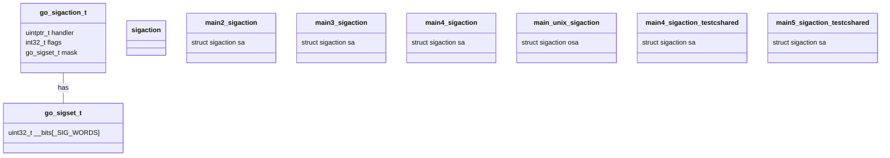
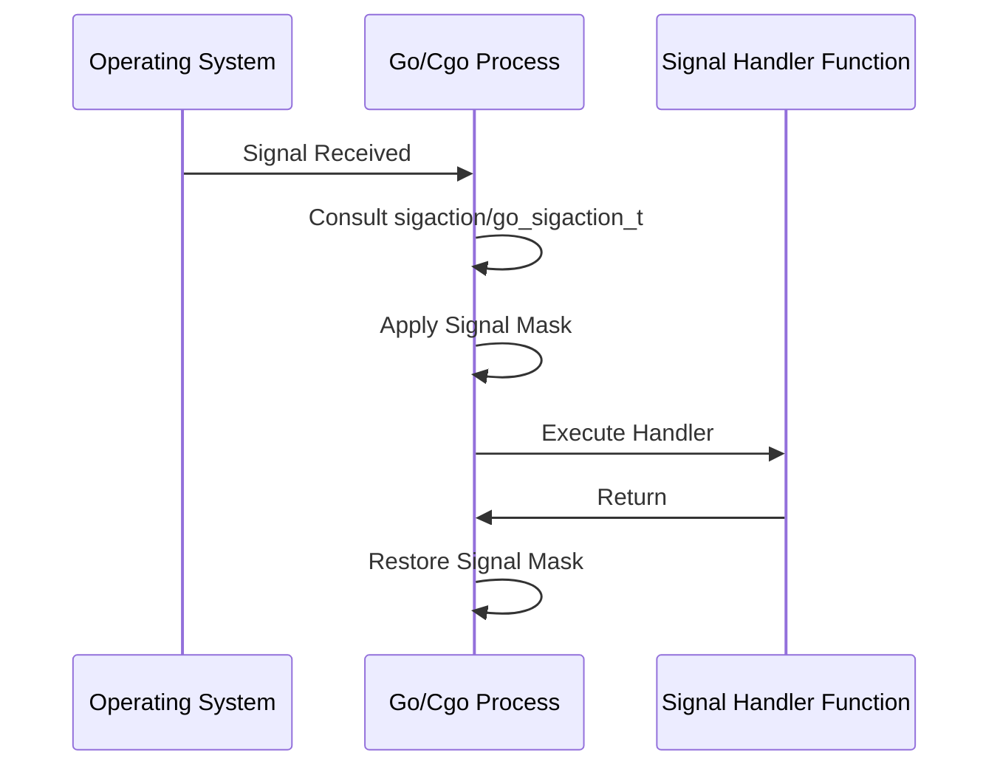

# Signal Handling

## Introduction

This module focuses on signal handling within the `runtime/cgo` package. It provides the necessary structures and functions to manage signals when Go code interacts with C code using cgo. Signal handling is crucial for maintaining the stability and predictability of applications that rely on both Go and C components. This documentation outlines the key components involved in signal management, their relationships, and how they contribute to the overall system.

## Overview

Signal handling in `runtime/cgo` involves defining signal actions, managing signal masks, and ensuring that signals are delivered and processed correctly. The module deals with the differences in signal handling mechanisms between Go and C, particularly in the context of cgo, where Go code calls C code and vice versa.

## Architecture

The architecture of the Signal Handling module revolves around the `sigaction` structure, `go_sigaction_t` and `go_sigset_t`. These structures are used to define the action to be taken when a signal is received, the set of signals to block during the execution of a signal handler, and related signal information.

## Component Details

### 1. `sigaction` Structure

- **Location:** `src/runtime/cgo/gcc_freebsd_sigaction.c`, `src/runtime/cgo/gcc_sigaction.c`, `src/cmd/cgo/internal/testcarchive/testdata/main2.c`, `src/cmd/cgo/internal/testcarchive/testdata/main3.c`, `src/cmd/cgo/internal/testcarchive/testdata/main4.c`, `src/cmd/cgo/internal/testcarchive/testdata/main_unix.c`, `src/cmd/cgo/internal/testcshared/testdata/main4.c`, `src/cmd/cgo/internal/testcshared/testdata/main5.c`
- **Description:** This structure, part of the standard C library, defines how a signal is handled. It typically includes a handler function (or a predefined action) and a set of flags.
- **Usage:** Used to set up signal handlers for specific signals.

### 2. `go_sigaction_t` Structure

- **Location:** `src/runtime/cgo/gcc_freebsd_sigaction.c`, `src/runtime/cgo/gcc_sigaction.c`
- **Description:** This structure represents a Go-compatible signal action.
- **Fields:**
  - `handler`: A uintptr_t representing the signal handler function.
  - `flags`: Flags associated with the signal action.
  - `mask`: A `go_sigset_t` representing the signal mask.

### 3. `go_sigset_t` Structure

- **Location:** `src/runtime/cgo/gcc_freebsd_sigaction.c`
- **Description:** Represents a set of signals to be blocked during the execution of a signal handler.
- **Fields:**
  - `__bits`: An array of `uint32_t` representing the signal set.

## Data Flow

The data flow in signal handling involves setting up signal actions, receiving signals, and executing the corresponding handlers. When a signal is received, the operating system consults the `sigaction` structure (or its Go equivalent, `go_sigaction_t`) to determine the appropriate action. The signal mask is applied to block certain signals during the execution of the handler.

## Relationships to Other Modules

The Signal Handling module interacts closely with other modules within the `runtime/cgo` package. Specifically, it relates to:

- **Context Management:** The execution context of signal handlers might require coordination with context management to ensure proper state and resource handling. See [Context Management](Context Management.md).
- **Thread Management:** Signal handling can affect thread execution, especially when signals interrupt C code running in separate threads. See [Thread Management](Thread Management.md).

## Notes

The `sigaction` structures found in `src/cmd/cgo/internal/testcarchive/testdata` and `src/cmd/cgo/internal/testcshared/testdata` are primarily used for testing purposes within the cgo toolchain. They demonstrate how signal handling is set up and used in specific test cases.
