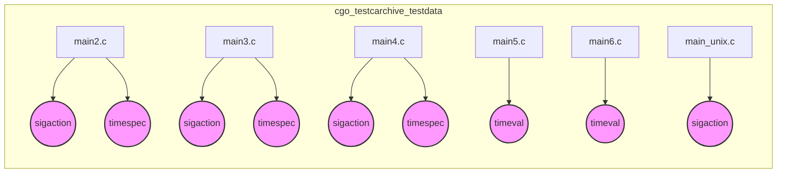

# cgo_testcarchive_testdata Module Documentation

## Overview

The `cgo_testcarchive_testdata` module contains test data and C code used to test the `cgo` tool's archive functionality. It includes several `mainX.c` files and `main_unix.c`, each focusing on different aspects of signal handling, time management, and interaction with the operating system. This module is crucial for ensuring the correct behavior of `cgo` when creating and using C archives.

## Architecture

The module consists of multiple C files, each acting as a separate test case. These files primarily define `struct sigaction` and `struct timespec` variables and demonstrate their usage in various contexts. The `main_unix.c` file contains unix-specific code, dealing with signal actions.

## Functionality

- **main2.c**: Defines `struct sigaction` and `struct timespec`.
- **main3.c**: Defines `struct sigaction` and `struct timespec`.
- **main4.c**: Defines `struct sigaction` and `struct timespec`.
- **main5.c**: Defines `struct timeval`.
- **main6.c**: Defines `struct timeval`.
- **main_unix.c**: Defines `struct sigaction`.

## Core Components

- `sigaction`: Structure for defining signal handling actions.
- `timespec`: Structure for specifying time intervals with nanosecond precision.
- `timeval`: Structure for specifying time intervals with microsecond precision.

## Relationships to Other Modules

This module is related to the `runtime_cgo` module as it tests the C-Go interface, especially signal handling aspects. Refer to the [runtime_cgo.md](runtime_cgo.md) documentation for more details on the runtime aspects of C-Go integration.
