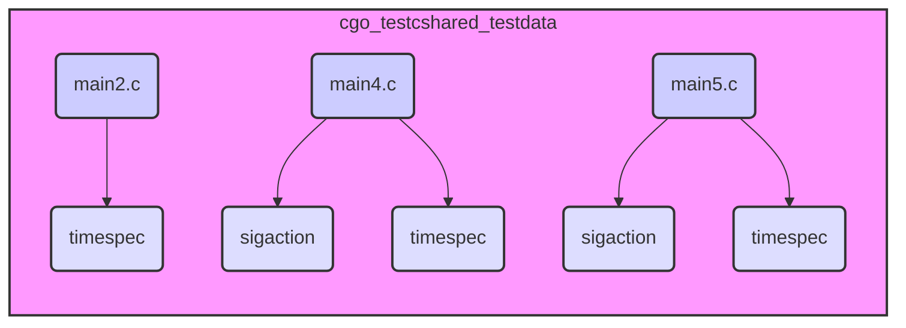

# cgo_testcshared_testdata Module Documentation

## Overview

The `cgo_testcshared_testdata` module contains test data and C code snippets used for testing the `cgo` tool, specifically focusing on scenarios involving shared libraries. It provides various C structs like `timespec` and `sigaction` to validate the behavior of `cgo` when interacting with C code in shared library contexts.

## Architecture

The module consists of several C files (e.g., `main2.c`, `main4.c`, `main5.c`), each containing different test cases. These test cases often involve the definition and usage of C structs. The module's architecture is relatively simple, with each C file representing a distinct test scenario.

## Core Functionality

*   **main2.c:** Defines and uses the `timespec` struct. See [main2.md](main2.md) for details.
*   **main4.c:** Defines and uses the `sigaction` and `timespec` structs. See [main4.md](main4.md) for details.
*   **main5.c:** Defines and uses the `sigaction` and `timespec` structs. See [main5.md](main5.md) for details.

## Relationship to Other Modules

This module is part of the `cmd/cgo` toolchain and is used for testing. It shares some common C struct definitions (e.g., `sigaction`, `timespec`) with other `cgo` test modules, such as `cgo_testcarchive_testdata`, but the specific test scenarios and usage may differ.
