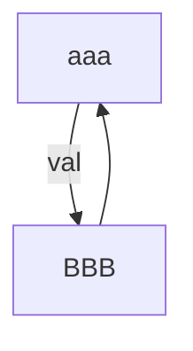

# Cycle Module Documentation

## Introduction

The `cycle` module, located within the `debug_dwarf_testdata` package, is designed to test the DWARF debugging information generation for programs containing cyclic data structures. Specifically, it examines how the debugger handles structures that refer to each other, creating a cycle.

## Architecture

The module consists of a single core component, `src.debug.dwarf.testdata.cycle.aaa`, which defines a structure `aaa` containing a member `val` of type `BBB`. The `BBB` type is assumed to be defined elsewhere (likely in another file within the same `testdata` directory) and refers back to `aaa`, creating a cycle.



## Component Details

### src.debug.dwarf.testdata.cycle.aaa

This component defines the structure `aaa`:

```c
struct aaa { BBB val; };
```

It contains a single field `val` of type `BBB`. This structure is part of a larger test case designed to evaluate how debuggers handle cyclic data structures.

## Relationships with Other Modules

This module is a part of the `debug_dwarf_testdata` module. It shares the same parent directory with the [bitfields](bitfields.md) and [typedef](typedef.md) modules, and likely interacts with them or other modules within the `debug_dwarf_testdata` when running complete test scenarios for DWARF generation.

## Data Flow

The module itself does not involve complex data flows. It primarily serves as a data structure definition for testing purposes. The data flow would occur during debugging, when the debugger attempts to inspect instances of the `aaa` structure and navigate the cyclic relationship between `aaa` and `BBB`.

## Usage

This module is used as part of the test suite for the DWARF debugging information generator. It helps ensure that the debugger can correctly handle cyclic data structures, providing accurate information about the structure's members and relationships.
