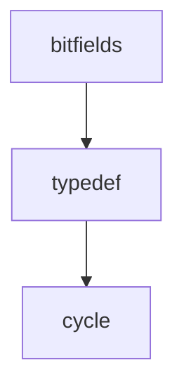

# debug_dwarf_testdata Module Documentation

## Overview

The `debug_dwarf_testdata` module provides a collection of C data structures used for testing the `debug/dwarf` package in Go. It includes various data types, such as structures with bitfields, typedefs, and cyclic dependencies, which are designed to test the DWARF expression evaluation and type parsing capabilities of the `debug/dwarf` package.

## Architecture

The module consists of several sub-modules, each focusing on a specific aspect of DWARF testing. The relationships between these sub-modules are illustrated below:

### Sub-modules:

- **bitfields**: Contains structures with bitfield members. See [bitfields.md](bitfields.md) for details.
- **typedef**: Defines various typedefs, including structs and lists. See [typedef.md](typedef.md) for details.
- **cycle**: Defines structs with cyclic dependencies. See [cycle.md](cycle.md) for details.

## Core Functionality

The `debug_dwarf_testdata` module serves as a data source for tests in the `debug/dwarf` package. It defines a variety of C data structures with different complexities and features. These data structures are then compiled into object files, and the DWARF debugging information embedded in these files is used by the `debug/dwarf` package to test its ability to parse and interpret DWARF data.
