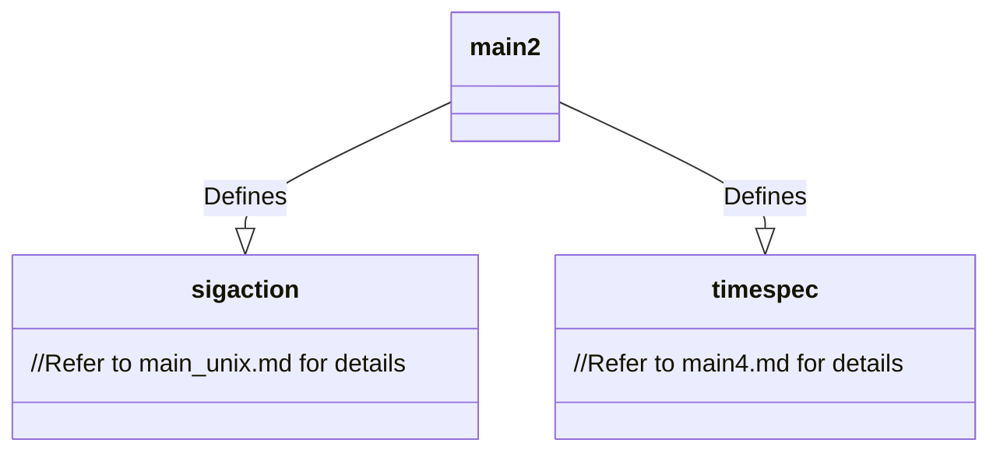
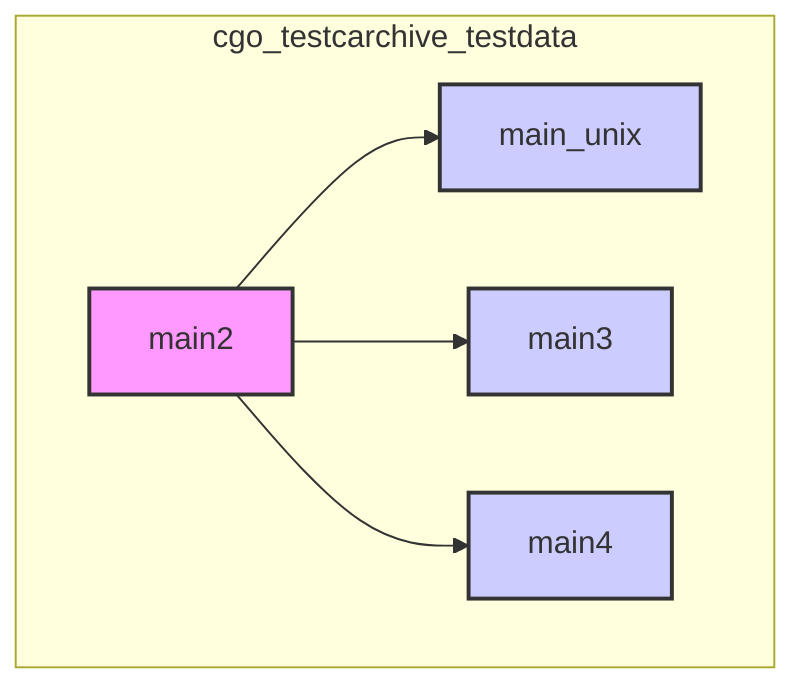

# Main2 Module Documentation

## Introduction

This module, `main2`, is part of the `cgo_testcarchive_testdata` package and focuses on testing the `cgo` tool's ability to handle struct definitions when creating archives. It defines and uses structures related to signal handling and time specifications, specifically `sigaction` and `timespec`. These structures are commonly used in Unix-like systems for asynchronous signal handling and precise time management.

## Architecture

The module primarily deals with the declaration of two C structures: `sigaction` and `timespec`. These structures are used within the larger test suite to verify `cgo`'s handling of C structures when creating static archives.

## Component Details

### sigaction

*   **Definition:** `struct sigaction sa;` (Line 98)
*   **Description:** This structure is fundamental to POSIX signal handling. It allows a process to specify the action to be taken upon receiving a specific signal. The `sigaction` structure includes fields to specify a signal handler function, a set of signals to be blocked during the execution of the handler, and a set of flags that modify the behavior of the signal handling.
*   **See Also:** For detailed information about the `sigaction` structure, refer to the [main_unix module documentation](main_unix.md), where `sigaction` is also used and potentially described in more detail.

### timespec

*   **Definition:** `struct timespec ts;` (Line 125)
*   **Description:** The `timespec` structure is used to represent time with nanosecond precision. It is commonly used in system calls dealing with time, such as `clock_gettime` and `nanosleep`. It contains fields for seconds and nanoseconds.
*   **See Also:** For detailed information about the `timespec` structure, refer to the [main4 module documentation](main4.md), where `timespec` is also used and potentially described in more detail.

## Module Relationships

This module is closely related to other `mainX` modules within the `cgo_testcarchive_testdata` package, such as `main3`, `main4`, and `main_unix`. These modules likely share similar goals of testing `cgo` with different structure definitions. The `sigaction` structure is also present in `main_unix`, and the `timespec` structure is also present in `main3` and `main4`.

## Usage

The `main2` module, as part of the `cgo_testcarchive_testdata` test suite, doesn't have direct usage in application code. Instead, it is used internally by the Go toolchain to ensure that `cgo` correctly handles C structure definitions during archive creation.
