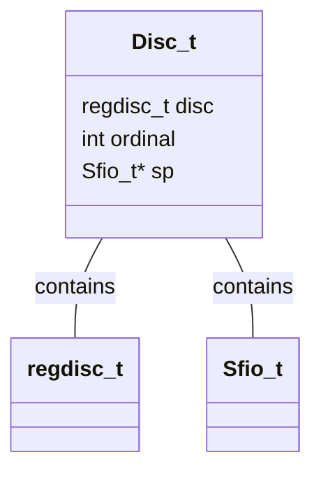

# regexp_testdata Module Documentation

## Introduction

The `regexp_testdata` module primarily serves as a test suite for regular expression functionalities. It defines data structures necessary for testing and benchmarking regular expression engines.

## Architecture

The module revolves around a central data structure, `Disc_t`, used to manage regular expression testing within a specific discipline. This structure holds vital context for the tests, facilitating organized and repeatable testing.



### Component Details

#### `Disc_t`

This structure is the core of the module, it is defined as:

```c
typedef struct Disc_s
{
	regdisc_t	disc;
	int		ordinal;
	Sfio_t*	sp;
} Disc_t;
```

*   `disc`: An instance of `regdisc_t`, likely containing discipline-specific information for regular expression operations.
*   `ordinal`: An integer representing the ordinal number or index of the discipline.
*   `sp`: A pointer to an `Sfio_t` stream, probably used for input/output operations during regular expression testing.

## Relationships to Other Modules

While this module primarily focuses on testing regular expressions, it doesn't have direct dependencies on other modules in the provided module tree. However, it is possible that the `Sfio_t` type has its definitions and implementations in another module not present in the provided module tree. The `regexp_testdata` module relies on external functionalities for regular expression processing and input/output operations, which would typically reside in separate modules dedicated to those tasks.
