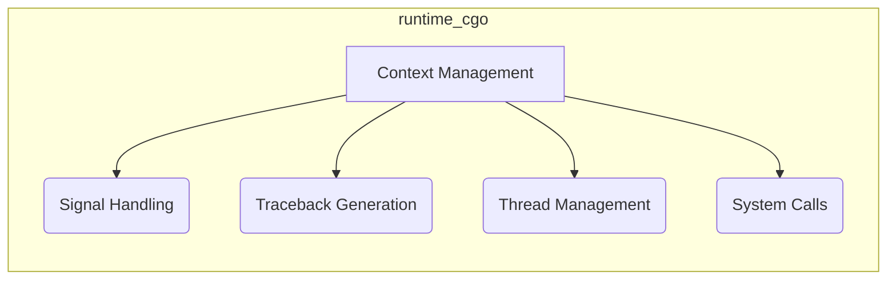

# runtime_cgo Module Documentation

## Introduction

The `runtime_cgo` module provides the necessary functionality for Go programs to interact with C code. It enables calling C functions from Go and vice versa, allowing Go programs to leverage existing C libraries and system interfaces. This module handles the complexities of data conversion, memory management, and signal handling between the Go runtime and the C environment.

## Architecture

The `runtime_cgo` module can be conceptually divided into several sub-modules, each responsible for a specific aspect of CGO integration:

- **Context Management:** Handles the creation and management of C contexts.
- **Signal Handling:**  Deals with signal handling between Go and C, ensuring proper signal delivery and execution.
- **Traceback Generation:** Provides support for generating tracebacks that include both Go and C code.
- **Thread Management:** Manages the creation and execution of threads when interacting with C code.
- **System Calls:** Provides support for making system calls from C code.

## Sub-modules Functionality

### Context Management

This sub-module is responsible for managing the C context required for CGO calls. It includes the `cgoContextArg` structure, which is used to pass context information between Go and C. See [Context Management Documentation](context_management.md) for more details.

### Signal Handling

This sub-module handles signal delivery and execution within the CGO environment. It includes structures like `sigaction`, `go_sigset_t`, and `go_sigaction_t` to manage signal handlers and masks. See [Signal Handling Documentation](signal_handling.md) for more details.

### Traceback Generation

This sub-module provides the functionality to generate tracebacks that include both Go and C code. It uses structures like `cgoTracebackArg` and `cgoSymbolizerArg` to collect information about the call stack and symbol names. See [Traceback Generation Documentation](traceback_generation.md) for more details.

### Thread Management

This sub-module manages the creation and execution of threads when interacting with C code. It includes the `ThreadStart` structure, which is used to start new threads with a specified Go function and TLS. See [Thread Management Documentation](thread_management.md) for more details.

### System Calls

This sub-module supports making system calls from C code, using the `argset_t` structure to pass arguments and retrieve return values. See [System Calls Documentation](system_calls.md) for more details.

## Integration with Other Modules

The `runtime_cgo` module interacts with other Go runtime modules to provide complete CGO functionality. These interactions include:

- **runtime:** The `runtime` module provides the Go runtime environment, including memory management, garbage collection, and scheduling.

## Notes

The specifics of signal handling may vary depending on the target operating system (e.g., FreeBSD, Linux).
