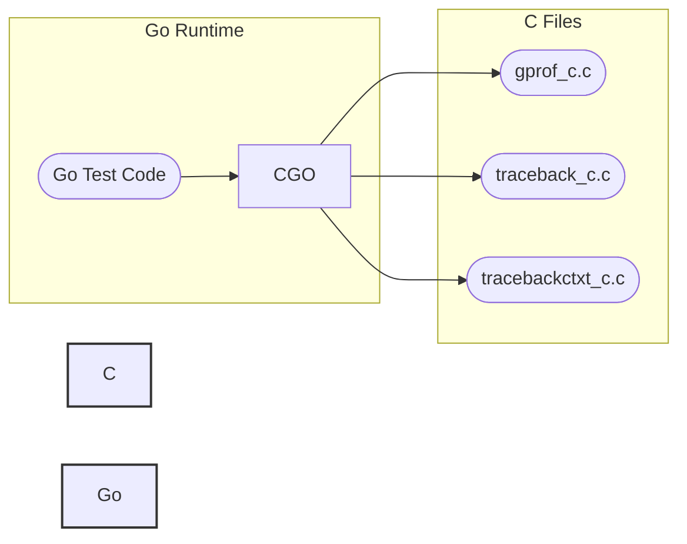

# runtime_testdata_testprogcgo

This module contains test data and C code to test CGO functionality within the Go runtime. It specifically focuses on testing aspects like profiling with gprof and generating/handling tracebacks in CGO scenarios. The tests within this module verify that the Go runtime correctly interacts with C code, particularly when dealing with function calls between Go and C.

## Architecture

This module primarily consists of C files that define functions callable from Go code via CGO. These C functions often manipulate data structures passed from Go or trigger scenarios that test the runtime's behavior. Below is a high-level diagram of the module's architecture.

## Sub-modules and Functionality

*   **gprof_c:** This sub-module (`gprof_c.c`) contains C code related to testing profiling functionality with `gprof`. It includes definitions necessary for interacting with the Go runtime and verifying that profiling data is correctly generated.
*   **traceback_c:** This sub-module (`traceback_c.c`) provides C functions for testing traceback generation in CGO scenarios. These functions are called from Go test code to trigger specific conditions and verify the correctness of the generated tracebacks. See [traceback_c.md](traceback_c.md) for more details.
*   **tracebackctxt_c:** Similar to `traceback_c`, the `tracebackctxt_c` sub-module (`tracebackctxt_c.c`) focuses on testing tracebacks, but it seems to emphasize context handling during traceback generation. See [tracebackctxt_c.md](tracebackctxt_c.md) for more details. 
