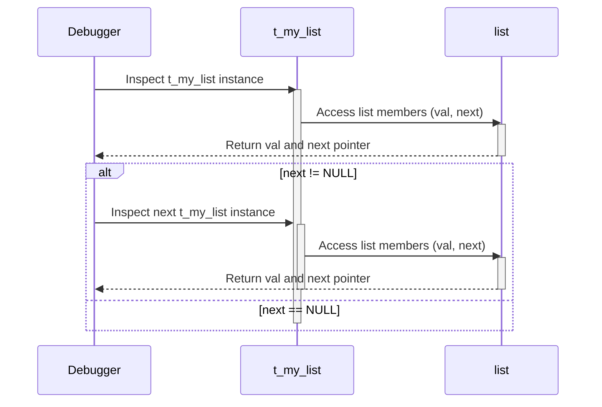

# debug_dwarf_testdata - typedef Module Documentation

## Introduction

This module, `typedef`, is part of the `debug_dwarf_testdata` suite and focuses on testing the handling of typedefs in DWARF debugging information. It defines several structures and typedefs, including `t_my_struct`, `t_my_struct1`, `t_my_list`, and `t_my_tree`, to represent different data structures and their type definitions. This module is designed to verify that debuggers can correctly interpret and display variables and data structures that involve typedefs.

## Architecture

The module consists of a single C file (`typedef.c`) that defines several structs and their corresponding typedefs. The primary purpose is to create a variety of typedef scenarios for testing DWARF debugging capabilities.


## Component Details

### 1. `t_my_struct` and `my_struct`

```c
typedef struct my_struct {
	volatile int vi;
	char x : 1;
	int y : 4;
	int z[0];
	long long array[40];
	int zz[0];
} t_my_struct;
```

- `t_my_struct` is a typedef for `struct my_struct`.
- `my_struct` contains a volatile integer (`vi`), bit fields (`x`, `y`), zero-length arrays (`z`, `zz`), and a large array (`array`).
- The purpose is to test the debugger's ability to handle various data types and array sizes within a struct, as well as bitfields and volatile variables.

### 2. `t_my_struct1` and `my_struct1`

```c
typedef struct my_struct1 {
	int zz [1];
} t_my_struct1;
```

- `t_my_struct1` is a typedef for `struct my_struct1`.
- `my_struct1` contains a single-element integer array.
- This tests the debugger's handling of simple structs with small arrays.

### 3. `t_my_list` and `list`

```c
typedef struct list t_my_list;

struct list {
	short val;
	t_my_list *next;
};
```

- `t_my_list` is a typedef for `struct list`.
- `list` represents a node in a linked list, containing a short value (`val`) and a pointer (`next`) to the next node.
- This tests the debugger's ability to handle forward declarations and linked data structures.

### 4. `t_my_tree` and `tree`

```c
typedef struct tree {
	struct tree *left, *right;
	unsigned long long val;
} t_my_tree;
```

- `t_my_tree` is a typedef for `struct tree`.
- `tree` represents a node in a binary tree, containing pointers to the left and right child nodes and an unsigned long long value.
- This tests the debugger's handling of self-referential structures and tree-like data structures.

## Data Flow

There isn't explicit data flow in the sense of a running program. This module primarily defines data structures. However, a debugger might traverse these structures to inspect their contents. For example, when inspecting a `t_my_list`, the debugger would follow the `next` pointer to iterate through the list.



## Relationships to Other Modules

This module is part of the `debug_dwarf_testdata` suite. It is related to other modules like `bitfields` ([bitfields.md]) and `cycle` ([cycle.md]) in that they all serve as test cases for the DWARF debugging information. This module focuses specifically on typedefs, while others test different aspects of DWARF, such as bitfields or cyclic data structures.

## Usage

This module is not intended for direct use in applications. Instead, it provides data structures that are inspected by debuggers to verify their correct handling of DWARF debugging information related to typedefs.
