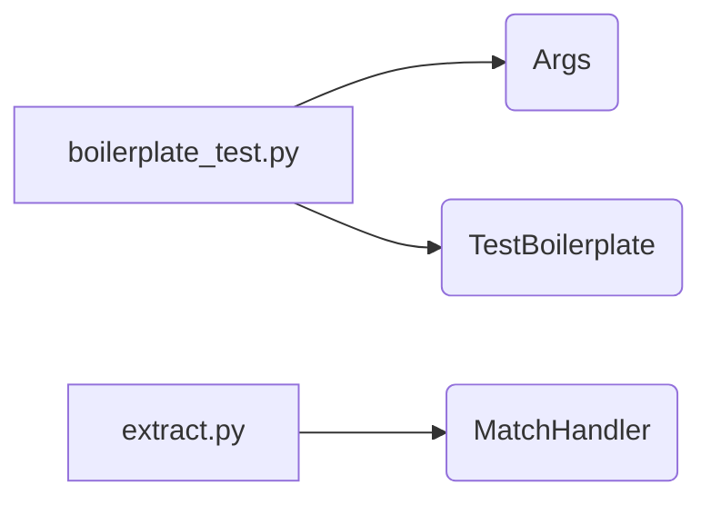

# Main Module Documentation

## Overview

This module consists of components for boilerplate checking and regular expression matching. It includes a test suite for verifying the boilerplate and a handler for matching regular expressions in files.

## Architecture

The module has the following structure:

-   `boilerplate_test.py` contains the `Args` class for storing arguments and `TestBoilerplate` class for testing the boilerplate.
-   `extract.py` contains the `MatchHandler` class for handling regular expression matching.

## Sub-modules Functionality

### `hack.boilerplate.boilerplate_test`

The `hack.boilerplate.boilerplate_test` sub-module contains components related to boilerplate checking, including argument handling and testing.
- `Args`: Defines arguments used by the boilerplate checker.
- `TestBoilerplate`: Implements a unit test to verify the boilerplate in files. This test checks for the correct boilerplate headers in the specified files.

### `staging.src.k8s.io.kubectl.pkg.util.i18n.translations.extract`

The `staging.src.k8s.io.kubectl.pkg.util.i18n.translations.extract` sub-module provides functionality for matching regular expressions in files.
- `MatchHandler`: Handles regular expression matching, holding a compiled regular expression and a function to execute upon a match.
