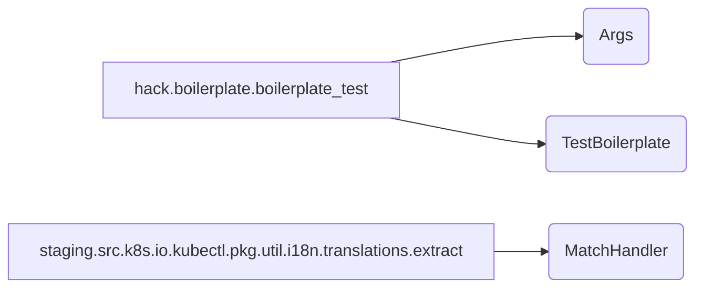

## Kubernetes Repository Overview

This repository contains a collection of tools and utilities for Kubernetes development, testing, and internationalization. It includes components for boilerplate checking, regular expression matching, and other helper functions.

## Architecture

The repository's architecture can be visualized as follows:

This diagram illustrates the main modules and their key components. The `hack.boilerplate.boilerplate_test` module focuses on boilerplate verification, while the `staging.src.k8s.io.kubectl.pkg.util.i18n.translations.extract` module provides regular expression matching capabilities.

## Core Modules Documentation

- [Main](main.md)