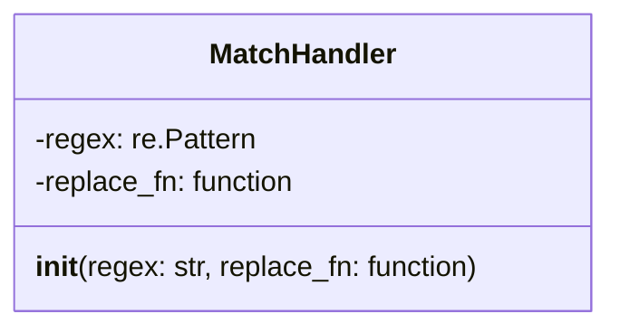
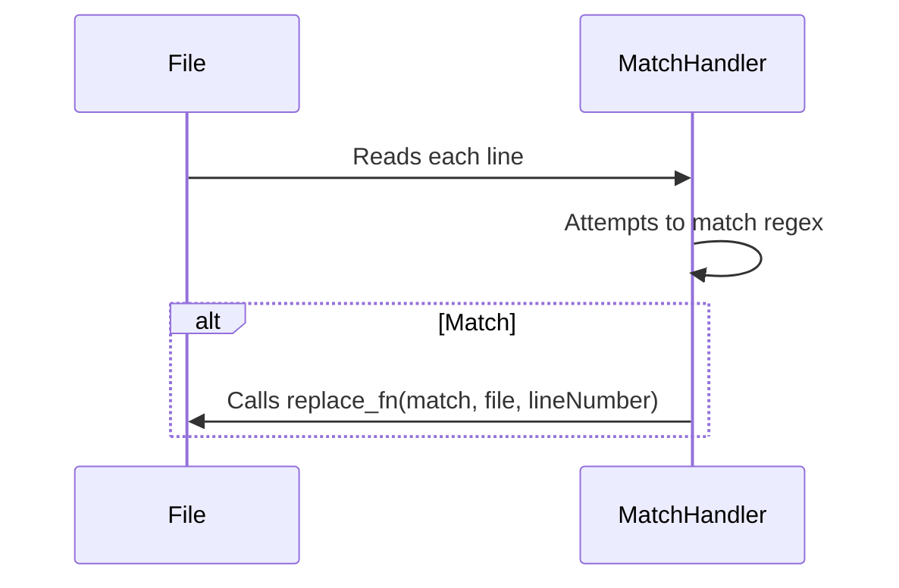

# staging.src.k8s.io.kubectl.pkg.util.i18n.translations.extract

## Introduction

This module provides functionality for extracting translatable strings from source code files. It uses regular expressions and custom functions to identify and process these strings. The core component is the `MatchHandler` class, which defines how to match specific patterns in files and apply corresponding replacement functions.

## Core Components

### MatchHandler

`MatchHandler` is a class that encapsulates a regular expression and a function to be executed when the regex matches a line in a file. It is used to define patterns for identifying translatable strings and the actions to perform on them.

*   **regex**: A compiled regular expression used to match lines in a file.
*   **replace\_fn**: A function that is called when the regex matches a line. This function should accept the regex match object, the file path, and the line number as arguments.

## Architecture

The module\'s architecture revolves around the `MatchHandler` class. Instances of this class are created with specific regex patterns and replacement functions tailored to identify and process translatable strings in different contexts. These `MatchHandler` objects can then be used to scan files and extract or modify strings that match their defined patterns.

## Usage

The `MatchHandler` class is instantiated with a regular expression and a replacement function. The regular expression defines the pattern to match, and the replacement function specifies how to process the matched string. For example, a `MatchHandler` could be created to find all occurrences of a specific function call and extract the string argument for translation.

## Relationships to Other Modules

This module might be used in conjunction with other modules that handle file system operations or string manipulation.  For example, it could be used with a module that reads files and passes their contents to the `MatchHandler` for processing. See [hack.boilerplate.boilerplate_test.md] for usage of regex matching.
