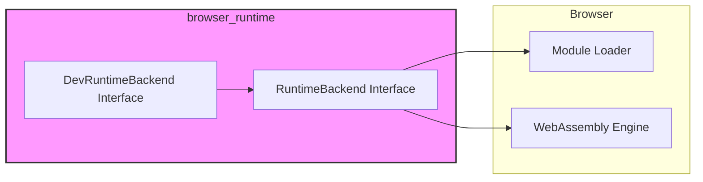
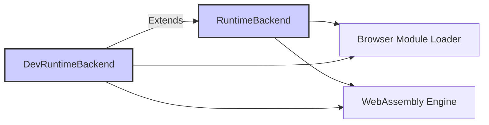
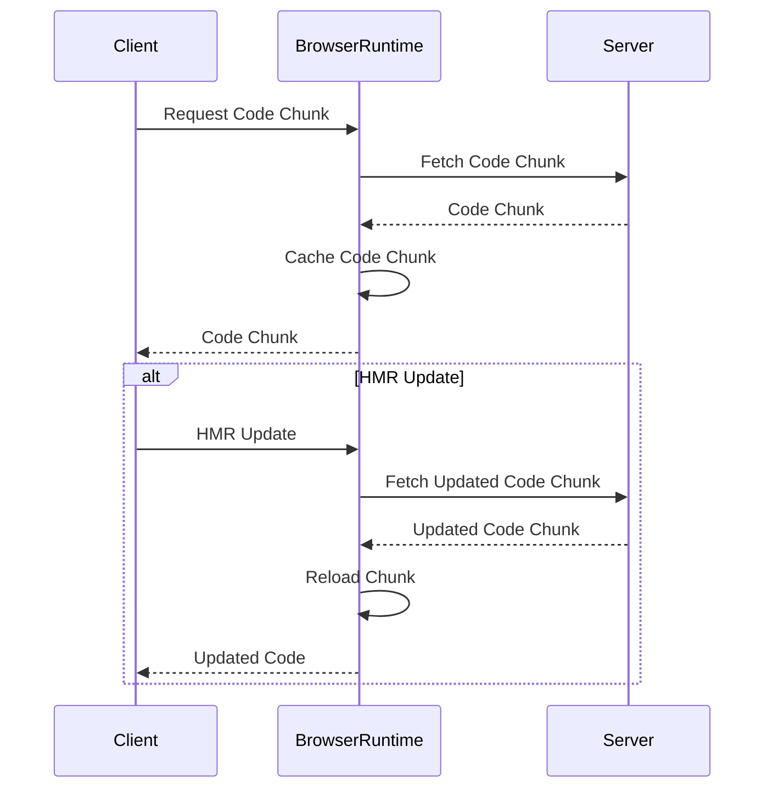

# Browser Runtime Module Documentation

## Introduction

The `browser_runtime` module within the Turbopack architecture is responsible for managing the runtime environment within a web browser. It handles the loading, unloading, and reloading of code chunks, particularly JavaScript and WebAssembly modules. This module is crucial for implementing features like Hot Module Replacement (HMR) and efficient code updates without full page reloads. It provides the necessary interfaces and functionalities to interact with the browser's runtime environment, enabling dynamic module management.

## Architecture

The `browser_runtime` module consists of several key components that work together to provide a robust runtime environment. The core of this module revolves around the `RuntimeBackend` and `DevRuntimeBackend` interfaces. These interfaces define the functionalities required for both production and development environments. The module interacts closely with the browser's module loading and execution mechanisms.



## Core Components

### 1. `RuntimeBackend` Interface

This interface defines the core functionalities for managing code chunks in a production environment.

```typescript
interface RuntimeBackend {
  registerChunk: (chunkPath: ChunkPath, params?: RuntimeParams) => void
  /**
   * Returns the same Promise for the same chunk URL.
   */
  loadChunkCached: (sourceType: SourceType, chunkUrl: ChunkUrl) => Promise<void>
  loadWebAssembly: (sourceType: SourceType, sourceData: SourceData, wasmChunkPath: ChunkPath, edgeModule: () => WebAssembly.Module, importsObj: WebAssembly.Imports) => Promise<Exports>
  loadWebAssemblyModule: (sourceType: SourceType, sourceData: SourceData, wasmChunkPath: ChunkPath, edgeModule: () => WebAssembly.Module) => Promise<WebAssembly.Module>
}
```

-   `registerChunk`: Registers a code chunk with the runtime, associating it with a specific path and optional parameters.
-   `loadChunkCached`: Loads a code chunk from a URL, caching the promise to ensure that the same promise is returned for subsequent requests to the same URL. This prevents redundant loading.
-   `loadWebAssembly`: Loads and initializes a WebAssembly module. It takes the source type, source data, the chunk path, a function that returns the WebAssembly module, and an imports object. Returns a promise that resolves with the module's exports.
-   `loadWebAssemblyModule`: Loads a WebAssembly module. It takes the source type, source data, the chunk path, and a function that returns the WebAssembly module. Returns a promise that resolves with the WebAssembly Module.

### 2. `DevRuntimeBackend` Interface

This interface extends the `RuntimeBackend` with functionalities specific to development environments, such as hot module replacement and code reloading.

```typescript
interface DevRuntimeBackend {
  reloadChunk?: (chunkUrl: ChunkUrl) => Promise<void>
  unloadChunk?: (chunkUrl: ChunkUrl) => void
  restart: () => void
}
```

-   `reloadChunk`: Reloads a specific code chunk, typically used during Hot Module Replacement (HMR) to update the code without a full page reload.
-   `unloadChunk`: Unloads a code chunk, removing it from the runtime environment.
-   `restart`: Restarts the runtime, typically used to recover from errors or apply significant changes.

## Component Relationships

The `DevRuntimeBackend` extends the `RuntimeBackend` interface, providing additional functionalities for development environments. Both interfaces interact with the browser's module loading and WebAssembly execution mechanisms.



## Data Flow

1.  **Chunk Registration**: When a new code chunk is available, the `registerChunk` method of the `RuntimeBackend` is called. The browser runtime stores the chunk information.
2.  **Chunk Loading**: When a code chunk is needed, the `loadChunkCached` method is called. This method fetches the chunk from the network (if not already cached) and executes it in the browser environment.
3.  **WebAssembly Loading**: When a WebAssembly module is loaded using `loadWebAssembly` or `loadWebAssemblyModule`, the browser runtime retrieves the module, compiles it, and makes it available for use by JavaScript code.
4.  **HMR**: During development, when a code change is detected, the `reloadChunk` method of the `DevRuntimeBackend` is called. This method updates the code in the browser without a full page reload.



## Module Dependencies and Integration

The `browser_runtime` module likely depends on other modules within the Turbopack ecosystem for tasks such as module resolution, chunk generation, and communication with the server during development (HMR). While specific dependencies are not detailed in provided components, deeper analysis using `read_code_components` tool would unveil these connections. Especially [shared_runtime.md] module would be helpful since both modules are under the same directory.

## Usage

The `browser_runtime` module is used internally by Turbopack and its related tools. Developers typically do not interact directly with this module but benefit from its functionalities through features like fast refresh and efficient code updates.
