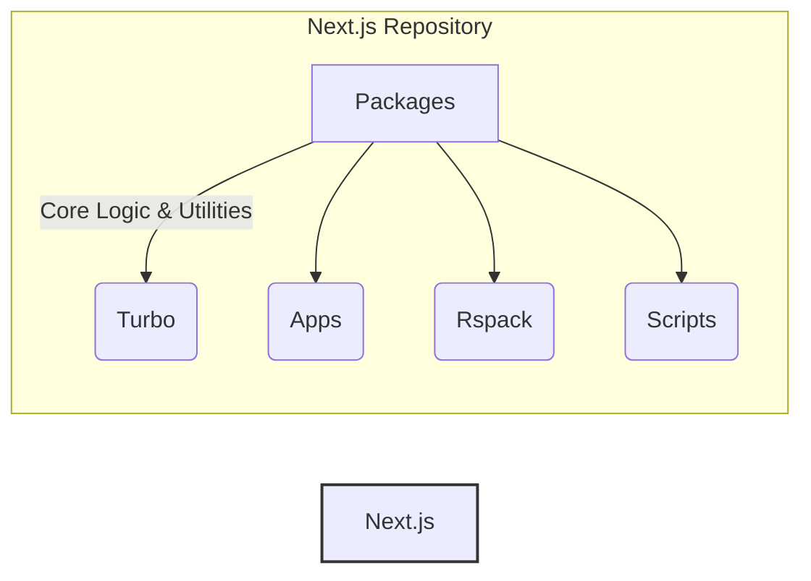
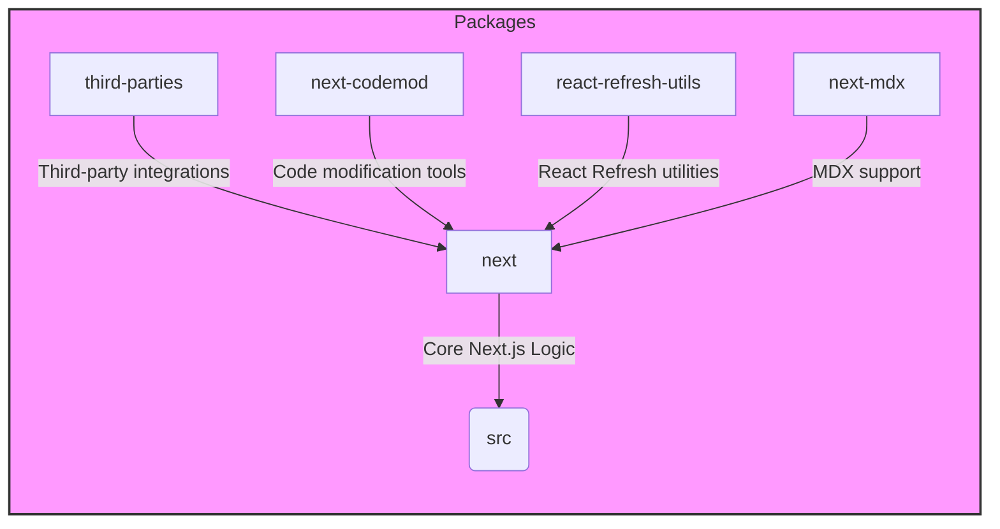
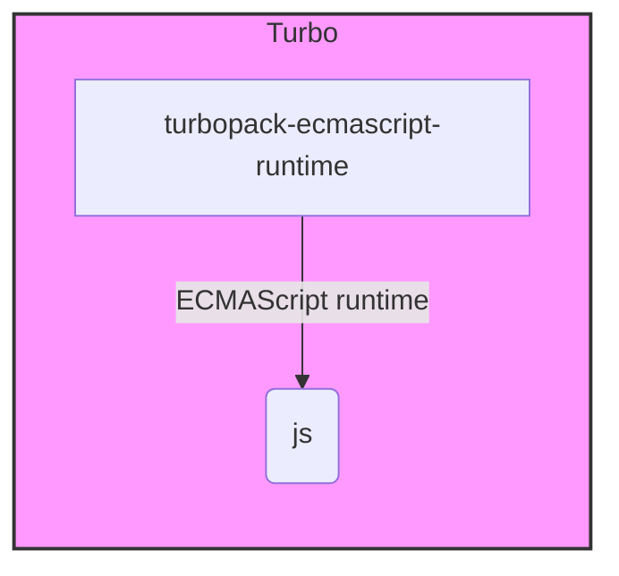
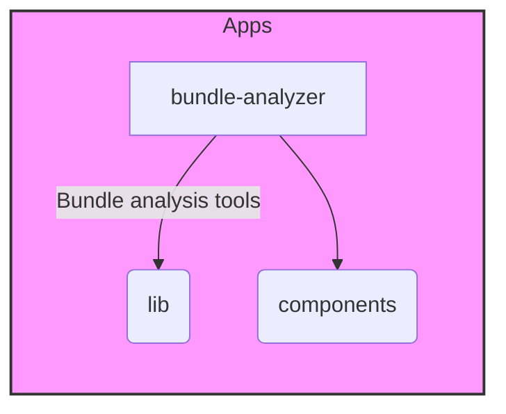
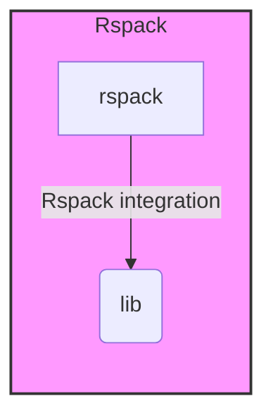
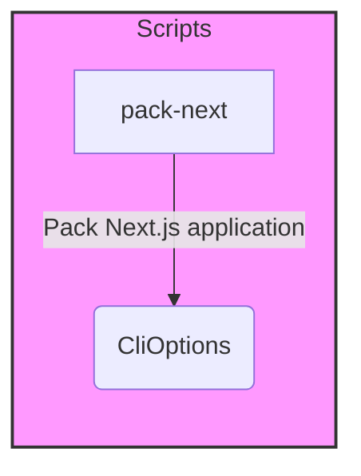

# Next.js Repository Overview

The Next.js repository contains the source code for the Next.js framework, a popular React framework for building web applications. It provides features like server-side rendering, static site generation, routing, and API routes.

## Architecture

The Next.js repository is structured into several key modules that work together to provide the framework's functionality. The core modules include:

- **Packages:** Contains the core logic and utilities for Next.js, including the build system, routing, and server-side rendering.
- **Turbo:** Contains code related to Turbopack, a fast and efficient build tool.
- **Apps:** Provides tools and utilities for analyzing application bundles, specifically targeting Next.js applications.
- **Rspack:** Integrates Rspack with Next.js, focusing on handling external dependencies.
- **Scripts:** Contains scripts for various tasks, such as building and packaging Next.js applications.

The following diagram illustrates the high-level architecture of the Next.js repository:

### Packages Module Architecture

The `packages` module is the heart of the Next.js framework. It contains the core logic and utilities that power Next.js applications.

### Turbo Module Architecture

The `turbo` module provides the ECMAScript runtime environment for Turbopack, a fast and efficient build tool.

### Apps Module Architecture

The `apps` module focuses on providing tools and utilities for analyzing application bundles, specifically targeting Next.js applications.

### Rspack Module Architecture

The `rspack` module integrates Rspack with Next.js, focusing on handling external dependencies.

### Scripts Module Architecture

The `scripts` module appears to be focused on handling command-line interface options for a "pack-next" utility.

## Core Modules Documentation

- [Packages](packages_next.md)
- [Turbo](turbopack.md)
- [Apps](apps.md)
- [Rspack](rspack.md)
- [Scripts](scripts.md)