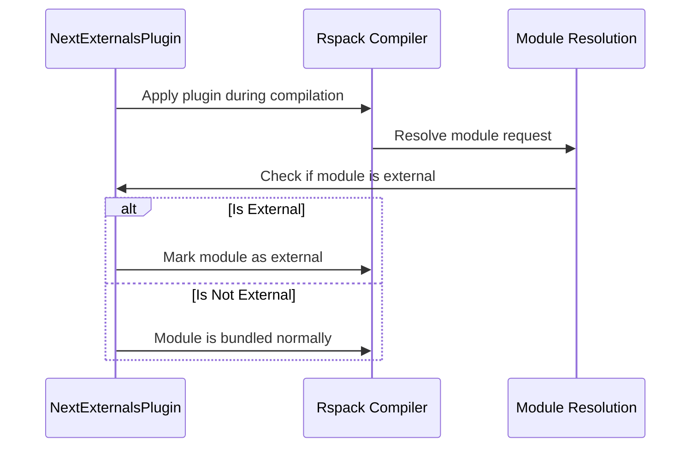
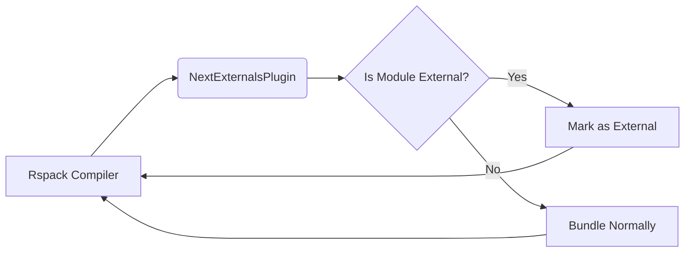

# Rspack Module Documentation

## Introduction

The `rspack` module integrates Rspack with Next.js, focusing on handling external dependencies. Currently, the core component provided is `NextExternalsPlugin`, which manages Next.js-specific external modules within the Rspack build process. This documentation will outline the plugin's purpose, architecture, and usage.

## NextExternalsPlugin

The `NextExternalsPlugin` is designed to configure Rspack to handle Next.js's external dependencies correctly. It ensures that dependencies required by Next.js are treated as external modules during the build, preventing them from being bundled into the main application code. This is crucial for optimizing build sizes and improving application performance. The plugin accepts `NapiNextExternalsPluginOptions` for configuration, but its core responsibility is to manage external modules. More details about externals can be found in [packages.md](packages.md) and [packages_next.md](packages_next.md).

### Architecture

The plugin primarily interacts with Rspack's module resolution and external handling mechanisms. It hooks into the Rspack build process to modify how external modules are resolved and handled. The following diagram illustrates the basic architecture:



### Options

The `NextExternalsPlugin` accepts an `options` parameter of type `NapiNextExternalsPluginOptions` in its constructor. While the specifics of these options aren't detailed in the provided code, they likely control aspects such as:

*   Specific external modules to include/exclude.
*   Configuration for how external modules are resolved.
*   Settings to fine-tune external handling behavior.

### Dependencies

The `NextExternalsPlugin` relies on Rspack's compiler and module resolution systems.  It likely interacts with modules within `packages_next` to understand the specific external dependencies required by Next.js. See [packages_next.md](packages_next.md) for more details on `packages_next`.

### Usage

To use the `NextExternalsPlugin`, you would typically instantiate it within your Rspack configuration and apply it to the Rspack compiler:

```javascript
const { NextExternalsPlugin } = require('rspack');

module.exports = {
  // ... other Rspack configuration
  plugins: [
    new NextExternalsPlugin(options)
  ]
};
```

### Data Flow

The following diagram illustrates the data flow within the `NextExternalsPlugin`:


