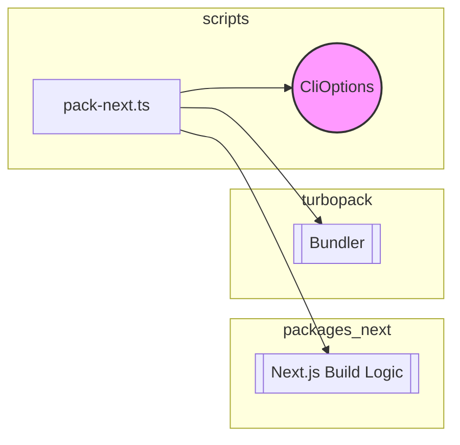

# Scripts Module Documentation

## Introduction

This document provides comprehensive details about the `scripts` module, focusing on its structure, components, and functionality within the larger system. Currently, the module has a single core component, `scripts.pack-next.CliOptions`, which is detailed below. The `scripts` module appears to be focused on handling command-line interface options for a "pack-next" utility. This utility likely deals with packaging and building Next.js applications. Deeper integration with modules like `packages_next` and `turbopack` is anticipated.

## scripts.pack-next.CliOptions

### Overview

The `CliOptions` interface defines the structure for command-line options accepted by the `pack-next` script. These options control various aspects of the build and packaging process.

### Definition

```typescript
interface CliOptions {
  jsBuild?: boolean
  project?: string
  tar?: boolean
  compress?: CompressOpt
  _: string[]
}
```

### Properties

*   `jsBuild`: (Optional boolean) Enables or disables JavaScript-only build.
*   `project`: (Optional string) Specifies the project directory.
*   `tar`: (Optional boolean) Enables or disables creating a tar archive.
*   `compress`: (Optional CompressOpt) Specifies the compression option. It is possibly related to the compression algorithm used in tar archive.
*   `_`: (String array) Represents positional arguments passed to the script.

### Usage

This interface is used to parse and validate command-line arguments passed to the `pack-next` script. The parsed options are then used to configure the build and packaging process. The `pack-next` script might leverage modules from `packages_next` to build the Next.js application and `turbopack` to bundle the application.

### Relationships

*   The `pack-next` script and its `CliOptions` likely interact closely with the `packages_next` module, which probably contains the core logic for building Next.js applications.  See [packages_next.md] for more details.
*   `turbopack` is a possible bundler used by the `pack-next` script to bundle the application. See [turbopack.md] for more details.

### Diagrams

#### Architecture Diagram



This diagram shows the basic architecture of the `scripts` module with `CliOptions` and highlights its relationship with `packages_next` and `turbopack`.
