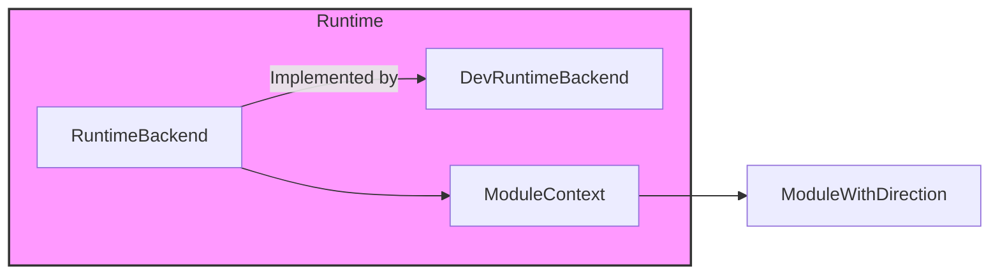
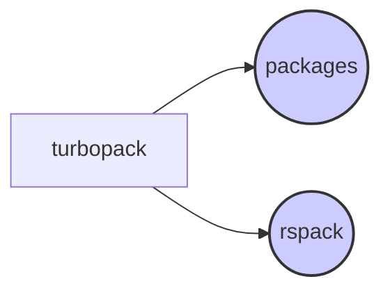

# Turbopack Module Documentation

## Introduction

The `turbopack` module provides the ECMAScript runtime environment for Turbopack, a fast and efficient build tool. It handles module loading, execution, and hot module replacement in the browser. It is a crucial part of the Turbopack ecosystem, enabling fast development cycles and optimized production builds. This module is responsible for managing the lifecycle of JavaScript modules within the Turbopack environment, from initial loading to hot updates and unloading.

## Architecture Overview

The `turbopack` module is designed with a layered architecture, separating the core runtime functionalities from the development-specific features. This allows for a more robust and maintainable system. The main components include:

- **RuntimeBackend**: Provides core functionalities for registering, loading, and managing chunks.
- **DevRuntimeBackend**: Extends the `RuntimeBackend` with development-specific features like hot module replacement (HMR) and chunk reloading.
- **ModuleContext**: Provides the context in which modules are executed, including `require` and `import` functionalities.
- **ModuleWithDirection**: Defines the structure of a module with information about its children and parents, enabling dependency graph traversal.

## Sub-modules and Functionality

The `turbopack` module can be broken down into several key areas of functionality. Sub-module documentation provides in-depth information for each.

- **Browser Runtime**: Contains `RuntimeBackend` and `DevRuntimeBackend` which are responsible for managing chunks in the browser environment.
- **Shared Runtime**: Contains `ModuleContext` and `ModuleWithDirection` which provide module context and dependency information shared between browser and server environments.

### Browser Runtime

The browser runtime provides the necessary functionality to load and manage JavaScript modules within a browser environment. It includes the core runtime and development-specific extensions for hot module replacement (HMR).

See [browser_runtime.md](browser_runtime.md) for details.

### Shared Runtime

The shared runtime provides common functionalities and type definitions used by both the browser and server runtime environments. This includes module context management and module dependency tracking.

See [shared_runtime.md](shared_runtime.md) for details.

## Module Relationships

The `turbopack` module interacts closely with other modules within the Turbopack ecosystem. Notably, it relies on the `packages` module for core utilities, such as managing dependencies between modules. It also interacts with `rspack` which is another bundler implementation. The relationship between `turbopack` and `packages` involves utilizing functionalities in `packages` for advanced bundling and optimization.

