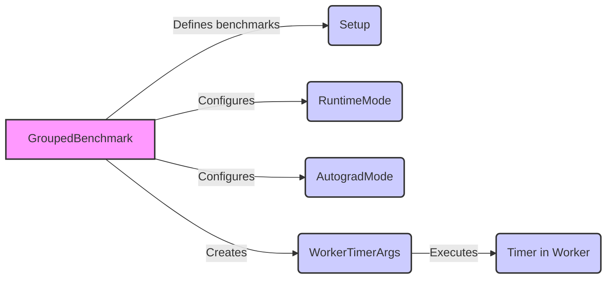

# benchmarks_instruction_counts Module Documentation

## Introduction

The `benchmarks_instruction_counts` module is designed to provide a flexible framework for benchmarking PyTorch code, with a particular focus on instruction counts. It allows defining and running benchmarks for various code snippets and models, considering factors like Python vs. C++, eager vs. TorchScript execution, and single vs. multi-threaded environments. The module aims to offer concise benchmark definitions and intelligent post-processing and analysis.

## Architecture Overview

The module is structured around the `GroupedBenchmark` class, which serves as the central point for defining and configuring benchmarks. It supports defining benchmarks from free-form statements, `torch.nn.Module` models, and code variants. The `WorkerTimerArgs` class facilitates the execution of benchmarks in worker processes.

## Sub-modules and Functionality

- **`benchmarks.instruction_counts.definitions.setup`**: Defines the `Setup` enum, which provides pre-configured setup routines for common benchmarking scenarios (e.g., trivial 2D/3D/4D tensors, training setups). See [benchmarks.instruction_counts.definitions.setup.md](benchmarks.instruction_counts.definitions.setup.md) for details.
- **`benchmarks.instruction_counts.core.api`**: Contains the core API for defining benchmarks. The `GroupedBenchmark` class is the primary interface, offering methods for initializing benchmarks from statements (`init_from_stmts`), models (`init_from_model`), and variants (`init_from_variants`).  `RuntimeMode` and `AutogradMode` enums are defined here to configure benchmark execution. See [benchmarks.instruction_counts.core.api.md](benchmarks.instruction_counts.core.api.md) for details.
- **`benchmarks.instruction_counts.worker.main`**: Defines the `WorkerTimerArgs` class, which encapsulates the necessary information to execute a benchmark in a separate worker process. This class is used to serialize benchmark configurations and pass them to worker processes, as the `Timer` class itself is not pickleable.

## Module Dependencies

This module interacts with other parts of the PyTorch ecosystem, including:

- `torch`: The core PyTorch library, used for tensor operations, module definitions, and TorchScript compilation.
- `torch.nn`: Used when defining benchmarks based on `torch.nn.Module` models.
- `torch.jit`: Used when enabling TorchScript compilation for benchmarks.

