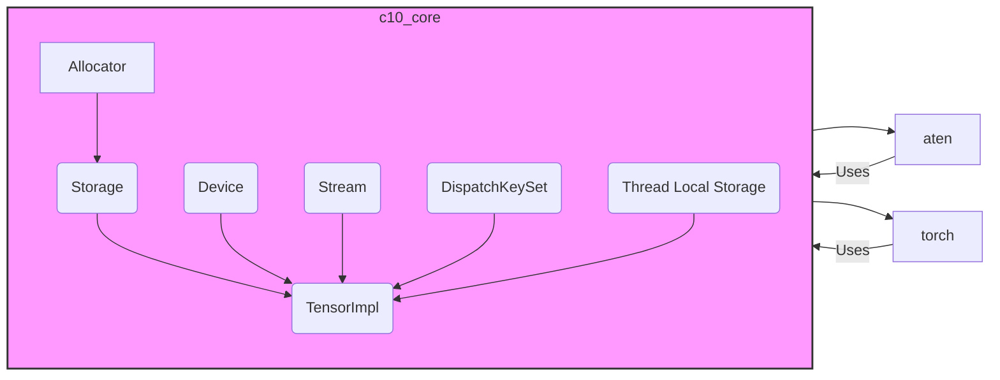

# c10_core Module Documentation

## Introduction

The `c10_core` module is a fundamental component of the PyTorch library, providing core data structures, utilities, and abstractions for tensor management, memory allocation, device management, and dispatch. It serves as the foundation upon which higher-level functionalities are built.

## Architecture Overview

The `c10_core` module is designed with a layered architecture, providing essential services to other modules within the `c10` namespace and the broader PyTorch ecosystem. Key components include:

- **Memory Management:** Allocators, Storage, and TensorImpl for efficient memory handling.
- **Device Abstraction:** Device and Stream for managing execution contexts.
- **Dispatching:** DispatchKeySet for operator dispatch.
- **Context Management:** Thread-local storage for various states.

## Sub-modules Functionality

### Allocator

The `Allocator` sub-module (see `Allocator.h`) is responsible for managing memory allocation and deallocation. It defines the interface for allocators and provides CPU and Caching Device allocators. Key components include `MemoryReportingInfoBase`, `GatheredContext`, `Stat`, `MempoolIdHash`, and `DurationStat`.

### Storage

The `Storage` sub-module (see `Storage.h`, `StorageImpl.h`, `impl/COW.h`) provides an abstraction for memory buffers. It manages the underlying data and provides methods for accessing and modifying it. `StorageImpl` is the implementation of `Storage` that uses copy-on-write to save memory. Core components: `Storage`, `StorageImpl`, `ExclusivelyOwnedTraits`, `MaybeOwnedTraits`.

### TensorImpl

The `TensorImpl` sub-module (see `TensorImpl.h`) is the core implementation of tensors, managing metadata, storage, and dispatch information. `VersionCounter` tracks the version of the tensor for autograd.

### Device

The `Device` sub-module (see `Device.h`) represents the device on which a tensor resides (e.g., CPU, CUDA). It provides an abstraction for device-specific operations.

### Stream

The `Stream` sub-module (see `Stream.h`) represents a stream of operations on a device, enabling asynchronous execution.

### DispatchKeySet

The `DispatchKeySet` sub-module (see `DispatchKeySet.h`) manages the set of dispatch keys used for operator dispatch, determining which implementation of an operator should be called.

### Thread Local Storage

Thread-local storage (TLS) components such as `TorchDispatchModeTLS.h`, `impl/HermeticPyObjectTLS.h`, and `impl/PythonDispatcherTLS.h` provide mechanisms for storing and accessing data that is local to a specific thread.

### Autograd and Inference Mode

`AutogradState.h` and `InferenceMode.h` provides a structure to manage the autograd state and inference mode.

## Relationships with Other Modules

- **aten:** The `c10_core` module provides the underlying data structures and utilities used by the `aten` module for defining and implementing tensor operations.
- **torch:** The `torch` module builds upon `c10_core` to provide a high-level interface for tensor manipulation, neural network construction, and other functionalities.
- **c10:** Other modules in the `c10` namespace, such as `c10_util`, `c10_cuda`, and `c10_xpu`, rely on `c10_core` for core functionalities like memory management and device abstraction.

## Sub-module Documentation

- [Allocator sub-module documentation](allocator_sub_module.md)
- [Storage sub-module documentation](storage_sub_module.md)
