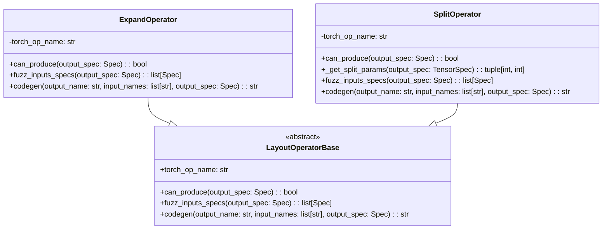
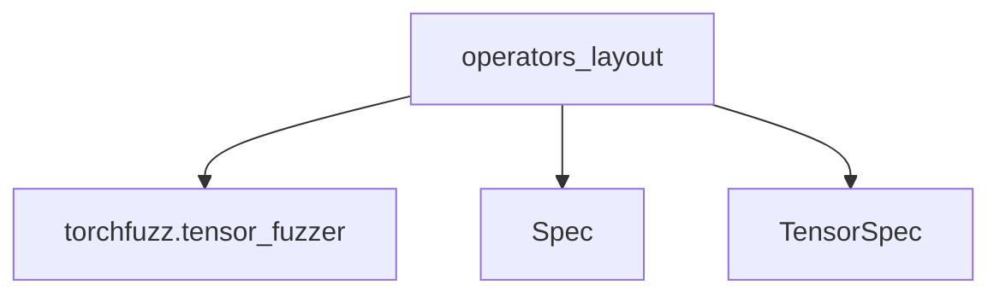

# operators_layout Module Documentation

## Introduction

The `operators_layout` module, located within `tools.experimental.torchfuzz.operators`, focuses on providing layout-specific operators for tensor manipulation within the torchfuzz framework. Specifically, it includes operators that modify the shape and arrangement of tensors, such as `ExpandOperator` and `SplitOperator`. These operators are crucial for generating diverse tensor layouts during fuzzing, ensuring thorough testing of PyTorch operations.

## Architecture

The `operators_layout` module contains the following core components:

- `ExpandOperator`: Defines the logic for the `torch.expand()` operation, allowing tensors to be broadcast to a new shape.
- `SplitOperator`: Implements the `torch.split()` operation, dividing a tensor into chunks along a specified dimension.

These operators inherit from a common base class (likely `LayoutOperatorBase`, though not explicitly provided), which likely defines the interface for operator creation, input fuzzing, and code generation.



## Component Details

### ExpandOperator

The `ExpandOperator` is responsible for generating `torch.expand()` operations. It takes an output tensor specification (`TensorSpec`) and generates a compatible input tensor specification. The input tensor's dimensions must either match the output tensor's dimensions or be equal to 1 (for broadcasting). The `codegen` method then generates the corresponding PyTorch code to perform the expansion.

#### Functionality

- **`can_produce(output_spec: Spec) -> bool`**: Checks if the operator can produce the given output specification. For `ExpandOperator`, it verifies that the output is a `TensorSpec` with at least one dimension.
- **`fuzz_inputs_specs(output_spec: Spec) -> list[Spec]`**: Generates the input tensor specification based on the output specification. It ensures that the input tensor is compatible for expansion by adjusting its size according to the output size.
- **`codegen(output_name: str, input_names: list[str], output_spec: Spec) -> str`**: Generates the code snippet for the `torch.expand()` operation, using the input tensor and the desired output shape.

#### Example

```python
# Example of using ExpandOperator
output_spec = TensorSpec(size=(2, 3, 4), stride=(12, 4, 1), dtype=torch.float32)
expand_operator = ExpandOperator()
input_specs = expand_operator.fuzz_inputs_specs(output_spec)

# Assuming input_specs[0] is a TensorSpec with size (1, 3, 4)
input_name = "input_tensor"
output_name = "output_tensor"
code = expand_operator.codegen(output_name, [input_name], output_spec)
print(code)  # Output: output_tensor = input_tensor.expand([2, 3, 4])
```

### SplitOperator

The `SplitOperator` handles the `torch.split()` operation. It determines a split dimension and the number of chunks to split the input tensor into. The `fuzz_inputs_specs` method creates an input tensor specification where the split dimension is larger than the output, ensuring that the output is one of the split chunks. The `codegen` method generates the PyTorch code to perform the split and select the appropriate chunk.

#### Functionality

- **`can_produce(output_spec: Spec) -> bool`**: Checks if the operator can produce the given output specification, ensuring it is a `TensorSpec` with at least one dimension.
- **`_get_split_params(output_spec: TensorSpec) -> tuple[int, int]`**: Chooses the split dimension and the number of chunks based on the output specification, ensuring deterministic behavior between fuzzing and code generation.
- **`fuzz_inputs_specs(output_spec: Spec) -> list[Spec]`**: Generates the input tensor specification for the `torch.split()` operation. It calculates the input size by multiplying the output size along the split dimension by the number of chunks.
- **`codegen(output_name: str, input_names: list[str], output_spec: Spec) -> str`**: Generates the code snippet for the `torch.split()` operation, splitting the input tensor along the chosen dimension and selecting the first chunk as the output.

#### Example

```python
# Example of using SplitOperator
output_spec = TensorSpec(size=(2, 3, 4), stride=(12, 4, 1), dtype=torch.float32)
split_operator = SplitOperator()
input_specs = split_operator.fuzz_inputs_specs(output_spec)

# Assuming input_specs[0] is a TensorSpec with size (2, 3, 12)
input_name = "input_tensor"
output_name = "output_tensor"
code = split_operator.codegen(output_name, [input_name], output_spec)
print(code)  # Output: output_tensor = torch.split(input_tensor, 4, dim=2)[0]
```

## Relationships to Other Modules

The `operators_layout` module interacts with the broader torchfuzz framework. It relies on the `torchfuzz.tensor_fuzzer` module for generating valid tensor strides. The `Spec` and `TensorSpec` classes are used to define tensor specifications, enabling the generation of compatible input and output tensors for fuzzing.



## Usage

The `operators_layout` module is used within the torchfuzz framework to generate layout-modifying operations for fuzzing PyTorch models. By incorporating operators like `ExpandOperator` and `SplitOperator`, the fuzzer can explore a wide range of tensor layouts, improving the robustness and reliability of PyTorch code.
