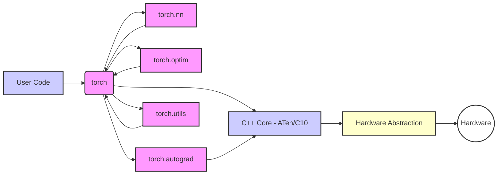

# PyTorch Repository Overview

PyTorch is an open-source machine learning framework that accelerates the path from research prototyping to production deployment. This document provides a high-level overview of the PyTorch repository's structure and core modules.

## Purpose

The PyTorch repository houses the source code for the PyTorch framework, including its core functionalities for tensor computation, neural network building, automatic differentiation, and hardware acceleration. It also includes tools and utilities for deployment, optimization, and extending the framework.

## Architecture

The PyTorch repository follows a modular architecture, with different directories and sub-directories dedicated to specific functionalities. The end-to-end architecture can be visualized as follows:

### Key Modules:

*   **torch**: The main PyTorch module, providing core functionalities for tensor operations, neural networks, and more.
*   **torch.nn**: Contains modules and classes for building neural networks.
*   **torch.optim**: Implements various optimization algorithms.
*   **torch.autograd**: Provides automatic differentiation capabilities.
*   **torch.utils**: Includes utility classes and functions for data loading, training, and other tasks.
*   **c10**: The common core library, providing fundamental data structures and utilities.
*   **aten**: The Accelerated Tensor Engine, providing the core tensor operations.
*   **torchgen**: Code generation tools for PyTorch.
*   **third_party**: Contains external libraries and dependencies.
*   **_ci**: Continuous integration scripts and configurations.
*   **functorch**: Experimental composable function transforms for PyTorch.
*   **caffe2**: Legacy code from the Caffe2 project.
*   **mypy_plugins**: Plugins for the mypy type checker.
*   **_circleci**: CircleCI configuration files.
*   **tools**: Various development tools and utilities.
*   **scripts**: Utility scripts for development and release management.
*   **setup**: Build and installation scripts.
*   **android**: Support for running PyTorch models on Android devices.

## Core Modules Documentation

*   [torch](torch.md)
*   [torch.nn](torch_nn.md)
*   [torch.optim](torch_optim.md)
*   [torch.autograd](torch_autograd.md)
*   [torch.utils](torch_utils.md)
*   [c10](c10.md)
*   [aten](aten.md)
*   [torchgen](torchgen.md)
*   [third_party](third_party.md)
*   [_ci](_ci.md)
*   [functorch](functorch.md)
*   [caffe2](caffe2.md)
*   [mypy_plugins](mypy_plugins.md)
*   [_circleci](_circleci.md)
*   [tools](tools.md)
*   [scripts](scripts.md)
*   [setup](setup.md)
*   [android](android.md)