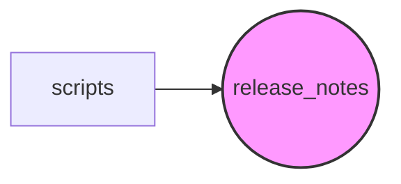

# Scripts Module Documentation

## Introduction

The `scripts` module contains various utility scripts for PyTorch development, release management, and testing. Currently, it primarily focuses on release note generation.

## Architecture

The module's architecture is centered around release note management. It consists of the following sub-modules:

### Sub-modules:

*   **release\_notes**:  This sub-module is responsible for generating and managing release notes. See [release_notes.md](release_notes.md) for details. It contains sub-modules: [common.md](common.md) and [test_release_notes.md](test_release_notes.md).

## Core Functionality

The `scripts` module provides the following key functionalities:

*   **Release Note Generation:**  Scripts for automating the process of generating release notes from commit lists.

## Module Dependencies

This module depends on standard Python libraries such as `tempfile` and `unittest`.
