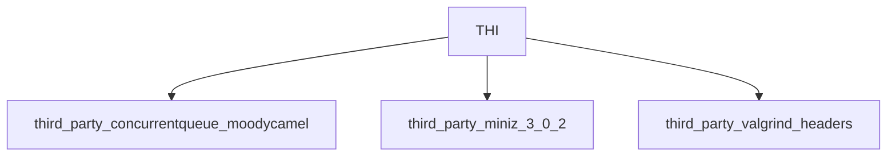

# Third Party

This module contains 3 sub-modules:

- [third_party_concurrentqueue_moodycamel](third_party_concurrentqueue_moodycamel.md) - 21 components
- [third_party_miniz_3_0_2](third_party_miniz_3_0_2.md) - 22 components
- [third_party_valgrind_headers](third_party_valgrind_headers.md) - 1 components

## Architecture

