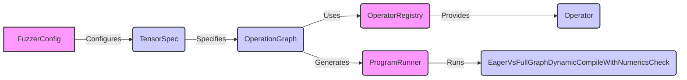

# tools_experimental Module Documentation

## Introduction

The `tools_experimental` module provides a set of experimental tools for fuzzing PyTorch operators. It focuses on generating and running random PyTorch programs to identify potential issues like crashes, numerical inconsistencies, and performance regressions. This module is composed of several sub-modules and classes that work together to define the fuzzing process, generate tensor specifications, define operators, and execute the generated programs.

## Architecture Overview

The following diagram illustrates the high-level architecture of the `tools_experimental` module, highlighting the relationships between its core components.

## Sub-modules and Core Functionality

### 1. Tensor Fuzzing (`tools.experimental.torchfuzz.tensor_fuzzer`)

This sub-module defines core classes for configuring tensor fuzzing behavior and specifying tensor arguments. It includes:

-   `FuzzerConfig`:  A class that holds global configuration options for tensor fuzzing, such as whether to use real values or zeros, and whether to avoid complex data types.
-   `TensorSpec`: A NamedTuple that specifies the size, stride, and data type of a tensor argument.

### 2. Operators (`tools.experimental.torchfuzz.operators`)

This sub-module defines the base class for operators and concrete operator implementations for fuzzing. The [OperatorRegistry](operators_registry.md) is used to register available operators.

-   `Operator`: An abstract base class for all operators in torchfuzz, defining methods for checking if an operator can produce a given output specification, generating input specifications for fuzzing, and generating code for the operation. More details can be found in operators_base.md

- `ExpandOperator`: An operator that performs the `torch.expand()` operation. See [operators_layout.md] for details.
- `SplitOperator`: An operator that performs the `torch.split()` operation. See [operators_layout.md] for details.

### 3. Checks (`tools.experimental.torchfuzz.checks`)

This sub-module implements checks to validate the behavior of the fuzzed programs. It currently includes:

-   `EagerVsFullGraphDynamicCompileWithNumericsCheck`: A check that compares the numerical results of running a program in eager mode versus running it after compilation with `torch.compile` (full graph, dynamic). It checks for significant differences in the sum of the output tensors and reports any discrepancies.

### 4. Operator Registry (`tools.experimental.torchfuzz.operators.registry`)

-   `OperatorRegistry`: A class that manages the available operator instances.  It is responsible for registering operators and providing access to them by name. The registered operators are the building blocks for generating the operation graphs. See operators_registry.md for details.

### 5. Multi-Process Fuzzer (`tools.experimental.torchfuzz.multi_process_fuzzer`)

-   `MockTqdm`: A mock implementation of the tqdm progress bar, used for providing feedback during the fuzzing process without requiring the tqdm library.

### 6. Operation Graph (`tools.experimental.torchfuzz.ops_fuzzer`)

-   `OperationGraph`: Represents a graph of operations used for fuzzing.  It stores the nodes of the graph, the root node ID, and the target specification. It provides methods for obtaining the topological order of nodes, identifying leaf nodes, and collecting node dependencies.

### 7. Program Runner (`tools.experimental.torchfuzz.runner`)

-   `ProgramRunner`: A class responsible for running the generated PyTorch programs and handling output and error reporting. It provides methods for running a program and validating its results, including capturing standard output and standard error, and checking the return code.

## Relationships to Other Modules

This module interacts with core PyTorch functionalities through the operators it defines. For example, the layout operators like `ExpandOperator` and `SplitOperator` use `torch.expand()` and `torch.split()` respectively. The `EagerVsFullGraphDynamicCompileWithNumericsCheck` makes use of `torch.compile`.
