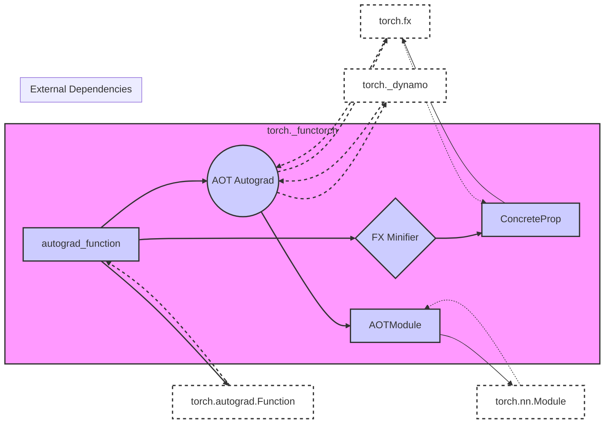

# torch._functorch Documentation

## Introduction

The `torch._functorch` module provides composable function transforms for PyTorch. It enables advanced autograd functionalities like vector Jacobian products, higher-order gradients, and custom autograd functions. This module empowers users to manipulate and transform functions, enabling a wide range of applications in machine learning research and development.

## Architecture Overview

The `torch._functorch` module is structured into several sub-modules, each responsible for a specific aspect of function transformation and autograd customization. The core components work together to provide a flexible and extensible framework.



Key components:

- **autograd_function**: Provides utilities and higher-order operators for working with `torch.autograd.Function`. It includes the `DynamoAutogradFunctionTraceHelper`, `CustomFunctionHigherOrderOperator`, `AutogradFunctionApply`, and `ApplyTemplate` which are designed to allow Dynamo and other tracing tools to correctly handle custom autograd functions.
- **aot_autograd**: (Ahead-of-Time Autograd) Focuses on ahead-of-time compilation of autograd graphs, enabling significant performance improvements. Key components include schemas, descriptors, runtime wrappers, and cache management tools. For more details, see [aot_autograd.md](aot_autograd.md).
- **fx_minifier**: Contains utilities for minimizing FX graphs, which are symbolic representations of PyTorch models. It helps in debugging and optimizing complex models by simplifying their graph structure. For more details, see [fx_minifier.md](fx_minifier.md).
- **AOTModule**: Wraps a given `nn.Module` and compiles its forward pass using AOT Autograd. This allows for ahead-of-time optimization of the module’s computation graph. It leverages the `compiled_f` function to execute the optimized graph.

## Sub-modules

- [torch._functorch.autograd_function](autograd_function.md): Contains components that helps tracing tools correctly handle custom autograd functions.
- [torch._functorch._aot_autograd](torch__functorch__aot_autograd.md): Focuses on ahead-of-time compilation of autograd graphs.
- [torch._functorch.fx_minifier](torch__functorch__fx_minifier.md): Contains utilities for minimizing FX graphs.
- [torch._functorch._activation_checkpointing](torch__functorch__activation_checkpointing.md): Provides tools for activation checkpointing, a technique used to reduce memory consumption during training by recomputing activations during the backward pass.

## Installation

```bash
pip install functorch
```

## Usage

To use `torch._functorch`, import the necessary modules and utilize the provided functions and classes to transform your PyTorch models and functions.

```python
import torch
import torch._functorch as functorch

# Example usage (Illustrative)
def my_function(x):
    return x * 2

transformed_fn = functorch.make_functional(my_function)
```
