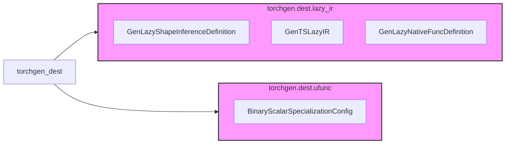

# torchgen_dest Module Documentation

## Overview

The `torchgen_dest` module is responsible for generating code related to the Lazy IR (Intermediate Representation) and Ufuncs (Universal Functions) within the PyTorch JIT (Just-In-Time) compiler. It defines classes and functions that automate the creation of necessary components for the Lazy Tensor Core (LTC) and other backends, bridging the gap between high-level operator definitions and low-level execution.

## Architecture

The module is composed of the following sub-modules:

### Sub-modules:

- [torchgen.dest.lazy_ir](lazy_ir.md): Contains classes responsible for generating Lazy IR components, including shape inference definitions and implementations for native functions.
- torchgen.dest.ufunc: Contains classes related to the configuration and generation of Ufuncs. Currently only `BinaryScalarSpecializationConfig` is defined. No separate documentation is created for this module due to its simplicity.

## Module Components

### torchgen.dest.lazy_ir

This sub-module focuses on generating code for the Lazy IR. It comprises the following core components:

- `GenLazyShapeInferenceDefinition`: Generates shape inference functions for Lazy IR operations.
- `GenTSLazyIR`: Generates the `Lower` and `Create` functions for the Lazy IR, responsible for lowering the IR to backend-specific operations.
- `GenLazyNativeFuncDefinition`: Generates definitions for native functions within the Lazy IR framework. This includes handling device information, lazy tensor declarations, shape inference, and building IR nodes.

### torchgen.dest.ufunc

This sub-module is responsible for handling Ufuncs.

- `BinaryScalarSpecializationConfig`: Configures the specialization of binary scalar Ufuncs, defining the scalar index, constructor tensor, and Ufunc key.
