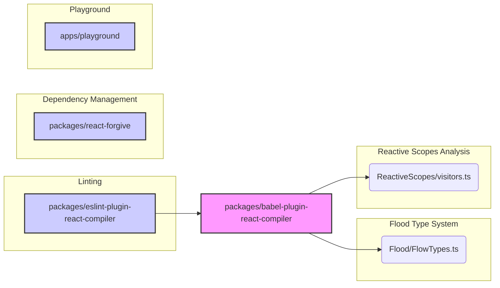

# Compiler Module Documentation

## Introduction

The `compiler` module is responsible for transforming React code, specifically using a Babel plugin (`babel-plugin-react-compiler`) to optimize React components and enforce best practices via an ESLint plugin (`eslint-plugin-react-compiler`). It leverages Flow type annotations for static analysis and includes utilities for reactive scope analysis.

## Architecture

The compiler module's architecture is centered around the `babel-plugin-react-compiler` package, which uses Flow for type analysis and performs code transformations. `eslint-plugin-react-compiler` provides linting rules to ensure code quality and compatibility with the compiler. `react-forgive` package provides utilities for dependency management.

## Sub-modules

1.  **Flood Type System**: Located in `compiler.packages.babel-plugin-react-compiler.src.Flood`. This sub-module defines the types used by the compiler for static analysis. See [Flood Type System Documentation](Flood Type System.md).
2.  **Reactive Scopes Analysis**: Located in `compiler.packages.babel-plugin-react-compiler.src.ReactiveScopes`. This sub-module provides utilities for analyzing reactive scopes within React components. See [Reactive Scopes Analysis Documentation](Reactive Scopes Analysis.md).
3.  **ESLint Plugin**: Located in `compiler.packages.eslint-plugin-react-compiler.src`. This sub-module provides linting rules for React components. It includes an LRU cache (`compiler.packages.eslint-plugin-react-compiler.src.shared.RunReactCompiler.LRUCache`) for efficient rule execution.
4.  **React Forgive**: Located in `compiler.packages.react-forgive`. This sub-module provides utilities for dependency management and code decorations related to auto dependencies.

## Core Components

The core components of the compiler module are spread across its sub-modules:

*   **Flow Types**: Defined in `compiler.packages.babel-plugin-react-compiler.src.Flood.FlowTypes.ts`, these components represent the various types used in Flow type checking. They are documented in [Flood Type System Documentation](Flood Type System.md).
*   **Reactive Function Transform**: The `compiler.packages.babel-plugin-react-compiler.src.ReactiveScopes.visitors.ReactiveFunctionTransform` component is responsible for transforming reactive functions within React components. They are documented in [Reactive Scopes Analysis Documentation](Reactive Scopes Analysis.md).
*   **LRUCache**: The `compiler.packages.eslint-plugin-react-compiler.src.shared.RunReactCompiler.LRUCache` component provides an LRU cache for the ESLint plugin.
*   **AutoDepsDecorationsParams**: The `compiler.packages.react-forgive.(client|server).src.autodeps.AutoDepsDecorationsParams` component is used for auto dependencies decorations.

## Module Dependencies

The `compiler` module depends on the following modules:

*   `packages_react`: Provides core React functionality.
*   `packages_react_dom`: Provides React DOM functionality.
*   `packages_babel-plugin-react-compiler`: Provides the core compilation logic.
*   `packages_eslint-plugin-react-compiler`: Provides linting rules.
*   `packages_react-forgive`: Provides utilities for dependency management

It interacts with these modules through direct code dependencies and by leveraging their APIs for React component transformation and analysis.
