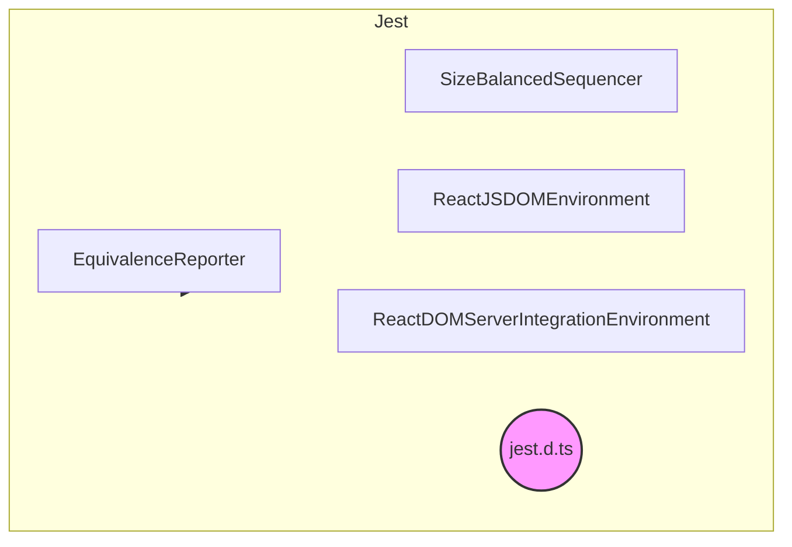
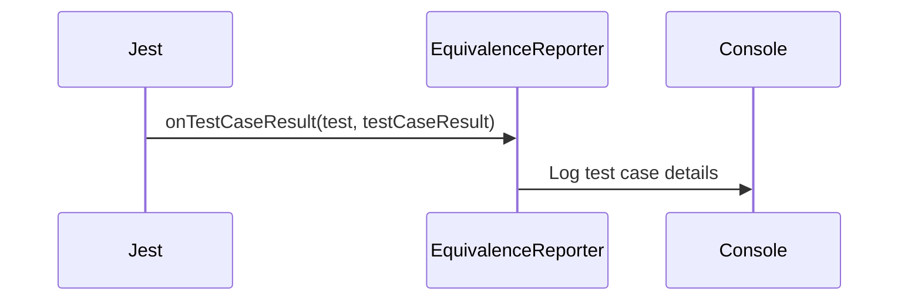
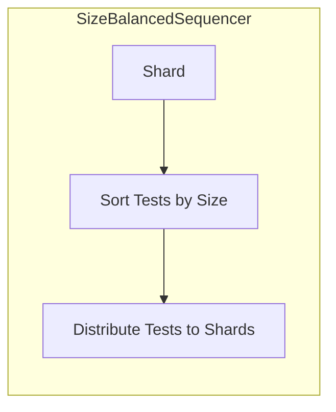
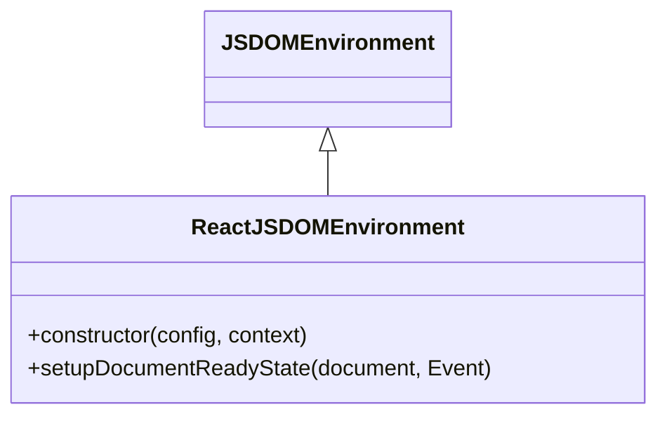
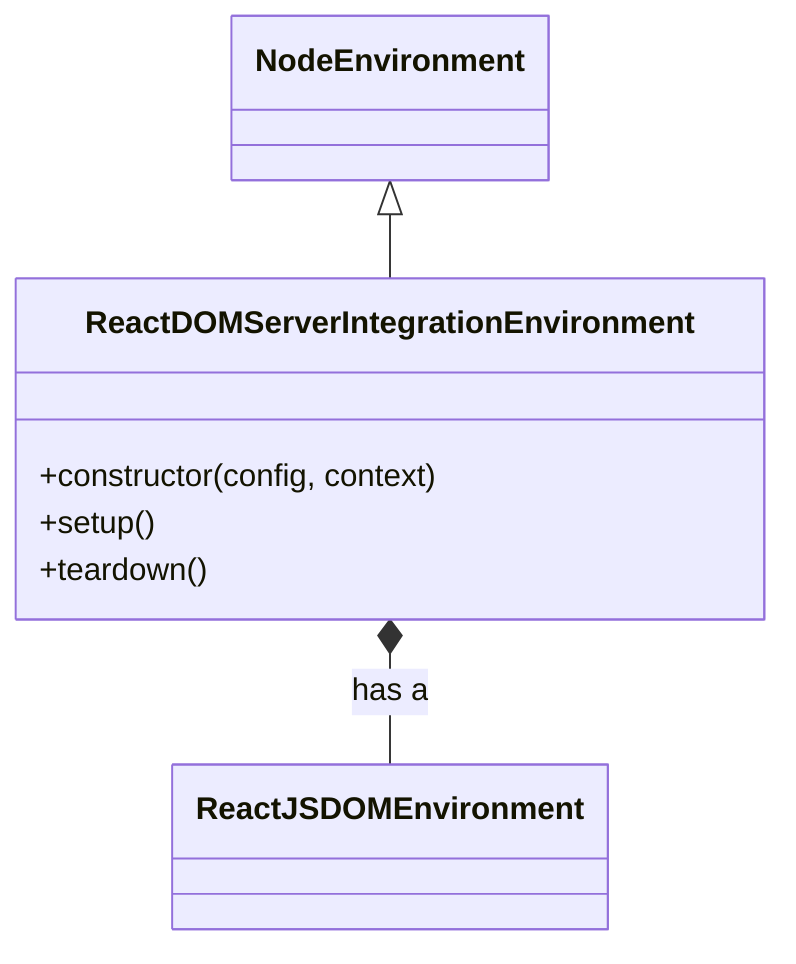

# Jest Module Documentation

## Introduction

The `jest` module provides custom extensions and configurations for the Jest testing framework, tailored to the specific needs of the project. It includes custom reporters, environment setups, and sequencer to optimize testing.

## Architecture

The `jest` module extends the functionality of the standard Jest framework. It consists of several components that customize the test environment, test execution order, and reporting.

## Core Components

### 1. `EquivalenceReporter`

The `EquivalenceReporter` is a custom Jest reporter that logs test case results to the console, indicating the title, status, and number of passing assertions. This reporter can be used to provide more detailed and customized feedback during test execution.

### 2. `SizeBalancedSequencer`

The `SizeBalancedSequencer` is a custom test sequencer that extends Jest's default sequencer. It sorts tests by file size and distributes them across shards to balance the workload during parallel test execution. This can help improve test execution time, especially for large projects.

### 3. `ReactJSDOMEnvironment`

The `ReactJSDOMEnvironment` is a custom Jest environment that extends the `JSDOMEnvironment`. It sets up the document ready state, making it suitable for testing React components that rely on DOM APIs.

### 4. `ReactDOMServerIntegrationEnvironment`

The `ReactDOMServerIntegrationEnvironment` extends `NodeEnvironment` and integrates `ReactJSDOMEnvironment` to provide a comprehensive environment for testing React components that interact with the DOM in a server-side context. It sets up the necessary global variables and ensures that the DOM environment is properly initialized and torn down.

### 5. `JestTypescriptDefinition`

The `JestTypescriptDefinition` (jest.d.ts) provides TypeScript definitions for the Jest object, including methods for mocking and controlling the test environment. This file ensures type safety and improves the developer experience when writing tests in TypeScript.

## Module Dependencies

- This module has a dependency on the `scripts.bench` module. Please refer to the [bench.md](bench.md) documentation for more details.

## Usage

The components in this module are used to configure and extend Jest for React testing. They are typically set up in the Jest configuration file (`jest.config.js`) to customize the test environment, reporters, and sequencers.
