# React Repository Overview

This document provides a high-level overview of the React repository, its purpose, architecture, and key modules.

## Purpose

The React repository contains the source code for the React JavaScript library, a popular framework for building user interfaces. It includes the core reconciliation algorithm, component model, and platform-specific renderers (e.g., React DOM, React Native).

## Architecture

The React repository is organized into several key modules, each responsible for a specific aspect of the library. The core modules include:

- **React**: Contains the core component model, JSX transformation, and base primitives.
- **React Reconciler**: Implements the reconciliation algorithm that diffs virtual DOM trees and applies updates to the underlying platform.
- **React DOM**: Provides the renderer for web browsers, translating React components into DOM nodes.
- **React Native Renderer**: Provides the renderer for native mobile platforms.
- **React Server DOM Webpack**: Provides the renderer for server environments.
- **React DevTools**: Provides the React DevTools.
- **React DevTools Shared**: Provides shared functionality for the React DevTools.
- **React Native Renderer**: Provides the React Native Renderer.
- **React Test Renderer**: Provides the React Test Renderer.
- **ESLint Plugin React Hooks**: Provides the ESLint Plugin React Hooks.
- **React DevTools Timeline**: Provides the React DevTools Timeline.
- **React Art**: Provides the React Art.
- **React Refresh**: Provides the React Refresh.
- **Scheduler**: Provides the Scheduler.
- **Use Subscription**: Provides the Use Subscription.
- **React DevTools Extensions**: Provides the React DevTools Extensions.
- **Scripts**: Contains scripts for building, testing, and benchmarking React.
- **Fixtures**: Contains test fixtures for various React features.
- **Compiler**: Contains the compiler for React.

The following diagram illustrates the high-level architecture of the React repository:

```mermaid
graph LR
    core["React"]
    reconciler["React Reconciler"]
    dom["React DOM"]
    native["React Native Renderer"]
    server["React Server DOM Webpack"]
    devtools["React DevTools"]
    devtools_shared["React DevTools Shared"]
    native_renderer["React Native Renderer"]
    test_renderer["React Test Renderer"]
    eslint_hooks["ESLint Plugin React Hooks"]
    devtools_timeline["React DevTools Timeline"]
    art["React Art"]
    refresh["React Refresh"]
    scheduler["Scheduler"]
    use_subscription["Use Subscription"]
    devtools_extensions["React DevTools Extensions"]
    scripts["Scripts"]
    fixtures["Fixtures"]
    compiler["Compiler"]

    core --> reconciler
    reconciler --> dom
    reconciler --> native
    reconciler --> server
    devtools --> devtools_shared

    subgraph "React Repository"
        core
        reconciler
        dom
        native
        server
        devtools
        devtools_shared
        native_renderer
        test_renderer
        eslint_hooks
        devtools_timeline
        art
        refresh
        scheduler
        use_subscription
        devtools_extensions
	scripts
	fixtures
	compiler
    end
```

## Core Modules Documentation

- [React](packages_react.md)
- [React Reconciler](packages_react_reconciler.md)
- [React DOM](packages_react_dom.md)
- [React Native Renderer](packages_react_native_renderer.md)
- [React Server DOM Webpack](packages_react_server_dom_webpack.md)
- [React DevTools](packages_react_devtools_shared.md)
- [React DevTools Shared](packages_react_devtools_shell.md)
- [React Native Renderer](packages_react_native_renderer.md)
- [React Test Renderer](packages_react_test_renderer.md)
- [ESLint Plugin React Hooks](packages_eslint_plugin_react_hooks.md)
- [React DevTools Timeline](packages_react_devtools_timeline.md)
- [React Art](packages_react_art.md)
- [React Refresh](packages_react_refresh.md)
- [Scheduler](packages_scheduler.md)
- [Use Subscription](packages_use_subscription.md)
- [React DevTools Extensions](packages_react_devtools_extensions.md)
- [Scripts](scripts.md)
- [Fixtures](fixtures.md)
- [Compiler](compiler.md)