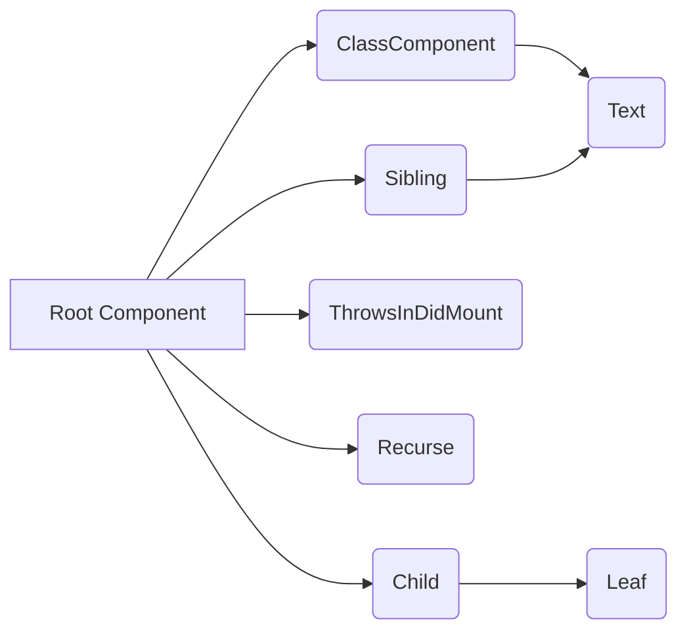

# Part 1 Module Documentation

## Introduction

The `part_1` module, located within `packages.react-reconciler.src.__tests__`, comprises a collection of test cases for the React reconciler. These tests focus on verifying specific functionalities and behaviors of the reconciler, including activity tracking, incremental updates, suspense effects semantics, incremental rendering, and asynchronous actions.

## Architecture Overview

The module primarily consists of React components used to construct test scenarios. These components are designed to simulate different rendering conditions and user interactions, allowing for thorough testing of the reconciler's update and rendering logic. Below is a high-level architecture diagram:

## Sub-modules and Components

This module doesn't have a clear sub-module structure in the traditional sense. Instead, it is organized as a set of test files, each focusing on a specific aspect of the reconciler. The main components include:

*   **ClassComponent:** A simple class component with lifecycle methods. See [`packages/react-reconciler/src/__tests__/Activity-test.js`](#packagesreact-reconcilersrc__tests__activity-testjs) for details.
*   **Child:** A class component that manages its own state. See [`packages/react-reconciler/src/__tests__/ReactIncrementalUpdatesMinimalism-test.js`](#packagesreact-reconcilersrc__tests__reactincrementalupdatesminimalism-testjs) for details.
*   **ThrowsInDidMount:** A component that throws an error in `componentDidMount`. See [`packages/react-reconciler/src/__tests__/ReactSuspenseEffectsSemantics-test.js`](#packagesreact-reconcilersrc__tests__reactsuspenseeffectssemantics-testjs) for details.
*   **Recurse:** A recursive component used for testing incremental rendering. See [`packages/react-reconciler/src/__tests__/ReactIncremental-test.js`](#packagesreact-reconcilersrc__tests__reactincremental-testjs) for details.
*   **Sibling:** A component that updates its state via a function passed as a prop. See [`packages/react-reconciler/src/__tests__/ReactAsyncActions-test.js`](#packagesreact-reconcilersrc__tests__reactasyncactions-testjs) for details.

### Activity-test.js

Contains tests related to activity tracking during rendering. Includes the `ClassComponent`.

### ReactIncrementalUpdatesMinimalism-test.js

Focuses on testing incremental updates with minimal code. Includes the `Child` component.

### ReactSuspenseEffectsSemantics-test.js

Tests the semantics of suspense effects, including error handling in lifecycle methods. Includes the `ThrowsInDidMount` component.

### ReactIncremental-test.js

Tests incremental rendering scenarios. Includes the `Recurse` component.

### ReactAsyncActions-test.js

Tests asynchronous actions and state updates. Includes the `Sibling` component.

## Module Relationships

This module primarily interacts with the React reconciler itself. It relies on React's component model and testing utilities.
