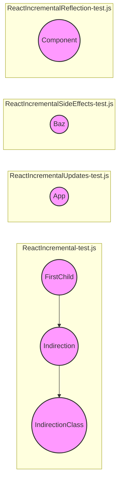

# Part 2 Documentation

## Introduction

This document provides an overview of the `part_2` module within the `packages_react_reconciler` package. This module primarily focuses on testing incremental reconciliation features of React. It includes various test components that simulate different scenarios of component updates, side effects, and context propagation.

## Architecture

The `part_2` module consists of several test components designed to verify specific aspects of React's incremental rendering. The tests cover scenarios such as:

- Incremental updates and state management
- Side effects during updates
- Context propagation with indirections
- Component lifecycle methods and DOM reflection

## Sub-modules and Components

### ReactIncremental-test.js

This file contains components that test basic incremental reconciliation scenarios. Refer to [ReactIncremental-test.js.md](ReactIncremental-test.js.md) for details.

- **FirstChild:** A simple component that updates based on prop changes and logs lifecycle events.
- **Indirection:** A component that tests context propagation through nested components.
- **IndirectionClass:** A class component used in context propagation tests.

### ReactIncrementalUpdates-test.js

This file includes components that test incremental updates and state management, especially `getDerivedStateFromProps`. Refer to [ReactIncrementalUpdates-test.js.md](ReactIncrementalUpdates-test.js.md) for details.

- **App:** A component that uses `getDerivedStateFromProps` to update its state based on incoming props, simulating a complex state update scenario.

### ReactIncrementalSideEffects-test.js

This file focuses on testing side effects that occur during incremental updates. Refer to [ReactIncrementalSideEffects-test.js.md](ReactIncrementalSideEffects-test.js.md) for details.

- **Baz:** A component that conditionally updates based on its `idx` prop and renders a pair of `Bar` components.

### ReactIncrementalReflection-test.js

This file tests the reflection of DOM updates during incremental rendering. Refer to [ReactIncrementalReflection-test.js.md](ReactIncrementalReflection-test.js.md) for details.

- **Component:** A component that logs lifecycle events and updates its rendered DOM node based on the `step` prop.

## Module Relationships

`part_2` is a test module within the broader `packages_react_reconciler` package. It depends on core React APIs and the reconciler implementation to verify its behavior. It complements other `part_*` modules in the same directory, each focusing on different aspects of reconciliation testing. For more details on the overall reconciliation process, see the documentation for the parent module, [packages_react_reconciler](packages_react_reconciler.md).
