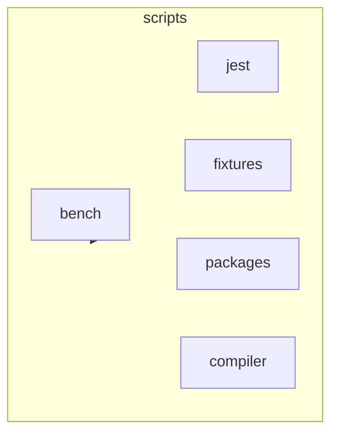

# Scripts Module Documentation

## Introduction

The `scripts` module encompasses a variety of scripts used for benchmarking, testing, and other utility functions. It includes tools for performance evaluation, ensuring code equivalence, and managing test environments.

## Architecture Overview

The `scripts` module is structured into several sub-modules, each addressing a specific concern. The primary sub-modules are:

- `bench`: Contains benchmarking scripts for performance evaluation, particularly focusing on PE class components.
- `jest`: Includes utilities for testing, such as custom reporters, sequencers, and environment setup.
- `fixtures`: Contains fixed data sets used for testing.
- `packages`: Contains sub-modules related to packaging and distribution of the codebase
- `compiler`: Contains sub-modules related to compiling the codebase

The following diagram illustrates the high-level architecture of the `scripts` module:

## Sub-modules Functionality

### 1. `bench`

The `bench` sub-module focuses on benchmarking the performance of React components, particularly those related to PE (Product Engineering) class components. It measures rendering times and other performance metrics to identify potential bottlenecks.

For more detailed information, see [bench.md](bench.md).

### 2. `jest`

The `jest` sub-module provides utilities for testing React components and JavaScript code. It includes custom reporters, sequencers for managing test execution order, and custom test environments.

Key components:

- `EquivalenceReporter`: A custom Jest reporter that logs test case results, checking the equivalence between expected and actual results.
- `SizeBalancedSequencer`: A custom test sequencer that shards tests based on file size to balance execution time across shards.
- `ReactJSDOMEnvironment`: A custom test environment that extends JSDOMEnvironment and sets up the document ready state for React components.
- `ReactDOMServerIntegrationEnvironment`: A custom test environment for React DOM server-side integration testing.

### 3. `fixtures`

The `fixtures` module likely contains data fixtures used for testing purposes. Without specific code components, its exact functionality is not clear, but it generally provides sample data for unit or integration tests.

### 4. `packages`

This module likely contains scripts for packaging and distributing the codebase. Without specific code components, its exact functionality is not clear.

### 5. `compiler`

This module likely contains scripts for compiling the codebase. Without specific code components, its exact functionality is not clear.
