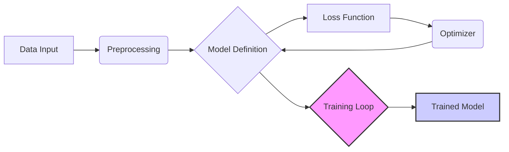
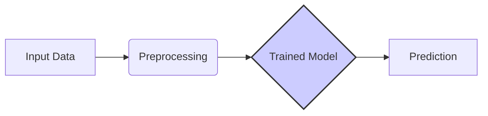

# TensorFlow Repository Overview

The TensorFlow repository is the home of TensorFlow, a powerful open-source software library for numerical computation and large-scale machine learning. TensorFlow provides a flexible architecture and APIs for building and deploying machine learning models across a variety of platforms.

## Architecture

The TensorFlow repository encompasses a wide range of functionalities, from defining computational graphs to deploying models on various hardware. The following diagrams illustrate the high-level architecture of TensorFlow, focusing on the core components involved in training and inference.

### Training Pipeline

This diagram illustrates the typical training pipeline:

1.  **Data Input**: The process begins with feeding data into the system.
2.  **Preprocessing**: The input data is preprocessed to ensure compatibility with the model.
3.  **Model Definition**: A machine learning model is defined using TensorFlow APIs.
4.  **Loss Function**: A loss function is defined to measure the difference between the model's predictions and the actual values.
5.  **Optimizer**: An optimizer is used to update the model's parameters based on the gradients of the loss function.
6.  **Training Loop**: The model is trained iteratively by feeding it batches of data and updating its parameters.
7.  **Trained Model**: The final output of the training pipeline is a trained model.

### Inference Pipeline

This diagram illustrates the inference pipeline:

1.  **Input Data**: The process begins with feeding data into the system.
2.  **Preprocessing**: The input data is preprocessed to ensure compatibility with the model.
3.  **Trained Model**: The trained model from the training pipeline is loaded.
4.  **Prediction**: The model generates predictions based on the input data.

## Core Modules

The TensorFlow repository is organized into several core modules, each responsible for a specific aspect of the library. Here are some of the key modules:

*   [Framework](framework.md): This module provides the core data structures and operations for defining and executing computational graphs.
*   [Eager](eager.md): This module enables eager execution, a more imperative style of programming where operations are executed immediately.
*   [Data](data.md): This module provides APIs for building complex input pipelines for feeding data into TensorFlow models.
*   [Keras](keras.md): This module provides a high-level API for building and training neural networks.
*   [Compiler](compiler.md): This module includes components for compiling and optimizing TensorFlow graphs for various hardware platforms.
*   [Tools](tools.md): This module contains various tools for working with TensorFlow, such as graph transformation utilities and API generators.

This overview provides a starting point for exploring the TensorFlow repository. Each module contains its own documentation with more detailed information about its functionality and usage.