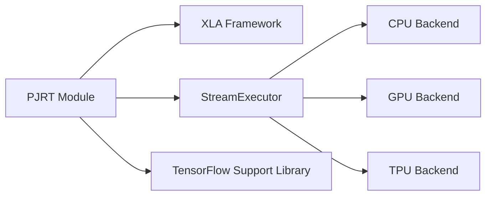

# Overview of third_party.xla.xla.pjrt Module

This module is part of the TensorFlow ecosystem and focuses on the implementation of the PJRT (Plugin-based JIT Runtime) interface within the XLA (Accelerated Linear Algebra) framework. It provides a way to execute XLA computations on various backends through a unified runtime interface.

## Architecture

The `third_party.xla.xla.pjrt` module interacts with several other modules within XLA and TensorFlow. Here's a high-level architectural diagram:



**Key Components and Interactions:**

*   **PJRT Module:** Provides the main PJRT implementation, including client interfaces and execution logic.
*   **XLA Framework:**  The core computation framework that PJRT leverages for optimized execution.
*   **StreamExecutor:** An abstraction layer that allows XLA to run on different hardware backends (CPU, GPU, TPU). See also [third_party_xla_third_party](third_party_xla_third_party.md) for more information.
*   **TSL (TensorFlow Support Library):** Provides low-level utilities and platform-specific functionalities.
*   **CPU/GPU/TPU Backends:** The specific hardware devices where XLA computations are executed.

## Functionality of Sub-modules

This module composes of several sub-modules focusing on different aspects of XLA and PJRT.

*   **pjrt:** Implements the core PJRT functionality. Includes [PjRtStreamExecutorExecutionOutput](#pjrtstreamexecutorexecutionoutput).
*   **codegen.tiling:** Deals with tiling of the generated code for efficient execution on hardware. Includes [InstructionAndNumTilingParameters](#instructionandtilingparameters).
*   **stream_executor.tpu:** Provides support for TPU (Tensor Processing Unit) execution. Includes [SparseCore_GetMaxIdsAndUniques_Params](#sparsecoregetmaxidsanduniquesparams).
*   **backends.cpu.runtime:** Implements runtime support for CPU execution. Includes [Info](#info).
*   **tsl.profiler.convert:** Provides utilities for profiling XLA operations. Includes [OpSourceInfo](#opsourceinfo).
*   **mlir_hlo.mhlo.transforms:** Implements MLIR (Multi-Level Intermediate Representation) transformations for HLO (High-Level Optimization). Includes [ChloLegalizeToHighLevelMhloPassOptions](#chlolegalizetohighlevelmhlopassoptions).
*   **service.gpu.model:** Provides cost modeling for GPU execution. Includes [DotProblemDimensions](#dotproblemdimensions).
*   **ffi:** Defines Foreign Function Interface (FFI) structures. Includes [CollectiveParams](#collectiveparams).
*   **tsl.platform.cloud:** Provides support for cloud platforms. Includes [GcsCacheOptions](#gcscacheoptions).
*   **pjrt.c:** Defines the C API for PJRT. Includes [PJRT_Memory_Kind_Id_Args](#pjrtmemorykindidargs).
*   **util:**  Provides general utility functions for XLA. Includes [ConvertedDimensionNumbers](#converteddimensionnumbers).
*   **backends.cpu.testlib:**  Provides utilities for testing CPU execution. Includes [KernelArg](#kernelarg).
*   **tsl.platform:**  Provides platform-specific functionalities. Includes [FileStatistics](#filestatistics).

## Core Components

### PjRtStreamExecutorExecutionOutput
```c
struct PjRtStreamExecutorExecutionOutput {
  ShapeTree<tsl::AsyncValueRef<RawSEDeviceMemory>> result;
  // Donated inputs which must be freed.
  std::vector<tsl::AsyncValueRef<RawSEDeviceMemory>> to_be_released;
  // For PjRtStreamExecutorClient implementations that
  // use ScopedDeviceAddress for donated inputs.
  std::vector<se::ScopedDeviceAddress<uint8_t>> se_to_be_released;
};
```

This structure represents the output of executing a PJRT computation on a StreamExecutor. It contains the result of the computation, as well as any donated input buffers that need to be released.

### InstructionAndNumTilingParameters
```c
struct InstructionAndNumTilingParameters {
  // The instruction that this `InstructionAndNumTilingParameters` is
  // associated with.
  const HloInstruction* instruction;
  // The number of tile sizes that must be specified for the instruction.
  int64_t num_tiling_parameters;
};
```

This structure associates an HLO (High-Level Optimization) instruction with the number of tiling parameters that need to be specified for it. This is used for code generation and optimization.

### SparseCore_GetMaxIdsAndUniques_Params
```c
typedef struct SparseCore_GetMaxIdsAndUniques_Params {
  size_t struct_size;
  void* priv;
  const char* program_key;
  const char* table_name;
  int64_t num_samples_per_sparse_core;
  int64_t feature_width;
  // out
  TF_Status* status;
  int64_t max_ids_per_partition;
  int64_t max_unique_ids_per_partition;
} SparseCore_GetMaxIdsAndUniques_Params;
```

This structure defines the parameters for the `SparseCore_GetMaxIdsAndUniques` operation, which is used for sparse tensor processing on TPUs. It specifies the input data, as well as the output buffers for the maximum IDs and unique IDs.

### Info
```c
struct Info {
  std::string op_name;
  std::string module_name;
  int64_t module_id;
};
```

This structure contains information about a thunk, which is a compiled function that can be executed on the CPU. It includes the operation name, module name, and module ID.

### OpSourceInfo
```c
struct OpSourceInfo {
  std::string source_file;
  int32_t source_line = -1;
  std::string stack_frame;

  std::string GetSourceTopLine() const {
    if (source_file.empty()) return "";
    return absl::StrCat(source_file, ":", source_line);
  }
```

This structure stores the source code location of an XLA operation. It includes the source file, line number, and stack frame.

### ChloLegalizeToHighLevelMhloPassOptions
```c
struct ChloLegalizeToHighLevelMhloPassOptions;
```

This structure defines the options for the `ChloLegalizeToHighLevelMhloPass`, which converts CHLO (Compiler HLO) operations to MHLO (Machine HLO) operations.

### DotProblemDimensions
```c
struct DotProblemDimensions {
  int64_t b;
  int64_t m;
  int64_t n;
  int64_t k;

  explicit DotProblemDimensions(const HloDotInstruction& dot);
};
```

This structure represents the dimensions of a dot product operation. It includes the batch size, M, N, and K dimensions.

### CollectiveParams
```c
struct CollectiveParams;
```

This structure defines the parameters for collective operations, such as all-reduce and all-gather.

### GcsCacheOptions
```c
struct GcsCacheOptions {
  // Block size for aligned reads from GCS.
  size_t block_size = kDefaultBlockSize;
  // Max size of the LRU cache of blocks read from GCS.
  size_t max_bytes = kDefaultMaxCacheSize;
  // Max staleness of cached file contents, in seconds.
  uint64_t max_staleness_secs = kDefaultMaxStaleness;
};
```

This structure defines the options for caching data read from Google Cloud Storage (GCS). It includes the block size, maximum cache size, and maximum staleness.

### PJRT_Memory_Kind_Id_Args
```c
struct PJRT_Memory_Kind_Id_Args {
  size_t struct_size;
  PJRT_Extension_Base* extension_start;
  PJRT_Memory* memory;
  int kind_id;  // out
};
```

This structure defines the arguments for the `PJRT_Memory_Kind_Id` function, which retrieves the ID of a memory kind.

### ConvertedDimensionNumbers
```c
struct ConvertedDimensionNumbers {
  DimensionVector transformed_from_dimensions;
  DimensionVector untransformed_from_dimensions;
  DimensionVector to_dimensions;
  DimensionVector split_from_dimensions;
  DimensionVector split_from_sizes;
  DimensionVector split_to_dimensions;
};
```

This structure describes how dimension numbers are converted during a transformation.

### KernelArg
```c
struct KernelArg {
  size_t size_bytes;
  BufferUse::MemoryAccess memory_access;
};
```

This structure represents an argument to a kernel function. It includes the size of the argument in bytes, as well as the memory access type.

### FileStatistics
```c
struct FileStatistics {
  // The length of the file or -1 if finding file length is not supported.
  int64_t length = -1;
  // The last modified time in nanoseconds.
  int64_t mtime_nsec = 0;
  // True if the file is a directory, otherwise false.
  bool is_directory = false;

  FileStatistics() {}
  FileStatistics(int64_t length, int64_t mtime_nsec, bool is_directory)
      : length(length), mtime_nsec(mtime_nsec), is_directory(is_directory) {}
  ~FileStatistics() {}
};
```

This structure stores statistics about a file, such as its length, last modified time, and whether it is a directory.
