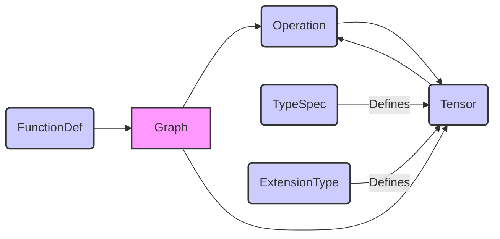

# Part 2 Documentation

This document provides an overview of the `part_2` module within the TensorFlow framework.  Since the provided components are part of the `tensorflow/python/framework` directory, this documentation will focus on that area. The `tensorflow/python/framework` module provides the core API building blocks for TensorFlow, including defining operations, tensors, and graphs.

## Architecture

The `tensorflow/python/framework` module is a fundamental part of TensorFlow, providing the low-level building blocks for constructing and executing TensorFlow graphs. The core components interact to define and manipulate the computational graph.

## Sub-modules and Functionality

*   **Graph:**  The `Graph` class (`tensorflow.python.framework.ops_test.GraphTest`) represents a TensorFlow computation graph. It contains operations and tensors.  It also provides mechanisms to control feeding and fetching tensors, and to manage resources. See [tensorflow_python_framework_ops_test.md](tensorflow_python_framework_ops_test.md) for details.
*   **FunctionDef:** The `FunctionDef` (`tensorflow.python.framework.function_def_to_graph_test.FunctionDefToGraphDefTest`)  relates to defining and converting function definitions to graph definitions. This is crucial for encapsulating sub-graphs as reusable functions. See [tensorflow_python_framework_function_def_to_graph_test.md](tensorflow_python_framework_function_def_to_graph_test.md) for details.
*   **TypeSpec & ExtensionType:** The `TypeSpec` and `ExtensionType` (`tensorflow.python.framework.extension_type_test.BrokenExtensionType`, `tensorflow.python.framework.type_spec_test.Foo`) provide mechanisms for defining and working with custom types within TensorFlow.  `ExtensionType` allows defining new Python types that can be used with TensorFlow, while `TypeSpec` defines how these types are serialized and handled within the TensorFlow graph. See [tensorflow_python_framework_extension_type_test.md](tensorflow_python_framework_extension_type_test.md) for details.

## Integration with the TensorFlow Ecosystem

The `tensorflow/python/framework` module sits at the base of the TensorFlow Python API. It provides the core classes and functions that are used by higher-level APIs such as `tf.keras` and `tf.function`. It interacts closely with the C++ backend of TensorFlow to execute operations efficiently.
