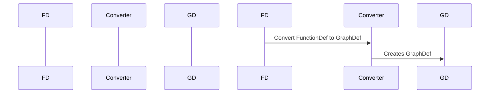

# tensorflow.python.framework.function_def_to_graph_test.FunctionDefToGraphDefTest Documentation

This document describes the `FunctionDefToGraphDefTest` class, which is part of the `tensorflow.python.framework.function_def_to_graph_test` module. The `FunctionDefToGraphDefTest` class provides unit tests for the functionality that converts a `FunctionDef` (a representation of a TensorFlow function) to a `GraphDef` (a representation of a TensorFlow graph).

## Core Functionality

The `FunctionDefToGraphDefTest` class includes several test methods that verify the conversion process, including:

*   **Tensor Naming:**  Tests that input tensors are correctly renamed during the conversion.
*   **Shape Handling:** Tests that shapes are correctly handled and propagated during the conversion.
*   **Control Dependencies:** Tests that control dependencies are preserved during the conversion.
*   **Attribute Handling:** Tests that attributes defined in the `FunctionDef` are correctly transferred to the `GraphDef`.

## Relationship to other components

*   The `FunctionDefToGraphDefTest` class tests the `function_def_to_graph` module, which is responsible for the conversion between `FunctionDef` and `GraphDef`.
*   It uses the `test.TestCase` class to provide a testing environment.
*   It utilizes various TensorFlow operations and functions, such as `array_ops.placeholder`, `op_def_library.apply_op`, and `test_ops.list_output` to construct and define functions.

## Data Flow

