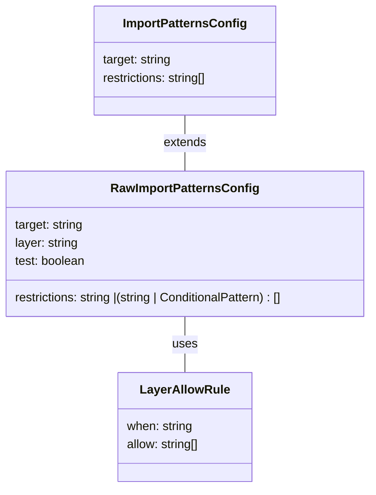

# _eslint_plugin_local Module Documentation

## Introduction

The `_eslint_plugin_local` module provides custom ESLint rules to enforce specific code import patterns within the project. This helps maintain a clean and modular architecture by restricting inter-layer dependencies and promoting code organization. It defines configurations and rules for allowed import patterns based on the target file and its layer.

## Architecture

The module consists of three core components that define the structure and rules for import patterns:

-   **`ImportPatternsConfig`**: Defines the target file and the allowed import restrictions.
-   **`RawImportPatternsConfig`**: Extends `ImportPatternsConfig` with layer information and conditional patterns.
-   **`LayerAllowRule`**: Defines conditional rules based on environment (browser, node, electron, or test).



## Components

### 1. `ImportPatternsConfig`

This interface defines the basic configuration for import patterns.

```typescript
interface ImportPatternsConfig {
	target: string;
	restrictions: string[];
}
```

-   **`target`**: A string representing the file or module to which these restrictions apply.
-   **`restrictions`**: An array of strings, each representing an allowed import path or pattern.

### 2. `RawImportPatternsConfig`

This interface extends `ImportPatternsConfig` and adds more contextual information, such as the layer the target belongs to and conditional patterns.

```typescript
interface RawImportPatternsConfig {
	target: string;
	layer?: 'common' | 'worker' | 'browser' | 'electron-browser' | 'node' | 'electron-utility' | 'electron-main';
	test?: boolean;
	restrictions: string | (string | ConditionalPattern)[];
}
```

-   **`target`**: Inherited from `ImportPatternsConfig`. A string representing the file or module to which these restrictions apply.
-   **`layer`**: An optional string representing the layer of the target file.  Possible values include 'common', 'worker', 'browser', 'electron-browser', 'node', 'electron-utility', and 'electron-main'.
-   **`test`**: An optional boolean indicating if the rule applies to test files.
-   **`restrictions`**:  An array of strings or ConditionalPatterns, each representing an allowed import path or pattern.

### 3. `LayerAllowRule`

This interface defines conditional rules for allowed imports based on the environment.

```typescript
interface LayerAllowRule {
	when: 'hasBrowser' | 'hasNode' | 'hasElectron' | 'test';
	allow: string[];
}
```

-   **`when`**:  A string indicating the environment when this rule applies. Possible values include 'hasBrowser', 'hasNode', 'hasElectron', and 'test'.
-   **`allow`**: An array of strings, each representing an allowed import path or pattern for the specified environment.

## Usage

This module is used to configure ESLint rules for enforcing import patterns.  The configurations defined by these interfaces are consumed by the ESLint plugin to validate import statements in the code.

## Integration

To integrate this module, you need to:

1.  Define configurations based on `RawImportPatternsConfig` and `LayerAllowRule`.
2.  Use these configurations within your ESLint plugin to check for import violations.

## Related Modules

-   Refer to the [extensions_typescript_language_features.md](extensions_typescript_language_features.md) for details on typescript language features and how they interact with eslint.
