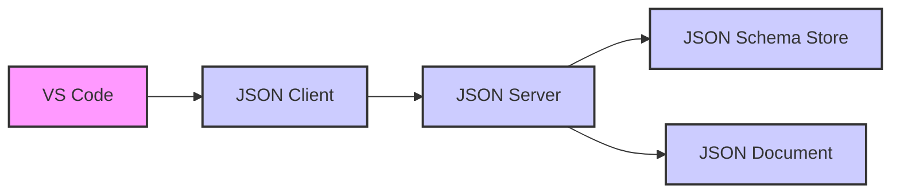

# extensions_json_language_features

## Overview

The `extensions_json_language_features` module provides JSON language support for VS Code. It includes features such as schema validation, completion proposals, hover information, formatting, and more. This module is comprised of client and server components that communicate to provide a rich editing experience for JSON files.

## Architecture

The architecture of the `extensions_json_language_features` module is based on the Language Server Protocol (LSP). The client component runs within VS Code and communicates with the server component, which runs in a separate process. This separation allows for language features to be implemented independently of the editor.

The client component handles communication with VS Code, manages language participants and schema associations. The server component provides core language features, such as validation, completion, and formatting.

## Sub-modules

- [Client](./client.md): Handles client-side functionalities, including communication with VS Code and management of language participants and schema associations.
- [Server](./server.md): Implements the core language features, such as validation, completion, and formatting.

## Core Components

- `LanguageParticipantContribution`: Defines the structure for contributing language-specific settings, such as language ID and comment support.
- `ITextEdit`: Represents a text modification within a document, defined by a range and new text.
- `ISchemaAssociations`: Defines the association between file patterns and JSON schemas.
- `DocumentSortingParams`: Defines the parameters for sorting a JSON document, including the document URI and sorting options.

