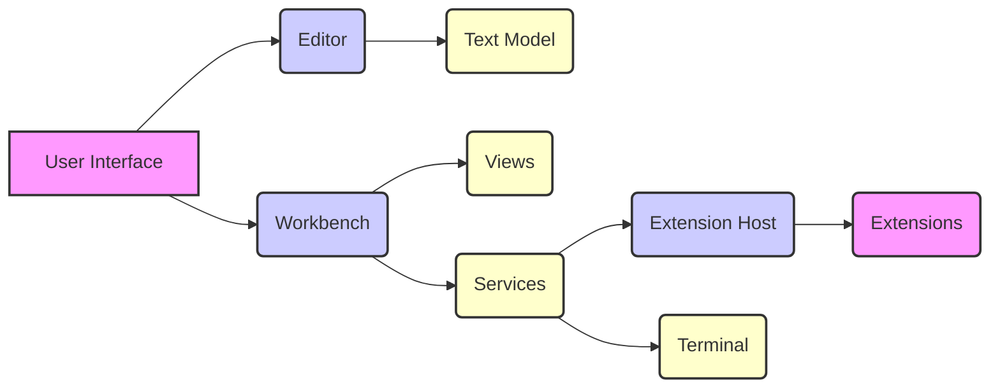
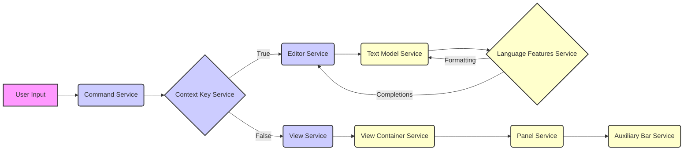

# vscode Repository Overview

This document provides a high-level overview of the `vscode` repository, including its purpose, architecture, and core modules.

## Purpose

The `vscode` repository contains the source code for Visual Studio Code, a lightweight but powerful source code editor which runs on your desktop and is available for Windows, macOS and Linux. It comes with built-in support for JavaScript, TypeScript and Node.js and has a rich ecosystem of extensions for other languages and runtimes.

## Architecture

The `vscode` architecture can be visualized as follows:

A more detailed view, focusing on the data flow and module interaction, can be represented as:

## Core Modules

The `vscode` repository is structured into several core modules, each responsible for a specific aspect of the editor's functionality. Here's a brief overview of some key modules:

-   **[Editor Common Config Editor Options](src.vs.editor.common.config.editorOptions.md)**: Provides configuration options for the editor.
-   **[Terminal Common Terminal](src.vs.platform.terminal.common.terminal.md)**: Defines the common interface for terminal functionality.
-   **[Chat Common Chat Service](src.vs.workbench.contrib.chat.common.chatService.chatService.md)**: Manages chat-related functionalities.
-   **[Extension Management Common ExtensionManagement](src.vs.platform.extensionManagement.common.extensionManagement.md)**: Handles extension management tasks.
-   **[Preferences Browser PreferencesService](src.vs.workbench.services.preferences.browser.preferencesService.md)**: Provides services for managing user preferences.
-   **[Notebook Browser NotebookService](src.vs.workbench.contrib.notebook.browser.services.notebookServiceImpl.md)**: Manages notebook functionalities.
-   **[Debug Common DebugProtocol](src.vs.workbench.contrib.debug.common.debugProtocol.md)**: Defines the Debug Adapter Protocol.
-   **[WorkingCopy Common WorkingCopyService](src.vs.workbench.services.workingCopy.common.workingCopyService.md)**: Manages working copies of files.
-   **[Search Common SearchService](src.vs.workbench.services.search.common.searchService.md)**: Provides search functionalities.
-   **[Theme Common ThemeService](src.vs.platform.theme.common.themeService.md)**: Handles theming and appearance settings.
-   **[Extensions Browser ExtensionService](src.vs.workbench.services.extensions.browser.extensionService.md)**: Manages extensions and their lifecycle.
-   **[Configuration Common ConfigurationService](src.vs.workbench.services.configuration.browser.configurationService.md)**: Provides configuration services.
-   **[Workspace Common WorkspaceService](src.vs.platform.workspace.common.workspace.md)**: Manages workspaces and their settings.
-   **[Files Common Files](src.vs.platform.files.common.files.md)**: Provides file system functionalities.
-   **[QuickInput Browser QuickInputService](src.vs.platform.quickinput.browser.quickInputService.md)**: Provides quick input functionalities.
-   **[CodeEditor Browser CodeEditorService](src.vs.workbench.services.editor.browser.codeEditorService.md)**: Provides code editor services.
-   **[Model Common ModelService](src.vs.editor.common.services.modelService.md)**: Manages text models.
-   **[Telemetry Common TelemetryService](src.vs.platform.telemetry.common.telemetryService.md)**: Handles telemetry and usage data collection.
-   **[UndoRedo Common UndoRedoService](src.vs.platform.undoRedo.common.undoRedoService.md)**: Manages undo/redo operations.
-   **[Terminal Browser TerminalService](src.vs.workbench.contrib.terminal.browser.terminalService.md)**: Provides terminal functionalities.
-   **[LifeCycle Common LifeCycleService](src.vs.workbench.services.lifecycle.common.lifecycleService.md)**: Manages the application lifecycle.
-   **[ExtensionHost Electron-Browser ExtensionHostService](src.vs.workbench.services.extensions.electron-browser.nativeExtensionService.md)**: Manages the extension host process.
-   **[EditorBrowser EditorBrowser](src.vs.editor.browser.editorBrowser.md)**: Provides editor browser functionalities.
-   **[LanguageStatus Browser LanguageStatusService](src.vs.workbench.services.languageStatus.common.languageStatusService.md)**: Provides language status functionalities.
-   **[ChatBrowser ChatService](src.vs.workbench.contrib.chat.common.chatService.chatServiceImpl.md)**: Provides chat functionalities.
-   **[McpCommon McpService](src.vs.workbench.contrib.mcp.common.mcpService.md)**: Provides Mcp functionalities.
-   **[NotebookCommon NotebookService](src.vs.workbench.contrib.notebook.browser.services.notebookServiceImpl.md)**: Provides Notebook functionalities.
-   **[TerminalContribChatAgentToolsBrowser TerminalChatService](src.vs.workbench.contrib.terminalContrib.chatAgentTools.browser.terminal.chatAgentTools.contribution.md)**: Provides Terminal Chat functionalities.
-   **[TerminalContribChatAgentToolsBrowser TerminalChatAgentToolsConfiguration](src.vs.workbench.contrib.terminalContrib.chatAgentTools.common.terminalChatAgentToolsConfiguration.md)**: Provides Terminal Chat Agent Tools Configuration functionalities.
-   **[TerminalContribChatAgentToolsBrowser TerminalChatAgentToolsConfiguration](src.vs.workbench.contrib.terminalContrib.chatAgentTools.browser.terminal.chatAgentTools.contribution.md)**: Provides Terminal Chat Agent Tools Configuration functionalities.
-   **[TerminalContribChatAgentToolsBrowser TerminalChatAgentToolsConfiguration](src.vs.workbench.contrib.terminalContrib.chatAgentTools.browser.terminal.chatAgentTools.contribution.md)**: Provides Terminal Chat Agent Tools Configuration functionalities.
-   **[TerminalContribChatAgentToolsBrowser TerminalChatAgentToolsConfiguration](src.vs.workbench.contrib.terminalContrib.chatAgentTools.browser.terminal.chatAgentTools.contribution.md)**: Provides Terminal Chat Agent Tools Configuration functionalities.
-   **[TerminalContribChatAgentToolsBrowser TerminalChatAgentToolsConfiguration](src.vs.workbench.contrib.terminalContrib.chatAgentTools.browser.terminal.chatAgentTools.contribution.md)**: Provides Terminal Chat Agent Tools Configuration functionalities.
-   **[TerminalContribChatAgentToolsBrowser TerminalChatAgentToolsConfiguration](src.vs.workbench.contrib.terminalContrib.chatAgentTools.browser.terminal.chatAgentTools.contribution.md)**: Provides Terminal Chat Agent Tools Configuration functionalities.
-   **[TerminalContribChatAgentToolsBrowser TerminalChatAgentToolsConfiguration](src.vs.workbench.contrib.terminalContrib.chatAgentTools.browser.terminal.chatAgentTools.contribution.md)**: Provides Terminal Chat Agent Tools Configuration functionalities.
-   **[TerminalContribChatAgentToolsBrowser TerminalChatAgentToolsConfiguration](src.vs.workbench.contrib.terminalContrib.chatAgentTools.browser.terminal.chatAgentTools.contribution.md)**: Provides Terminal Chat Agent Tools Configuration functionalities.
-   **[TerminalContribChatAgentToolsBrowser TerminalChatAgentToolsConfiguration](src.vs.workbench.contrib.terminalContrib.chatAgentTools.browser.terminal.chatAgentTools.contribution.md)**: Provides Terminal Chat Agent Tools Configuration functionalities.
-   **[TerminalContribChatAgentToolsBrowser TerminalChatAgentToolsConfiguration](src.vs.workbench.contrib.terminalContrib.chatAgentTools.browser.terminal.chatAgentTools.contribution.md)**: Provides Terminal Chat Agent Tools Configuration functionalities.
-   **[TerminalContribChatAgentToolsBrowser TerminalChatAgentToolsConfiguration](src.vs.workbench.contrib.terminalContrib.chatAgentTools.browser.terminal.chatAgentTools.contribution.md)**: Provides Terminal Chat Agent Tools Configuration functionalities.
-   **[TerminalContribChatAgentToolsBrowser TerminalChatAgentToolsConfiguration](src.vs.workbench.contrib.terminalContrib.chatAgentTools.browser.terminal.chatAgentTools.contribution.md)**: Provides Terminal Chat Agent Tools Configuration functionalities.
-   **[TerminalContribChatAgentToolsBrowser TerminalChatAgentToolsConfiguration](src.vs.workbench.contrib.terminalContrib.chatAgentTools.browser.terminal.chatAgentTools.contribution.md)**: Provides Terminal Chat Agent Tools Configuration functionalities.
-   **[TerminalContribChatAgentToolsBrowser TerminalChatAgentToolsConfiguration](src.vs.workbench.contrib.terminalContrib.chatAgentTools.browser.terminal.chatAgentTools.contribution.md)**: Provides Terminal Chat Agent Tools Configuration functionalities.
-   **[TerminalContribChatAgentToolsBrowser TerminalChatAgentToolsConfiguration](src.vs.workbench.contrib.terminalContrib.chatAgentTools.browser.terminal.chatAgentTools.contribution.md)**: Provides Terminal Chat Agent Tools Configuration functionalities.
-   **[TerminalContribChatAgentToolsBrowser TerminalChatAgentToolsConfiguration](src.vs.workbench.contrib.terminalContrib.chatAgentTools.browser.terminal.chatAgentTools.contribution.md)**: Provides Terminal Chat Agent Tools Configuration functionalities.
-   **[TerminalContribChatAgentToolsBrowser TerminalChatAgentToolsConfiguration](src.vs.workbench.contrib.terminalContrib.chatAgentTools.browser.terminal.chatAgentTools.contribution.md)**: Provides Terminal Chat Agent Tools Configuration functionalities.
-   **[TerminalContribChatAgentToolsBrowser TerminalChatAgentToolsConfiguration](src.vs.workbench.contrib.terminalContrib.chatAgentTools.browser.terminal.chatAgentTools.contribution.md)**: Provides Terminal Chat Agent Tools Configuration functionalities.
-   **[TerminalContribChatAgentToolsBrowser TerminalChatAgentToolsConfiguration](src.vs.workbench.contrib.terminalContrib.chatAgentTools.browser.terminal.chatAgentTools.contribution.md)**: Provides Terminal Chat Agent Tools Configuration functionalities.
-   **[TerminalContribChatAgentToolsBrowser TerminalChatAgentToolsConfiguration](src.vs.workbench.contrib.terminalContrib.chatAgentTools.browser.terminal.chatAgentTools.contribution.md)**: Provides Terminal Chat Agent Tools Configuration functionalities.
-   **[TerminalContribChatAgentToolsBrowser TerminalChatAgentToolsConfiguration](src.vs.workbench.contrib.terminalContrib.chatAgentTools.browser.terminal.chatAgentTools.contribution.md)**: Provides Terminal Chat Agent Tools Configuration functionalities.
-   **[TerminalContribChatAgentToolsBrowser TerminalChatAgentToolsConfiguration](src.vs.workbench.contrib.terminalContrib.chatAgentTools.browser.terminal.chatAgentTools.contribution.md)**: Provides Terminal Chat Agent Tools Configuration functionalities.
-   **[TerminalContribChatAgentToolsBrowser TerminalChatAgentToolsConfiguration](src.vs.workbench.contrib.terminalContrib.chatAgentTools.browser.terminal.chatAgentTools.contribution.md)**: Provides Terminal Chat Agent Tools Configuration functionalities.
-   **[TerminalContribChatAgentToolsBrowser TerminalChatAgentToolsConfiguration](src.vs.workbench.contrib.terminalContrib.chatAgentTools.browser.terminal.chatAgentTools.contribution.md)**: Provides Terminal Chat Agent Tools Configuration functionalities.
-   **[TerminalContribChatAgentToolsBrowser TerminalChatAgentToolsConfiguration](src.vs.workbench.contrib.terminalContrib.chatAgentTools.browser.terminal.chatAgentTools.contribution.md)**: Provides Terminal Chat Agent Tools Configuration functionalities.
-   **[TerminalContribChatAgentToolsBrowser TerminalChatAgentToolsConfiguration](src.vs.workbench.contrib.terminalContrib.chatAgentTools.browser.terminal.chatAgentTools.contribution.md)**: Provides Terminal Chat Agent Tools Configuration functionalities.
-   **[TerminalContribChatAgentToolsBrowser TerminalChatAgentToolsConfiguration](src.vs.workbench.contrib.terminalContrib.chatAgentTools.browser.terminal.chatAgentTools.contribution.md)**: Provides Terminal Chat Agent Tools Configuration functionalities.
-   **[TerminalContribChatAgentToolsBrowser TerminalChatAgentToolsConfiguration](src.vs.workbench.contrib.terminalContrib.chatAgentTools.browser.terminal.chatAgentTools.contribution.md)**: Provides Terminal Chat Agent Tools Configuration functionalities.
-   **[TerminalContribChatAgentToolsBrowser TerminalChatAgentToolsConfiguration](src.vs.workbench.contrib.terminalContrib.chatAgentTools.browser.terminal.chatAgentTools.contribution.md)**: Provides Terminal Chat Agent Tools Configuration functionalities.
-   **[TerminalContribChatAgentToolsBrowser TerminalChatAgentToolsConfiguration](src.vs.workbench.contrib.terminalContrib.chatAgentTools.browser.terminal.chatAgentTools.contribution.md)**: Provides Terminal Chat Agent Tools Configuration functionalities.
-   **[TerminalContribChatAgentToolsBrowser TerminalChatAgentToolsConfiguration](src.vs.workbench.contrib.terminalContrib.chatAgentTools.browser.terminal.chatAgentTools.contribution.md)**: Provides Terminal Chat Agent Tools Configuration functionalities.
-   **[TerminalContribChatAgentToolsBrowser TerminalChatAgentToolsConfiguration](src.vs.workbench.contrib.terminalContrib.chatAgentTools.browser.terminal.chatAgentTools.contribution.md)**: Provides Terminal Chat Agent Tools Configuration functionalities.
-   **[TerminalContribChatAgentToolsBrowser TerminalChatAgentToolsConfiguration](src.vs.workbench.contrib.terminalContrib.chatAgentTools.browser.terminal.chatAgentTools.contribution.md)**: Provides Terminal Chat Agent Tools Configuration functionalities.
-   **[TerminalContribChatAgentToolsBrowser TerminalChatAgentToolsConfiguration](src.vs.workbench.contrib.terminalContrib.chatAgentTools.browser.terminal.chatAgentTools.contribution.md)**: Provides Terminal Chat Agent Tools Configuration functionalities.
-   **[TerminalContribChatAgentToolsBrowser TerminalChatAgentToolsConfiguration](src.vs.workbench.contrib.terminalContrib.chatAgentTools.browser.terminal.chatAgentTools.contribution.md)**: Provides Terminal Chat Agent Tools Configuration functionalities.
-   **[TerminalContribChatAgentToolsBrowser TerminalChatAgentToolsConfiguration](src.vs.workbench.contrib.terminalContrib.chatAgentTools.browser.terminal.chatAgentTools.contribution.md)**: Provides Terminal Chat Agent Tools Configuration functionalities.
-   **[TerminalContribChatAgentToolsBrowser TerminalChatAgentToolsConfiguration](src.vs.workbench.contrib.terminalContrib.chatAgentTools.browser.terminal.chatAgentTools.contribution.md)**: Provides Terminal Chat Agent Tools Configuration functionalities.
-   **[TerminalContribChatAgentToolsBrowser TerminalChatAgentToolsConfiguration](src.vs.workbench.contrib.terminalContrib.chatAgentTools.browser.terminal.chatAgentTools.contribution.md)**: Provides Terminal Chat Agent Tools Configuration functionalities.
-   **[TerminalContribChatAgentToolsBrowser TerminalChatAgentToolsConfiguration](src.vs.workbench.contrib.terminalContrib.chatAgentTools.browser.terminal.chatAgentTools.contribution.md)**: Provides Terminal Chat Agent Tools Configuration functionalities.
-   **[TerminalContribChatAgentToolsBrowser TerminalChatAgentToolsConfiguration](src.vs.workbench.contrib.terminalContrib.chatAgentTools.browser.terminal.chatAgentTools.contribution.md)**: Provides Terminal Chat Agent Tools Configuration functionalities.
-   **[TerminalContribChatAgentToolsBrowser TerminalChatAgentToolsConfiguration](src.vs.workbench.contrib.terminalContrib.chatAgentTools.browser.terminal.chatAgentTools.contribution.md)**: Provides Terminal Chat Agent Tools Configuration functionalities.
-   **[TerminalContribChatAgentToolsBrowser TerminalChatAgentToolsConfiguration](src.vs.workbench.contrib.terminalContrib.chatAgentTools.browser.terminal.chatAgentTools.contribution.md)**: Provides Terminal Chat Agent Tools Configuration functionalities.
-   **[TerminalContribChatAgentToolsBrowser TerminalChatAgentToolsConfiguration](src.vs.workbench.contrib.terminalContrib.chatAgentTools.browser.terminal.chatAgentTools.contribution.md)**: Provides Terminal Chat Agent Tools Configuration functionalities.
-   **[TerminalContribChatAgentToolsBrowser TerminalChatAgentToolsConfiguration](src.vs.workbench.contrib.terminalContrib.chatAgentTools.browser.terminal.chatAgentTools.contribution.md)**: Provides Terminal Chat Agent Tools Configuration functionalities.
-   **[TerminalContribChatAgentToolsBrowser TerminalChatAgentToolsConfiguration](src.vs.workbench.contrib.terminalContrib.chatAgentTools.browser.terminal.chatAgentTools.contribution.md)**: Provides Terminal Chat Agent Tools Configuration functionalities.
-   **[TerminalContribChatAgentToolsBrowser TerminalChatAgentToolsConfiguration](src.vs.workbench.contrib.terminalContrib.chatAgentTools.browser.terminal.chatAgentTools.contribution.md)**: Provides Terminal Chat Agent Tools Configuration functionalities.
-   **[TerminalContribChatAgentToolsBrowser TerminalChatAgentToolsConfiguration](src.vs.workbench.contrib.terminalContrib.chatAgentTools.browser.terminal.chatAgentTools.contribution.md)**: Provides Terminal Chat Agent Tools Configuration functionalities.
-   **[TerminalContribChatAgentToolsBrowser TerminalChatAgentToolsConfiguration](src.vs.workbench.contrib.terminalContrib.chatAgentTools.browser.terminal.chatAgentTools.contribution.md)**: Provides Terminal Chat Agent Tools Configuration functionalities.
-   **[TerminalContribChatAgentToolsBrowser TerminalChatAgentToolsConfiguration](src.vs.workbench.contrib.terminalContrib.chatAgentTools.browser.terminal.chatAgentTools.contribution.md)**: Provides Terminal Chat Agent Tools Configuration functionalities.
-   **[TerminalContribChatAgentToolsBrowser TerminalChatAgentToolsConfiguration](src.vs.workbench.contrib.terminalContrib.chatAgentTools.browser.terminal.chatAgentTools.contribution.md)**: Provides Terminal Chat Agent Tools Configuration functionalities.
-   **[TerminalContribChatAgentToolsBrowser TerminalChatAgentToolsConfiguration](src.vs.workbench.contrib.terminalContrib.chatAgentTools.browser.terminal.chatAgentTools.contribution.md)**: Provides Terminal Chat Agent Tools Configuration functionalities.
-   **[TerminalContribChatAgentToolsBrowser TerminalChatAgentToolsConfiguration](src.vs.workbench.contrib.terminalContrib.chatAgentTools.browser.terminal.chatAgentTools.contribution.md)**: Provides Terminal Chat Agent Tools Configuration functionalities.
-   **[TerminalContribChatAgentToolsBrowser TerminalChatAgentToolsConfiguration](src.vs.workbench.contrib.terminalContrib.chatAgentTools.browser.terminal.chatAgentTools.contribution.md)**: Provides Terminal Chat Agent Tools Configuration functionalities.
-   **[TerminalContribChatAgentToolsBrowser TerminalChatAgentToolsConfiguration](src.vs.workbench.contrib.terminalContrib.chatAgentTools.browser.terminal.chatAgentTools.contribution.md)**: Provides Terminal Chat Agent Tools Configuration functionalities.
-   **[TerminalContribChatAgentToolsBrowser TerminalChatAgentToolsConfiguration](src.vs.workbench.contrib.terminalContrib.chatAgentTools.browser.terminal.chatAgentTools.contribution.md)**: Provides Terminal Chat Agent Tools Configuration functionalities.
-   **[TerminalContribChatAgentToolsBrowser TerminalChatAgentToolsConfiguration](src.vs.workbench.contrib.terminalContrib.chatAgentTools.browser.terminal.chatAgentTools.contribution.md)**: Provides Terminal Chat Agent Tools Configuration functionalities.
-   **[TerminalContribChatAgentToolsBrowser TerminalChatAgentToolsConfiguration](src.vs.workbench.contrib.terminalContrib.chatAgentTools.browser.terminal.chatAgentTools.contribution.md)**: Provides Terminal Chat Agent Tools Configuration functionalities.
-   **[TerminalContribChatAgentToolsBrowser TerminalChatAgentToolsConfiguration](src.vs.workbench.contrib.terminalContrib.chatAgentTools.browser.terminal.chatAgentTools.contribution.md)**: Provides Terminal Chat Agent Tools Configuration functionalities.
-   **[TerminalContribChatAgentToolsBrowser TerminalChatAgentToolsConfiguration](src.vs.workbench.contrib.terminalContrib.chatAgentTools.browser.terminal.chatAgentTools.contribution.md)**: Provides Terminal Chat Agent Tools Configuration functionalities.
-   **[TerminalContribChatAgentToolsBrowser TerminalChatAgentToolsConfiguration](src.vs.workbench.contrib.terminalContrib.chatAgentTools.browser.terminal.chatAgentTools.contribution.md)**: Provides Terminal Chat Agent Tools Configuration functionalities.
-   **[TerminalContribChatAgentToolsBrowser TerminalChatAgentToolsConfiguration](src.vs.workbench.contrib.terminalContrib.chatAgentTools.browser.terminal.chatAgentTools.contribution.md)**: Provides Terminal Chat Agent Tools Configuration functionalities.
-   **[TerminalContribChatAgentToolsBrowser TerminalChatAgentToolsConfiguration](src.vs.workbench.contrib.terminalContrib.chatAgentTools.browser.terminal.chatAgentTools.contribution.md)**: Provides Terminal Chat Agent Tools Configuration functionalities.
-   **[TerminalContribChatAgentToolsBrowser TerminalChatAgentToolsConfiguration](src.vs.workbench.contrib.terminalContrib.chatAgentTools.browser.terminal.chatAgentTools.contribution.md)**: Provides Terminal Chat Agent Tools Configuration functionalities.
-   **[TerminalContribChatAgentToolsBrowser TerminalChatAgentToolsConfiguration](src.vs.workbench.contrib.terminalContrib.chatAgentTools.browser.terminal.chatAgentTools.contribution.md)**: Provides Terminal Chat Agent Tools Configuration functionalities.
-   **[TerminalContribChatAgentToolsBrowser TerminalChatAgentToolsConfiguration](src.vs.workbench.contrib.terminalContrib.chatAgentTools.browser.terminal.chatAgentTools.contribution.md)**: Provides Terminal Chat Agent Tools Configuration functionalities.
-   **[TerminalContribChatAgentToolsBrowser TerminalChatAgentToolsConfiguration](src.vs.workbench.contrib.terminalContrib.chatAgentTools.browser.terminal.chatAgentTools.contribution.md)**: Provides Terminal Chat Agent Tools Configuration functionalities.
-   **[TerminalContribChatAgentToolsBrowser TerminalChatAgentToolsConfiguration](src.vs.workbench.contrib.terminalContrib.chatAgentTools.browser.terminal.chatAgentTools.contribution.md)**: Provides Terminal Chat Agent Tools Configuration functionalities.
-   **[TerminalContribChatAgentToolsBrowser TerminalChatAgentToolsConfiguration](src.vs.workbench.contrib.terminalContrib.chatAgentTools.browser.terminal.chatAgentTools.contribution.md)**: Provides Terminal Chat Agent Tools Configuration functionalities.
-   **[TerminalContribChatAgentToolsBrowser TerminalChatAgentToolsConfiguration](src.vs.workbench.contrib.terminalContrib.chatAgentTools.browser.terminal.chatAgentTools.contribution.md)**: Provides Terminal Chat Agent Tools Configuration functionalities.
-   **[TerminalContribChatAgentToolsBrowser TerminalChatAgentToolsConfiguration](src.vs.workbench.contrib.terminalContrib.chatAgentTools.browser.terminal.chatAgentTools.contribution.md)**: Provides Terminal Chat Agent Tools Configuration functionalities.
-   **[TerminalContribChatAgentToolsBrowser TerminalChatAgentToolsConfiguration](src.vs.workbench.contrib.terminalContrib.chatAgentTools.browser.terminal.chatAgentTools.contribution.md)**: Provides Terminal Chat Agent Tools Configuration functionalities.
-   **[TerminalContribChatAgentToolsBrowser TerminalChatAgentToolsConfiguration](src.vs.workbench.contrib.terminalContrib.chatAgentTools.browser.terminal.chatAgentTools.contribution.md)**: Provides Terminal Chat Agent Tools Configuration functionalities.
-   **[TerminalContribChatAgentToolsBrowser TerminalChatAgentToolsConfiguration](src.vs.workbench.contrib.terminalContrib.chatAgentTools.browser.terminal.chatAgentTools.contribution.md)**: Provides Terminal Chat Agent Tools Configuration functionalities.
-   **[TerminalContribChatAgentToolsBrowser TerminalChatAgentToolsConfiguration](src.vs.workbench.contrib.terminalContrib.chatAgentTools.browser.terminal.chatAgentTools.contribution.md)**: Provides Terminal Chat Agent Tools Configuration functionalities.
-   **[TerminalContribChatAgentToolsBrowser TerminalChatAgentToolsConfiguration](src.vs.workbench.contrib.terminalContrib.chatAgentTools.browser.terminal.chatAgentTools.contribution.md)**: Provides Terminal Chat Agent Tools Configuration functionalities.
-   **[TerminalContribChatAgentToolsBrowser TerminalChatAgentToolsConfiguration](src.vs.workbench.contrib.terminalContrib.chatAgentTools.browser.terminal.chatAgentTools.contribution.md)**: Provides Terminal Chat Agent Tools Configuration functionalities.
-   **[TerminalContribChatAgentToolsBrowser TerminalChatAgentToolsConfiguration](src.vs.workbench.contrib.terminalContrib.chatAgentTools.browser.terminal.chatAgentTools.contribution.md)**: Provides Terminal Chat Agent Tools Configuration functionalities.
-   **[TerminalContribChatAgentToolsBrowser TerminalChatAgentToolsConfiguration](src.vs.workbench.contrib.terminalContrib.chatAgentTools.browser.terminal.chatAgentTools.contribution.md)**: Provides Terminal Chat Agent Tools Configuration functionalities.
-   **[TerminalContribChatAgentToolsBrowser TerminalChatAgentToolsConfiguration](src.vs.workbench.contrib.terminalContrib.chatAgentTools.browser.terminal.chatAgentTools.contribution.md)**: Provides Terminal Chat Agent Tools Configuration functionalities.
-   **[TerminalContribChatAgentToolsBrowser TerminalChatAgentToolsConfiguration](src.vs.workbench.contrib.terminalContrib.chatAgentTools.browser.terminal.chatAgentTools.contribution.md)**: Provides Terminal Chat Agent Tools Configuration functionalities.
-   **[TerminalContribChatAgentToolsBrowser TerminalChatAgentToolsConfiguration](src.vs.workbench.contrib.terminalContrib.chatAgentTools.browser.terminal.chatAgentTools.contribution.md)**: Provides Terminal Chat Agent Tools Configuration functionalities.
-   **[TerminalContribChatAgentToolsBrowser TerminalChatAgentToolsConfiguration](src.vs.workbench.contrib.terminalContrib.chatAgentTools.browser.terminal.chatAgentTools.contribution.md)**: Provides Terminal Chat Agent Tools Configuration functionalities.
-   **[TerminalContribChatAgentToolsBrowser TerminalChatAgentToolsConfiguration](src.vs.workbench.contrib.terminalContrib.chatAgentTools.browser.terminal.chatAgentTools.contribution.md)**: Provides Terminal Chat Agent Tools Configuration functionalities.
-   **[TerminalContribChatAgentToolsBrowser TerminalChatAgentToolsConfiguration](src.vs.workbench.contrib.terminalContrib.chatAgentTools.browser.terminal.chatAgentTools.contribution.md)**: Provides Terminal Chat Agent Tools Configuration functionalities.
-   **[TerminalContribChatAgentToolsBrowser TerminalChatAgentToolsConfiguration](src.vs.workbench.contrib.terminalContrib.chatAgentTools.browser.terminal.chatAgentTools.contribution.md)**: Provides Terminal Chat Agent Tools Configuration functionalities.
-   **[TerminalContribChatAgentToolsBrowser TerminalChatAgentToolsConfiguration](src.vs.workbench.contrib.terminalContrib.chatAgentTools.browser.terminal.chatAgentTools.contribution.md)**: Provides Terminal Chat Agent Tools Configuration functionalities.
-   **[TerminalContribChatAgentToolsBrowser TerminalChatAgentToolsConfiguration](src.vs.workbench.contrib.terminalContrib.chatAgentTools.browser.terminal.chatAgentTools.contribution.md)**: Provides Terminal Chat Agent Tools Configuration functionalities.
-   **[TerminalContribChatAgentToolsBrowser TerminalChatAgentToolsConfiguration](src.vs.workbench.contrib.terminalContrib.chatAgentTools.browser.terminal.chatAgentTools.contribution.md)**: Provides Terminal Chat Agent Tools Configuration functionalities.
-   **[TerminalContribChatAgentToolsBrowser TerminalChatAgentToolsConfiguration](src.vs.workbench.contrib.terminalContrib.chatAgentTools.browser.terminal.chatAgentTools.contribution.md)**: Provides Terminal Chat Agent Tools Configuration functionalities.
-   **[TerminalContribChatAgentToolsBrowser TerminalChatAgentToolsConfiguration](src.vs.workbench.contrib.terminalContrib.chatAgentTools.browser.terminal.chatAgentTools.contribution.md)**: Provides Terminal Chat Agent Tools Configuration functionalities.
-   **[TerminalContribChatAgentToolsBrowser TerminalChatAgentToolsConfiguration](src.vs.workbench.contrib.terminalContrib.chatAgentTools.browser.terminal.chatAgentTools.contribution.md)**: Provides Terminal Chat Agent Tools Configuration functionalities.
-   **[TerminalContribChatAgentToolsBrowser TerminalChatAgentToolsConfiguration](src.vs.workbench.contrib.terminalContrib.chatAgentTools.browser.terminal.chatAgentTools.contribution.md)**: Provides Terminal Chat Agent Tools Configuration functionalities.
-   **[TerminalContribChatAgentToolsBrowser TerminalChatAgentToolsConfiguration](src.vs.workbench.contrib.terminalContrib.chatAgentTools.browser.terminal.chatAgentTools.contribution.md)**: Provides Terminal Chat Agent Tools Configuration functionalities.
-   **[TerminalContribChatAgentToolsBrowser TerminalChatAgentToolsConfiguration](src.vs.workbench.contrib.terminalContrib.chatAgentTools.browser.terminal.chatAgentTools.contribution.md)**: Provides Terminal Chat Agent Tools Configuration functionalities.
-   **[TerminalContribChatAgentToolsBrowser TerminalChatAgentToolsConfiguration](src.vs.workbench.contrib.terminalContrib.chatAgentTools.browser.terminal.chatAgentTools.contribution.md)**: Provides Terminal Chat Agent Tools Configuration functionalities.
-   **[TerminalContribChatAgentToolsBrowser TerminalChatAgentToolsConfiguration](src.vs.workbench.contrib.terminalContrib.chatAgentTools.browser.terminal.chatAgentTools.contribution.md)**: Provides Terminal Chat Agent Tools Configuration functionalities.
-   **[TerminalContribChatAgentToolsBrowser TerminalChatAgentToolsConfiguration](src.vs.workbench.contrib.terminalContrib.chatAgentTools.browser.terminal.chatAgentTools.contribution.md)**: Provides Terminal Chat Agent Tools Configuration functionalities.
-   **[TerminalContribChatAgentToolsBrowser TerminalChatAgentToolsConfiguration](src.vs.workbench.contrib.terminalContrib.chatAgentTools.browser.terminal.chatAgentTools.contribution.md)**: Provides Terminal Chat Agent Tools Configuration functionalities.
-   **[TerminalContribChatAgentToolsBrowser TerminalChatAgentToolsConfiguration](src.vs.workbench.contrib.terminalContrib.chatAgentTools.browser.terminal.chatAgentTools.contribution.md)**: Provides Terminal Chat Agent Tools Configuration functionalities.
-   **[TerminalContribChatAgentToolsBrowser TerminalChatAgentToolsConfiguration](src.vs.workbench.contrib.terminalContrib.chatAgentTools.browser.terminal.chatAgentTools.contribution.md)**: Provides Terminal Chat Agent Tools Configuration functionalities.
-   **[TerminalContribChatAgentToolsBrowser TerminalChatAgentToolsConfiguration](src.vs.workbench.contrib.terminalContrib.chatAgentTools.browser.terminal.chatAgentTools.contribution.md)**: Provides Terminal Chat Agent Tools Configuration functionalities.
-   **[TerminalContribChatAgentToolsBrowser TerminalChatAgentToolsConfiguration](src.vs.workbench.contrib.terminalContrib.chatAgentTools.browser.terminal.chatAgentTools.contribution.md)**: Provides Terminal Chat Agent Tools Configuration functionalities.
-   **[TerminalContribChatAgentToolsBrowser TerminalChatAgentToolsConfiguration](src.vs.workbench.contrib.terminalContrib.chatAgentTools.browser.terminal.chatAgentTools.contribution.md)**: Provides Terminal Chat Agent Tools Configuration functionalities.
-   **[TerminalContribChatAgentToolsBrowser TerminalChatAgentToolsConfiguration](src.vs.workbench.contrib.terminalContrib.chatAgentTools.browser.terminal.chatAgentTools.contribution.md)**: Provides Terminal Chat Agent Tools Configuration functionalities.
-   **[TerminalContribChatAgentToolsBrowser TerminalChatAgentToolsConfiguration](src.vs.workbench.contrib.terminalContrib.chatAgentTools.browser.terminal.chatAgentTools.contribution.md)**: Provides Terminal Chat Agent Tools Configuration functionalities.
-   **[TerminalContribChatAgentToolsBrowser TerminalChatAgentToolsConfiguration](src.vs.workbench.contrib.terminalContrib.chatAgentTools.browser.terminal.chatAgentTools.contribution.md)**: Provides Terminal Chat Agent Tools Configuration functionalities.
-   **[TerminalContribChatAgentToolsBrowser TerminalChatAgentToolsConfiguration](src.vs.workbench.contrib.terminalContrib.chatAgentTools.browser.terminal.chatAgentTools.contribution.md)**: Provides Terminal Chat Agent Tools Configuration functionalities.
-   **[TerminalContribChatAgentToolsBrowser TerminalChatAgentToolsConfiguration](src.vs.workbench.contrib.terminalContrib.chatAgentTools.browser.terminal.chatAgentTools.contribution.md)**: Provides Terminal Chat Agent Tools Configuration functionalities.
-   **[TerminalContribChatAgentToolsBrowser TerminalChatAgentToolsConfiguration](src.vs.workbench.contrib.terminalContrib.chatAgentTools.browser.terminal.chatAgentTools.contribution.md)**: Provides Terminal Chat Agent Tools Configuration functionalities.
-   **[TerminalContribChatAgentToolsBrowser TerminalChatAgentToolsConfiguration](src.vs.workbench.contrib.terminalContrib.chatAgentTools.browser.terminal.chatAgentTools.contribution.md)**: Provides Terminal Chat Agent Tools Configuration functionalities.
-   **[TerminalContribChatAgentToolsBrowser TerminalChatAgentToolsConfiguration](src.vs.workbench.contrib.terminalContrib.chatAgentTools.browser.terminal.chatAgentTools.contribution.md)**: Provides Terminal Chat Agent Tools Configuration functionalities.
-   **[TerminalContribChatAgentToolsBrowser TerminalChatAgentToolsConfiguration](src.vs.workbench.contrib.terminalContrib.chatAgentTools.browser.terminal.chatAgentTools.contribution.md)**: Provides Terminal Chat Agent Tools Configuration functionalities.
-   **[TerminalContribChatAgentToolsBrowser TerminalChatAgentToolsConfiguration](src.vs.workbench.contrib.terminalContrib.chatAgentTools.browser.terminal.chatAgentTools.contribution.md)**: Provides Terminal Chat Agent Tools Configuration functionalities.
-   **[TerminalContribChatAgentToolsBrowser TerminalChatAgentToolsConfiguration](src.vs.workbench.contrib.terminalContrib.chatAgentTools.browser.terminal.chatAgentTools.contribution.md)**: Provides Terminal Chat Agent Tools Configuration functionalities.
-   **[TerminalContribChatAgentToolsBrowser TerminalChatAgentToolsConfiguration](src.vs.workbench.contrib.terminalContrib.chatAgentTools.browser.terminal.chatAgentTools.contribution.md)**: Provides Terminal Chat Agent Tools Configuration functionalities.
-   **[TerminalContribChatAgentToolsBrowser TerminalChatAgentToolsConfiguration](src.vs.workbench.contrib.terminalContrib.chatAgentTools.browser.terminal.chatAgentTools.contribution.md)**: Provides Terminal Chat Agent Tools Configuration functionalities.
-   **[TerminalContribChatAgentToolsBrowser TerminalChatAgentToolsConfiguration](src.vs.workbench.contrib.terminalContrib.chatAgentTools.browser.terminal.chatAgentTools.contribution.md)**: Provides Terminal Chat Agent Tools Configuration functionalities.
-   **[TerminalContribChatAgentToolsBrowser TerminalChatAgentToolsConfiguration](src.vs.workbench.contrib.terminalContrib.chatAgentTools.browser.terminal.chatAgentTools.contribution.md)**: Provides Terminal Chat Agent Tools Configuration functionalities.
-   **[TerminalContribChatAgentToolsBrowser TerminalChatAgentToolsConfiguration](src.vs.workbench.contrib.terminalContrib.chatAgentTools.browser.terminal.chatAgentTools.contribution.md)**: Provides Terminal Chat Agent Tools Configuration functionalities.
-   **[TerminalContribChatAgentToolsBrowser TerminalChatAgentToolsConfiguration](src.vs.workbench.contrib.terminalContrib.chatAgentTools.browser.terminal.chatAgentTools.contribution.md)**: Provides Terminal Chat Agent Tools Configuration functionalities.
-   **[TerminalContribChatAgentToolsBrowser TerminalChatAgentToolsConfiguration](src.vs.workbench.contrib.terminalContrib.chatAgentTools.browser.terminal.chatAgentTools.contribution.md)**: Provides Terminal Chat Agent Tools Configuration functionalities.
-   **[TerminalContribChatAgentToolsBrowser TerminalChatAgentToolsConfiguration](src.